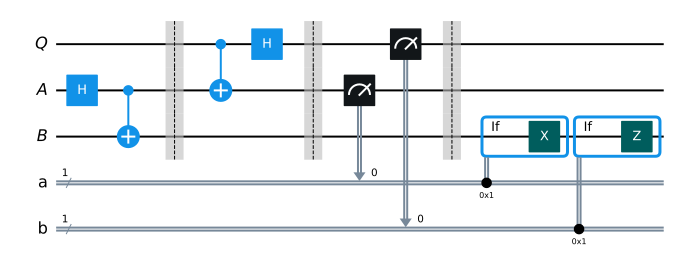
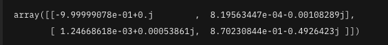
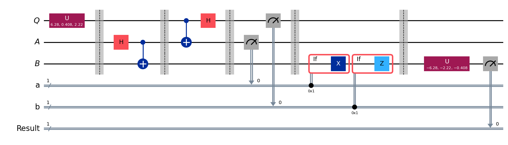
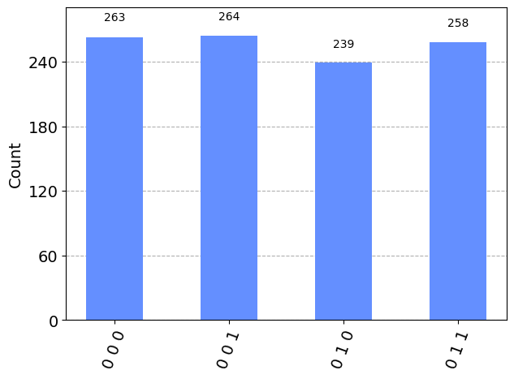
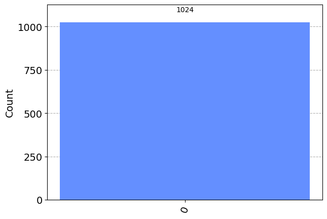

# Entanglement in action

[こちら](https://learning.quantum.ibm.com/course/basics-of-quantum-information/entanglement-in-action)のサイトの和訳

## 導入

このレッスンでは、基本的に重要な 3 つの例を見ていきます。 最初の 2 つはテレポーテーション プロトコルと超高密度コーディング プロトコルで、主に送信者から受信者への情報の送信に関係します。 3 番目の例は、CHSH ゲームと呼ばれるアブストラクト ゲームで、非局所性とも呼ばれる量子情報の現象を示しています。 (CHSH ゲームは常にゲームとして説明されるわけではありません。多くの場合、代わりに実験として説明され、具体的にはベル テストの例であり、CHSH 不等式と呼ばれます。)

テレポーテーション、超高密度コーディング、CHSH ゲームは、量子情報がどのように機能するかを説明するための単なる例ではありません (ただし、この点では十分に役立ちます)。 むしろ、それらは量子情報の基礎となる石です。 エンタングルメントは 3 つの例すべてで重要な役割を果たします。そのため、このレッスンは、エンタングルメントの動作を確認し、エンタングルメントが非常に興味深く重要な概念である理由を探求し始める、このシリーズの最初の機会を提供します。

例自体に進む前に、3 つの例すべてに関連する予備的なコメントをいくつか説明します。

### AliceとBob

アリスとボブは、システム、プロトコル、ゲーム、および情報交換を伴うその他の相互作用における仮想的なエンティティまたはエージェントに伝統的に与えられている名前です。 これらは通常人間に付けられる名前ですが、これらは抽象化を表し、必ずしも実際の人間を表しているわけではないことを理解する必要があります。したがって、たとえば、アリスとボブは複雑な計算を実行することが期待されるかもしれません。

これらの名前は、1970 年代に暗号化の文脈で初めてこの方法で使用されましたが、それ以来、この規則はより広く一般的になりました。 考え方としては、これらは文字 A と B で始まる (少なくとも世界の一部の地域では) 一般的な名前であるというだけです。また、アリスを代名詞「her」で呼び、ボブを代名詞「彼」で呼ぶことも非常に便利です。 」 簡潔にするために。

デフォルトでは、アリスとボブは異なる場所にいると想定します。 彼らは、発生した状況に応じて、異なる目標や行動を持つ可能性があります。 たとえば、情報の送信を意味するコミュニケーションでは、送信される情報の送信者を指すためにアリスという名前を使用し、送信される情報の受信者を指すためにボブという名前を使用することを決定するかもしれません。 一般に、アリスとボブは協力する可能性があり、これはさまざまな設定でよく見られることですが、他の設定では、彼らは競争していたり、一貫性や調和がある場合とそうでない異なる目標を持っている場合があります。 これらのことは、当面の状況において明らかにされなければなりません。

必要に応じて、チャーリーやダイアンなどの追加のキャラクターを紹介することもできます。 盗聴者のイブや悪意のある行動をする人のマロリーなど、さまざまな人物を表す他の名前も使用されることがあります。

アリスとボブは、このレッスンで説明する 3 つの例すべてに登場しており、後続のレッスンでも時々登場します。

### リソースとしてのもつれ

レッスン 2 の 2 量子ビットのもつれ量子状態の例を思い出してください。
$$
\begin{align}
\ket{\phi^+} = \frac{1}{\sqrt{2}} \ket{00} + \frac{1}{\sqrt{2}}\ket{11}
\end{align}
$$
これは 4 つのベル状態の 1 つであり、もつれた量子状態の典型的な例として見られることがよくあります。

また、次の 2 ビットの確率的状態の例にも遭遇しました。

$$
\begin{align}
    \frac{1}{2} \ket{00} + \frac{1}{2} \ket{11}
\end{align}
$$

ある意味、それはもつれ量子状態 (1) に似ています。
2 つのビットが相関しているが、もつれは発生していない確率的な状態を表します。 もつれは、本質的に定義上、独自の量子現象です。簡単に言うと、もつれとは、非古典的な量子相関を指します。

残念ながら、もつれを非古典的な量子相関として定義することは、直感的なレベルではやや満足のいくものではありません。なぜなら、それはもつれの定義が、そうでないものに関するものだからです。 おそらくこの理由から、エンタングルメントとは何か、そしてそれが何が特別なのかを直観的な言葉で正確に説明するのはかなり難しいのです。

もつれの典型的な説明では、2 つの状態 (1) と (2) を意味のある方法で区別できないことがよくあります。 たとえば、もつれ合った 2 つの量子ビットのうちの 1 つが測定されると、もう一方の量子ビットの状態が何らかの形で瞬間的に影響を受けると言われることがあります。 あるいは、2 つの量子ビットを合わせた状態を個別に記述することはできない。 あるいは、2 つの量子ビットが何らかの形で互いの記憶を維持しているのではないかと考えられます。 これらのステートメントは誤りではありませんが、(もつれのない) 確率状態 (2) にも当てはまらないのはなぜでしょうか? この状態で表される 2 つのビットは密接に関連しており、文字通りの意味で、それぞれがもう一方の完全な記憶を持っています。 しかしそれでも絡まない。

何がもつれを特別なものにし、量子状態 (1) が確率状態 (2) と大きく異なるのかを説明する 1 つの方法は、もつれで何ができるのか、またはもつれによって何が起こっているのかを説明することです。 ベクトルを使用して状態の知識を表現する方法について私たちが行う決定を超えています。 このレッスンで説明する 3 つの例はすべて、状態 (2) を含む古典的な相関関係のある状態では実行できないことを、状態 (1) では実行できることを示すという点で、この性質を持っています。

実際、量子情報と計算の研究では、エンタングルメントがさまざまなタスクを達成できるリソースとして見なされるのが一般的です。 これが行われると、状態 (1) はエンタングルメントの 1 つの単位を表すものとみなされ、これを e ビットと呼びます。 (「e」は「エンタングルド」または「エンタングルメント」を表します。状態 (1) が 2 量子ビットの状態であることは事実ですが、それが表す量子もつれの量は 1 e ビットです。)

ちなみに、確率状態 (2) をリソース、つまり 1 ビットの共有ランダム性とみなすこともできます。 たとえば、ランダムなビットを誰かと共有し (誰もそのビットが何であるかを知らないと仮定して)、それを秘密鍵 (または秘密鍵の一部) として使用できるようにすることは、暗号化において非常に役立ちます。 暗号化のため。 ただし、このレッスンでは、エンタングルメントとそれを使ってできるいくつかのことに焦点を当てます。

用語に関する明確化の点として、アリスとボブが e ビットを共有すると言うとき、私たちが意味するのは、アリスは A という名前の量子ビットを持ち、ボブは B という名前の量子ビットを持っており、これらを合わせるとペア (A,B) は次のようになります。 量子状態では (1)。 もちろん、量子ビットに別の名前を選択することもできますが、このレッスンでは、わかりやすくするためにこれらの名前を使用します。

## テレポーテーション

量子テレポーテーション、または略してテレポーテーションは、共有量子もつれ量子状態 (具体的には 1 つの e ビット) と 2 つのビットを利用して、送信者 (アリス) が受信者 (ボブ) に量子ビットを送信するプロトコルです。 古典的なコミュニケーションのこと。 テレポーテーションという名前は、物質が未来的なプロセスによってある場所から別の場所に輸送されるという SF の概念を示唆することを意図していますが、量子テレポーテーションでは物質はテレポートされないことを理解する必要があります。実際にテレポートされるのは量子情報です。

テレポートの設定は次のとおりです。

アリスとボブが e ビットを共有すると仮定します。アリスは量子ビット A を保持し、ボブは量子ビット B を保持し、ペア (A,B) は共に$\ket{\psi^+}$の状態にあります。 たとえば、アリスとボブが過去に同じ場所にいて、量子ビット A と B を$\ket{\psi^+}$の状態で準備し、その後、それぞれが量子ビットを手にして独自の道を進んだ可能性があります。 あるいは、この共有電子ビットを確立するために、サードパーティが関与するプロセスや複雑な分散プロセスなどの別のプロセスが使用された可能性があります。 これらの詳細は、テレポーテーション プロトコル自体の一部ではありません。

その後、アリスはボブに送信したい 3 番目の量子ビット Q を所有します。 量子ビット Q の状態はアリスとボブにとって未知であると考えられており、それについての仮定は行われません。 たとえば、量子ビット Q は、アリスもボブもアクセスできない 1 つ以上の他のシステムともつれている可能性があります。 アリスが量子ビット Q をボブに送信したいということは、アリスがボブに、Q が他のシステムと持っていた相関関係を持った、プロトコルの開始時に Q があったのと同じ状態にある量子ビットを保持してもらいたいことを意味します。 あたかもアリスが Q をボブに物理的に手渡したかのように。

もちろん、アリスが物理的に量子ビット Q をボブに送信すると想像することができ、Q が転送中に変更されたり妨害されたりすることなくボブに到達すると仮定すると、アリスとボブのタスクは達成されます。 しかし、テレポーテーションの文脈では、アリスが Q をボブに物理的に送信することは不可能であると仮定しています。 ただし、彼女は古典的な情報をボブに送信する可能性があります。

これらは、さまざまな設定における合理的な仮定です。 たとえば、アリスがボブの正確な位置を知らない場合、または両者間の距離が遠い場合、今日または予見可能な将来のテクノロジーを使用して量子ビットを物理的に送信することは、控えめに言っても困難です。 しかし、私たちが日常の経験から知っているように、このような状況下での古典的な情報伝達は非常に簡単です。

この時点で、アリスとボブが共有電子ビットを利用することなくタスクを完了できるかどうか疑問に思う人もいるかもしれません。 言い換えれば、古典的な通信のみを使用して量子ビットを送信する方法はあるのでしょうか? 答えは「いいえ」です。古典的な通信だけを使用して量子情報を送信することは不可能です。 このシリーズの第 3 単元で説明する基本的な量子情報理論を使用してこれを証明するのはそれほど難しいことではありません。しかし、今のところ、古典的な通信のみを使用して量子ビットを送信する可能性を排除する直感的な方法は、複製禁止定理について考えることです。

古典的な通信のみを使用して量子情報を送信する方法があったと想像してください。 古典的な情報は簡単にコピーしてブロードキャストすることができます。つまり、アリスからボブへの古典的な送信は、潜在的に 2 番目の受信機 (チャーリーだとします) にも受信される可能性があります。 しかし、チャーリーがボブが受信したのと同じ古典的通信を受信した場合、彼は量子ビット Q のコピーを取得することもできるのではないでしょうか? これは、Q がクローン化されたことを示唆しますが、クローン化不可能定理からそれは不可能であることがすでにわかっています。 したがって、古典的な通信だけを使用して量子情報を送信する方法はないと結論付けます。

ただし、アリスとボブが電子ビットを共有するという前提が設定されている場合、アリスとボブはタスクを達成することができます。 これはまさに量子テレポーテーション プロトコルが行うことです。

## プロトコル

以下は、テレポーテーション プロトコルを説明する量子回路図です。


この図は、アリスとボブの間の分離を描いているという点でわずかに様式化されており、2 本の対角線がアリスからボブに送信される古典的なビットを表していますが、それ以外は通常の量子回路図です。

つまり、テレポーテーション プロトコルは次のとおりです。
1. Aliceは制御NOT操作$(A, Q)$行う. $Q$は制御, $A$はターゲット. その後アダマールゲートを$Q$に課す.
2. 次にAliceは、$(A, Q)$の両方について標準的な基準測定で測定し、古典的な結果をボブに送信します。 $A$の測定結果を$a$とし、$Q$の測定結果を$b$とします。
3. ボブはアリスから$a$と$b$を受け取り、これらのビットの値に応じて次の操作を実行します。
   - もし$a = 1$のとき、Bobは彼のqビット$B$にビットフリップ(or Xゲート)を実行する。
   - もし$b = 1$のとき、Bobは彼のqビット$B$に位相フリップ(or Zゲート)を実行する
   - すなわち、$ab$が$00, 01, 10, 11$のときBobはそれぞれ$I, Z, X, ZX$をqビット$B$に実行する。
これはテレポーテーション プロトコルの完全な説明です。 以下に示す分析は、量子ビット B が実行されると、他のシステムとの相関関係を含む、プロトコルが実行される前の Q の状態になることを明らかにしています。つまり、プロトコルは効果的に実装されています。 Q の状態が B に「テレポート」された完全な量子ビット通信チャネル。

## 分析

テレポーテーション プロトコルを分析するために$Q$が最初に状態$\alpha\ket{0} + \beta\ket{1}$にある状況から始めて、上記の回路の動作を一度に1ステップずつ調べます。これは、$Q$が他のシステムと絡み合っている可能性を捉えていないため、最も一般的な状況ではありませんが、この単純なケースから始めると、分析がさらに明確になります。 より一般的なケースについては、より単純なケースの分析に続いて以下で説明します。

特にqビット$(B, A, Q)$の状態について図で示しながら説明する。


qビット$Q$が状態$\alpha\ket{0} + \beta\ket{1}$から始まるという過程の元、３qビット$(B, A, Q)$の状態は
$$
\begin{aligned}
    \ket{\pi_0} = \ket{\phi^+} \otimes (\alpha\ket{0} + \beta\ket{1}) = \frac{\alpha\ket{000} + \alpha\ket{110} + \beta\ket{001} + \beta\ket{111}}{\sqrt{2}}
\end{aligned}
$$
となる。最初のゲートである制御NOTゲートにより
$$
\begin{aligned}
    \ket{\pi_1} = \frac{\alpha\ket{000} + \alpha\ket{110} + \beta\ket{011} + \beta\ket{101}}{\sqrt{2}}
\end{aligned}
$$
となる。
そしてアダマールゲートにより
$$
\begin{aliend}
    \ket{\pi_2} 
    &= \frac{\alpha\ket{00}\ket{+} + \alpha\ket{11}\ket{+} + \beta\ket{01}\ket{-} + \beta\ket{10}\ket{-}}{\sqrt{2}}
    &= \frac{\alpha\ket{000} + \alpha\ket{001} + \alpha\ket{110} + \alpha\ket{111} + \beta\ket{010} - \beta\ket{011} + \beta\ket{100} - \beta\ket{101}}{2}
\end{aligned}
$$
テンソル積の多重線形性を使用すると、この状態を次のように書くこともできます。
$$
\begin{aligned}
\ket{\pi_2} = 
&\frac{1}{2} (\alpha\ket{0} + \beta\ket{1})\ket{00}\\
&\frac{1}{2} (\alpha\ket{0} - \beta\ket{1})\ket{01}\\
&\frac{1}{2} (\alpha\ket{1} + \beta\ket{0})\ket{10}\\
&\frac{1}{2} (\alpha\ket{1} - \beta\ket{0})\ket{00}
\end{aligned}
$$

一見すると、アリスからボブへの通信がまだないにもかかわらず、左端の量子ビット B が数値 α と β に依存しているように見えるため、何か魔法が起こったように見えるかもしれません。 実際、これは幻想です。スカラーはテンソル積を自由に浮遊するため、α と β は、他の量子ビットと比べて、左端の量子ビットと多かれ少なかれ関連しません。 私たちが行ったことは、代数を使用して、測定の分析を容易にする方法で状態を表現することだけです。

ここで、アリスの標準基準測定で考えられる 4 つの結果と、その結果としてボブが実行するアクションを考えてみましょう。

### 可能性のある結果

- アリスの測定結果が$ab = 00$について、確率は
$$
\begin{aligned}
    ||\frac{1}{2} (\alpha\ket{0} + \beta{1})||^{2} = \frac{|\alpha|^2 + |\beta|^2}{4} = \frac{1}{4}
\end{aligned}
$$
となり状態$(B, A, Q)$は
$$
\begin{aligned}
(\alpha \ket{0} + \beta\ket{1})\ket{00}
\end{aligned}
$$
この場合、ボブは何もしないので、これがこれら 3 つの量子ビットの最終状態になります。

- アリスの測定が$ab = 01$となる確率は
$$
\begin{aligned}
    ||\frac{1}{2} (\alpha\ket{0} - \beta{1})||^{2} = \frac{|\alpha|^2 + |-\beta|^2}{4} = \frac{1}{4}
\end{aligned}
$$
となり状態$(B, A, Q)$は
$$
\begin{aligned}
(\alpha \ket{0} - \beta\ket{1})\ket{00}
\end{aligned}
$$
この場合、ボブは Z ゲートを B に適用し、(B,A,Q) を状態
$$
\begin{aligned}
    (\alpha \ket{0} + \beta\ket{1})\ket{01}
\end{aligned}
$$
のままにします。

- アリスの測定が$ab = 10$となる確率は
$$
\begin{aligned}
    ||\frac{1}{2} (\alpha\ket{1} - \beta{0})||^{2} = \frac{|\alpha|^2 + |\beta|^2}{4} = \frac{1}{4}
\end{aligned}
$$
$(B, A, Q)$の状態は
$$
\begin{aligned}
    (\alpha\ket{1} + \beta\ket{0}) \ket{10}
\end{aligned}
$$
となる。この時、ボブはqビット$B$にXゲートを課し、$(B, A, Q)$の状態は
$$
\begin{aligned}
    (\alpha\ket{1} + \beta\ket{1})\ket{10}
\end{aligned}
$$
となる。

- アリスの測定が$ab = 11$となる確率は
$$
\begin{aligned}
    ||\frac{1}{2} (\alpha\ket{1} - \beta{0})||^{2} = \frac{|\alpha|^2 + |-\beta|^2}{4} = \frac{1}{4}
\end{aligned}
$$
$(B, A, Q)$の状態は
$$
\begin{aligned}
    (\alpha\ket{1} - \beta\ket{0}) \ket{11}
\end{aligned}
$$
となる。この時、ボブはqビット$B$にZXゲートを課し、$(B, A, Q)$の状態は
$$
\begin{aligned}
    (\alpha\ket{0} + \beta\ket{1})\ket{11}
\end{aligned}
$$
となる。

4 つのケースすべてで、ボブの量子ビット B がプロトコルの終了時に状態 $\alpha\ket{0} + \beta\ket{1}$ のままであることがわかります。これが量子ビット Q の初期状態です。これが私たちが望んでいたものです。テレポーテーション プロトコルは、今回のケースでは正しく機能しました。

また、量子ビット A と Q は、アリスが取得した測定結果に応じて、それぞれ 1/4 の確率で 4 つの状態 $\ket{00}, \ket{01}, \ket{10}, \ket{11}$のいずれかに残っていることがわかります。 したがって、上ですでに示唆したように、プロトコルの終了時には、アリスはもはや非クローン化定理によって予期される状態 $\alpha\ket{0} + \beta\ket{1}$を持たなくなります。

また、アリスの測定では、状態 $\alpha\ket{0} + \beta\ket{1}$に関する情報がまったく得られないことにも注目してください。 つまり、4 つの可能な測定結果のそれぞれの確率は、$\alpha$と$\beta$に関係なく 1/4 です。 これは、テレポーテーションが正しく機能するためにも不可欠です。未知の量子状態から情報を抽出すると、一般に必ずその状態が乱されますが、ここではボブは乱されることなく状態を取得します。

ここで、量子ビット Q が最初に別のシステム (R と名付けます) ともつれている、より一般的な状況を考えてみましょう。上記と同様の分析により、このより一般的なケースではテレポーテーション プロトコルが正しく機能することが明らかになります。 このプロトコルでは、ボブが保持する量子ビット B は、あたかもアリスが単に Q をボブに渡したかのように、プロトコルの開始時に Q が存在したのと同じ方法で R と絡み合います。

これを証明するために、ペア (Q,R) の状態が最初に次の形式の量子状態ベクトルによって与えられると仮定します。
$$
\begin{aligned}
    \alpha\ket{0}_Q \ket{\gamma_0}_R + \beta\ket{1}_Q\ket{\gamma_1}_R
\end{aligned}
$$
ここで$\ket{\gamma_0}, \ket{\gamma_1}$は単位ベクトルであり, $\alpha, \beta$は$|\alpha|^2 + |\beta|^2 = 1$を満たす複素数である。
任意の量子状態ベクトル対(Q, R)がこの方法で表現可能である。

次の図は、前と同じ回路にシステム R を追加したものです (図の上部にある何も起こらない量子ビットの集合で表されます)。


テレポーテーション プロトコルの実行時に何が起こるかを分析するには、レッスン 2 で説明したのと同じ方針に沿ってシステムを並べ替えると役立ちます。具体的には、システムの状態を(B、A、Q、R) ではなく (B、R、A、Q)にする。 わかりやすくするために、さまざまなシステムの名前が下付き文字として以下の式に含まれます。

プロトコルの初めに系の状態は以下のようになっている。

$$
\begin{aligned}
    \ket{\pi_0} &= \ket{\phi^+}_{BA} \otimes (\alpha\ket{0}_Q \ket{\gamma_o}_R + \beta\ket{1}_Q \let{\gamma_1}_R)\\
    &= \frac{
        \alpha\ket{0}_B \ket{\gamma_0}_R \ket{00}_{AQ} 
        + \alpha\ket{1}_B \ket{\gamma_0}_R \ket{10}_{AQ} 
        + \beta\ket{0}_B \ket{\gamma_1}_R \ket{01}_{AQ}
        + \beta\ket{1}_B \ket{\gamma_1}_R \ket{11}_{AQ}  
    }{\sqrt{2}}
\end{aligned}
$$
最初の制御NOTゲートを適用すると
$$
\begin{aligned}
\ket{\pi_1} = \frac{
        \alpha\ket{0}_B \ket{\gamma_0}_R \ket{00}_{AQ} 
        + \alpha\ket{1}_B \ket{\gamma_0}_R \ket{10}_{AQ} 
        + \beta\ket{0}_B \ket{\gamma_1}_R \ket{01}_{AQ}
        + \beta\ket{1}_B \ket{\gamma_1}_R \ket{11}_{AQ}  
    }{\sqrt{2}}
\end{aligned}
$$
次に、アダマール ゲートが適用されます。 上記のより単純なケースの分析と同様の線に沿って、結果の状態を拡張および単純化した後、結果の状態の次の式が得られます。
$$
\begin{aligned}
\ket{\pi_2} = 
&\frac{1}{2} (\alpha\ket{0}_B \ket{\gamma_0}_R + \beta\ket{1}_B \ket{\gamma_1}_R)\ket{00}_{AQ}
&+ \frac{1}{2} (\alpha\ket{0}_B \ket{\gamma_0}_R - \beta\ket{1}_B \ket{\gamma_1}_R)\ket{01}_{AQ}
&+ \frac{1}{2} (\alpha\ket{1}_B \ket{\gamma_0}_R + \beta\ket{0}_B \ket{\gamma_1}_R)\ket{10}_{AQ}
&+ \frac{1}{2} (\alpha\ket{1}_B \ket{\gamma_0}_R - \beta\ket{0}_B \ket{\gamma_1}_R)\ket{11}_{AQ}
\end{aligned}
$$
前とまったく同じように進めて、アリスの測定結果とボブが実行した対応するアクションの 4 つの異なる結果を考慮すると、プロトコルの終了時点で (B,R) の状態が常に
$$
\begin{aligned}
\alpha\ket{0}\ket{\gamma_0} + \beta\ket{1}\ket{\gamma_1}
\end{aligned}
$$
となる。
非公式に言えば、上記の単純なケースと比較して、分析は大きく変わりません。 $\ket{\gamma_0}$と$\ket{\gamma_1}$は、基本的には「一緒に乗ってくる」だけです。 したがって、テレポーテーションは完全な量子通信チャネルの作成に成功し、量子ビット Q の内容を効果的に B に送信し、他のシステムとのすべての相関関係を維持します。

結局のところ、上記のより単純なケースの分析を考慮すると、これは実際には驚くべきことではありません。 その分析で明らかになったように、任意の量子状態の量子ビットに対して恒等演算のように動作する物理プロセスがあり、それが起こり得る方法は 1 つだけです。プロトコルによって実装される演算は恒等演算でなければなりません。 つまり、テレポーテーションが単独の単一量子ビットに対して正しく機能することがわかれば、このプロトコルは完全でノイズのない量子チャネルを効果的に実装しているため、入力量子ビットが別のシステムともつれている場合でも正しく機能するはずであると結論付けることができます。 この結論を適切に説明するには、シリーズのユニット 3 で説明する量子情報の一般的な定式化が必要ですが、重要なのは、線形性により、実際にはより一般的な分析を行う必要がなかったということです。

### さらなる議論

ここでは、テレポーテーションについての短い結論をいくつか述べます。

まず、テレポーテーションは量子情報の応用ではなく、量子通信を実行するためのプロトコルであることを理解する必要があります。 量子通信が有用である限りにおいてのみ有用です。

第二に、おそらくエンタングルメント蒸留として知られるプロセスを通じて、テレポーテーションがいつか量子情報を伝達する標準的な方法になる可能性があると推測するのが合理的です。 これは、多数のノイズの多い (または不完全な) 電子ビットを少数の高品質の電子ビットに変換するプロセスであり、ノイズのない、またはほぼノイズのないテレポートに使用できます。 この考えは、もつれ蒸留のプロセスは直接量子通信ほど繊細ではないということです。 たとえば、損失を受け入れることもできますし、プロセスがうまくいかなかった場合は、もう一度試してみることもできます。 対照的に、私たちが通信したいと考えている実際の量子ビットは、はるかに貴重なものである可能性があります。

最後に、テレポーテーションの背後にある考え方とその仕組みは、量子情報と計算において非常に基本的なものです。 これは量子情報理論の基礎であり、アイデアのバリエーションも頻繁に発生します。 ほんの一例として、量子ゲートはテレポーテーションを使用して実装できますが、通信ではなく選択された操作を適用する結果となるように、異なる初期状態と測定値が選択されます。

### Qiskitでの実装

```python
from qiskit import QuantumCircuit, QuantumRegister, ClassicalRegister
from qiskit_aer import AerSimulator
from qiskit.visualization import plot_histogram
from qiskit.result import marginal_distribution
from qiskit.circuit.library import UGate
from numpy import pi, random
```

これは、テレポーテーション プロトコルの量子回路実装です。

```python
qubit = QuantumRegister(1, 'Q')
ebit0 = QuatnumRegister(1, 'A')
ebit1 = QuantumRegister(1, 'B')
a = Classicalregister(1, 'a')
b = ClassicalRegister(1, 'b')

protocol = QuantumCircuit(qubit, ebit0, ebit1, a, b)

# テレポーてションに使用するebitの準備
protocol.h(ebit0)
protocol.cx(ebit0, ebit1)
protocol.barrier()

# アリスの操作
protocol.cx(qubit, ebit0)
protocol.h(qubit)
protocol.barrier()

# アリスの測定とボブへ古典ビットの転送
protocol.measure(ebit0, a)
protocol.measure(qubit, b)
protocol.barrier()

# ボブは古典的なビットを使用して条件付きでゲートを適用します
with protocol.if_test((a, 1)):
    protocol.x(ebit1)
with protocol.if_test((b, 1)):
    protocol.z(ebit1)

display(protocol.draw())
```



この回路では`barrier`関数や`if_test`関数など、これまでのレッスンではまだ見ていない Qiskit のいくつかの機能を利用します。 `barrier`関数は視覚的な分離を作成し、回路図を読みやすくします。また、回路が実際のハードウェアで実行されている場合、コンパイル中に Qiskit がバリアを越えてさまざまな単純化や最適化を実行するのを防ぎます。 `if_test`関数は、従来のビットまたはレジスタに応じて条件付きで演算を適用します。

回路は最初に (A,B) を$\ket{\phi^+}$状態 (プロトコル自体の一部ではない) になるように初期化し、次にアリスの操作、次に彼女の測定、最後にボブの操作が続きます。

プロトコルが正しく動作することをテストするために、ランダムに生成された単一量子ビット ゲートを Q の初期化された $\ket{0}$状態に適用して、テレポートされるランダムな量子状態ベクトルを取得します。 プロトコルの実行後にそのゲートの逆 (つまり、共役転置) を B に適用することで、$\ket{0}$状態に戻ったかどうかを測定することで、状態がテレポートされたことを確認できます。

まず、ユニタリ量子ビット ゲートをランダムに選択します。

```python
random_gate = UGate(
    theta   = random.random() * 2 * pi,
    phi     = random.random() * 2 * pi,
    lam     = random.random() * 2 * pi,
)
display(random_gate.to_matrix())
```



次に、最初にランダム ゲートを Q に適用し、次にテレポーテーション回路を実行し、最後にランダム ゲートの逆を量子ビット B に適用して測定する新しいテスト回路を作成します。 結果は確実に 0 になるはずです。

```python
# テレポーテーション プロトコルで使用されるのと同じビットと量子ビットを含む新しい回路を作成します。
test = QuantumCircuit(qubit, ebit0, ebit1, a, b)

# Q でランダムに選択されたゲートから開始します
test.append(random_gate, qubit)
test.barrier()

# 上記のテレポーテーション プロトコル全体を追加します。
test = test.compose(protocol)
test.barrier()

# 最後に、ランダムユニタリーの逆関数を B に適用して測定します。
test.apppend(random_gate.inverse(), ebit1)

result = ClassicalRegister(1, 'Result')
test.add_register(result)
test.measure(ebit1, result)

display(test.draw())
```



最後に、この回路で Aer シミュレーターを実行し、出力のヒストグラムをプロットしてみましょう。 3 つの古典的なビットすべての統計が表示されます。一番下/左端のビットは常に 0 である必要があり、量子ビット Q が B に正常にテレポートされたことを示しますが、他の 2 ビットはほぼ均一である必要があります。

```python
result = AerSimulator().run(test).result()
statistics = result.get_counts()
display(plot_histogram(statistics))
```



必要に応じて、次のように統計をフィルタリングして、テスト結果の量子ビットだけに焦点を当てることもできます。

```python
filtered_statistics = marginal_distribution(statistics, [2])
display(plot_histogram(filtered_statistics))
```



## Superdense coding(超高密度コーディング)

超高密度コーディングは、ある意味、テレポーテーションを補完する目的を達成するプロトコルです。 2 つの古典的な通信ビットを使用して 1 量子ビットの送信を可能にする (もつれの 1 e ビットを犠牲にする) のではなく、1 量子ビットの量子通信を使用して 2 つの古典的なビットの送信を可能にします (これもまた、 もつれの 1 つの電子ビット)。

さらに詳しく説明すると、エンタングルメントの 1 つの e ビットを共有する送信者 (アリス) と受信者 (ボブ) がいます。 レッスン用に設定された規則によれば、これは、アリスが量子ビット A を保持し、ボブが量子ビット B を保持し、ペア (A,B) が一緒になって状態$\ket{phi}$にあることを意味します。 アリスは 2 つの古典ビット (c と d で表す) をボブに送信したいと考えており、彼女は彼に 1 量子ビットを送信することでこれを実現します。

この偉業は、テレポーテーションが達成する偉業ほど興味深いものではないと考えるのが合理的です。 量子ビットの送信は、当面は古典ビットの送信よりもはるかに困難になる可能性が高く、電子ビットを犠牲にして、量子通信の 1 量子ビットを古典通信の 2 ビットと交換する価値はほとんどありません。 ただし、これは超高密度コーディングが面白くないという意味ではありません。

レッスンのテーマにふさわしく、超高密度コーディングが興味深い理由の 1 つは、エンタングルメントの具体的かつ (情報理論の文脈において) かなり印象的な使用法を示していることです。 ホレボの定理として知られる量子情報理論の有名な定理は、共有もつれ状態を使用しない限り、単一の量子ビットを送信して複数の古典的情報を通信することは不可能であることを示唆しています。 (ホレボの定理はこれよりも一般的です。その正確な記述は専門的で説明が必要ですが、これはその結果の 1 つです。) したがって、超高密度コーディングを通じて、共有エンタングルメントにより、量子ビットを送信する古典的な情報伝達容量を効果的に 2 倍にすることができます。

### プロトコル

次の量子回路図は、超高密度コーディング プロトコルを示しています。


アリスの行動を言葉で表すと、次のようになります。
1. もし$d = 1$ならアリスはZゲートを彼女のqビットAに作用させる。($d = 0$ならしない)
2. もし$c = 1$ならアリスはXゲートを彼女のqビットに作用させる。($c = 0$ならしない)

そしてアリスはqビットAをボブに送る

ボブが量子ビット A を受け取ったときに行うことは、まず A をコントロール、B をターゲットとして制御 NOT ゲートを実行し、次にアダマール ゲートを A に適用することです。その後、ボブは測定します。
B は c を取得し、A は d を取得します。どちらの場合も標準の基準測定値を使用します。

### 分析

このプロトコルの背後にある考え方は非常に単純です。アリスはボブと共有したいベル状態を効果的に選択し、量子ビットをボブに送信し、ボブはアリスがどのベル状態を選択したかを測定します。

すなわち、彼らはまず$\ket{\phi^+}$を共有し、ビットcとdに依存する。
アリスは、この状態をそのままにするか, $I, X, Z, XZ$を彼女のqビット$A$に適用して他のベル状態の 1 つに移行します。
$$
\begin{aligned}
    (I \otimes I)\ket{\phi^+} = \ket{\phi^+}\\ 
    (I \otimes Z)\ket{\phi^+} = \ket{\phi^i}\\
    (I \otimes X)\ket{\phi^+} = \ket{\psi^+}\\
    (I \otimes XZ)\ket{\phi^+} = \ket{\psi^i}\\
\end{aligned}
$$
ボブのアクションは、ベルの 4 つの状態に次のような影響を与えます。
$$