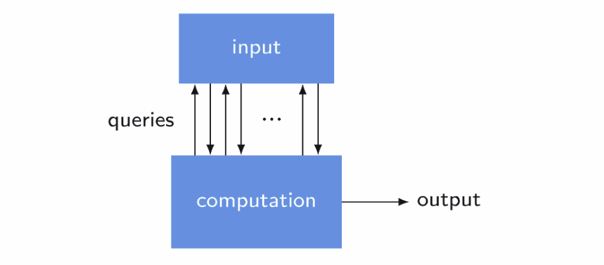

# 量子アルゴリズムの基礎

[こちら](https://learning.quantum.ibm.com/course/fundamentals-of-quantum-algorithms/quantum-query-algorithms)のページの翻訳

## 量子クエリアルゴリズム

### 導入

このコースでは、量子情報によってもたらされる計算上の利点を調査します。 つまり、量子コンピューターで何ができるのか、そして量子コンピューターが通常の古典コンピューターに比べてどのような利点を提供できるのかを考えます。 具体的には、たとえば複数の量子コンピュータがネットワーク上で相互作用する分散設定ではなく、単一の量子コンピュータで何ができるかに焦点を当てます。 (実際、通信と暗号化が関与する分散環境では量子の利点が見られますが、このトピックはこの単元の範囲外です。)

まず自然な質問から始めます。量子コンピューターが潜在的に提供できる利点は何ですか?

最初の潜在的な利点は、他のすべての利点の中で最も重要ですが、量子コンピューターが一部の計算問題に対してより高速な解決策を提供する可能性があることです。 時間は本当に貴重な資源です。そして、この可能性こそが、古典的なコンピューターでは解決できない特定の計算問題を量子コンピューターが解決できる可能性を秘めており、これが過去数十年間、量子コンピューティングの研究を推進してきました。

時間以外にも考慮できる計算リソースがあります。 計算の実行に必要なコンピューター メモリの量 (通常、計算に必要なスペースと呼ばれます) は、よく研究される 1 つの選択肢です。 しかし、結局のところ、量子コンピューターが宇宙利用において古典的なコンピューターに比べて利点を提供できる可能性は限られています。 コンピューターのメモリも比較的安価で、時間とは異なり、再利用できます。 これらの理由から、時間はより重要な問題であり、私たちは時間に主に焦点を当てます。

量子コンピューターにできないことの 1 つは、1930 年代にアラン・チューリングによって定式化された有名な停止問題など、古典的なコンピューターが解決できない問題 (必要なリソースに関係なく) に対して計算による解決策を提供することです。 量子コンピューターは古典コンピューターでシミュレートできるため、量子コンピューターで解決できる計算問題はすべて古典コンピューターでも解決できますが、古典コンピューターが解決策を見つけるには非常に長い時間がかかる可能性があります。

問題を解決するのに必要な時間は私たちの主な関心事ですが、この最初のレッスンでは、この焦点から少し逸れます。 私たちが行うことは、クエリ モデルとして知られる単純なアルゴリズム フレームワークを定式化し、このフレームワーク内で量子コンピューターが提供する利点を調査することです。

計算のクエリ モデルは、量子アルゴリズムのアイデアを表現するシャーレのようなものです。 これは、実際に私たちが一般に関心を持つ種類の計算問題を正確に表していないという意味で、厳密で不自然です。 それにもかかわらず、最もよく知られた量子アルゴリズム (Shor の因数分解アルゴリズムなど) を強化するものを含む、量子アルゴリズム技術を開発するためのツールとして非常に有用であることが証明されています。 これは、これらのテクニックを説明するための非常に役立つフレームワークでもあります。

クエリ モデルを紹介した後、最初に発見された量子アルゴリズムである Deutsch のアルゴリズムと、Deutsch-Jozsa アルゴリズムとして知られる Deutsch のアルゴリズムの拡張について説明します。 これらのアルゴリズムは、古典的なコンピューターに対する量子の定量的な利点を実証しており、実際、Deutsch-Jozsa アルゴリズムを使用して、クエリ モデル フレームワーク内の複数の計算問題を解決できます。 次に、サイモンのアルゴリズムとして知られる、関連する量子アルゴリズムについて説明します。このアルゴリズムは、後で説明する理由により、古典的な計算に比べて量子のより堅牢で満足のいく利点を提供します。

### 計算のクエリモデル

数学的な用語で計算をモデル化するときは、通常、次の図に示すようなプロセスを念頭に置きます。情報が入力として提供され、計算が行われ、出力が生成されます。

確かに、私たちが今日使用しているコンピューターは、継続的に入力を受け取り、出力を生成し、図には反映されていない方法で、基本的に私たちと他のコンピューターの両方と対話します。 ただし、ここでの目的は、コンピュータの進行中の動作を表すことではなく、むしろ、孤立した計算タスクに焦点を当てて、計算の単純な抽象化を作成することです。

たとえば、入力は数値、ベクトル、行列、グラフ、分子の説明、またはより複雑なものをエンコードする一方で、出力は私たちが念頭に置いている計算タスクの解決策をエンコードする可能性があります。 重要な点は、入力が通常バイナリ文字列の形式で計算に提供され、その一部が隠されることはないということです。

**詳細な説明**

一方、計算のクエリ モデルでは、入力全体が計算に提供されません。 むしろ、入力は関数の形式で利用可能になり、計算ではクエリを作成することで関数にアクセスします。 あるいは、クエリ モデルの計算は入力のビット (またはビットのセグメント) にランダムにアクセスすると考えることもできます。

クエリ モデルのコンテキストでは、入力はオラクルまたはブラック ボックスによって提供されるとよく呼ばれます。 どちらの用語も、入力の完全な説明は計算から隠されており、それにアクセスする唯一の方法は質問することであることを示唆しています。 それはあたかも私たちがインプットについてデルファイのオラクルに相談しているようなものです。彼女は知っているすべてを私たちに語ろうとはせず、特定の質問にのみ答えます。 ブラック ボックスという用語は、入力が関数で表されると考える場合に特に意味を持ちます。関数の内部を調べて関数がどのように機能するかを理解することはできず、選択した引数に基づいて関数を評価することしかできません。

レッスン全体を通してバイナリ文字列のみを扱うことになるので、簡潔にするためにバイナリ アルファベットを参照するために $\Sigma = \{0, 1\}$ と書きましょう。いくつかの簡単な例をすぐに説明しながら、さまざまな計算問題について考えますが、すべての入力は次の形式の関数で表されます。
$$
f: \Sigma^n \rightarrow \Sigma^m
$$
$n$と$m$は正の整数。
当然のことながら、代わりに$f$と別の名前を選択することもでき、レッスン全体では$f$を使い続けます。