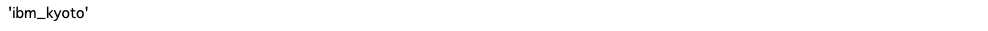
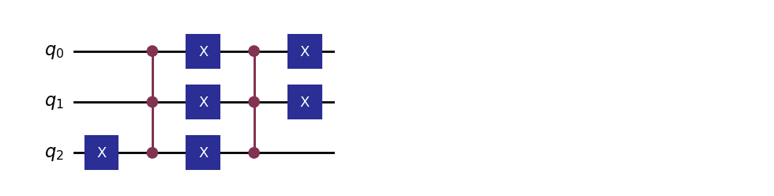
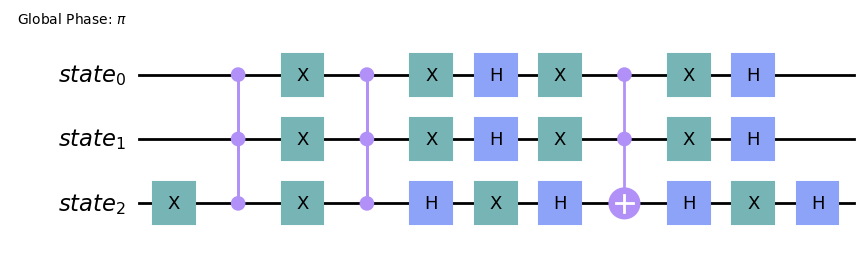
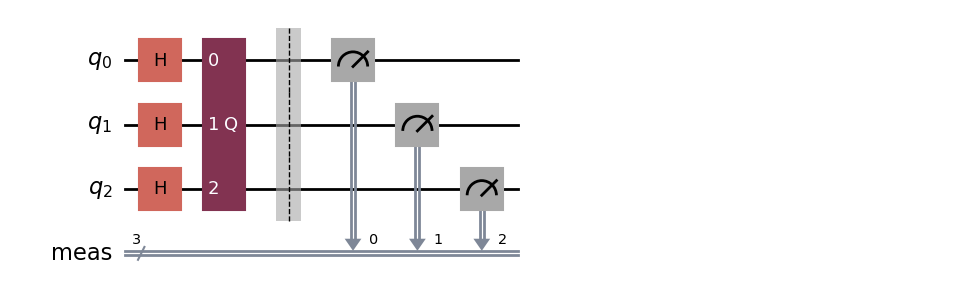
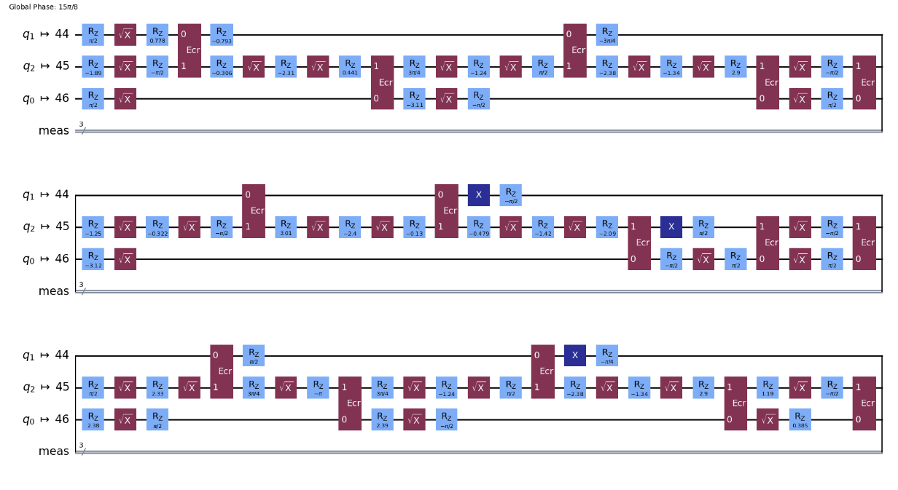
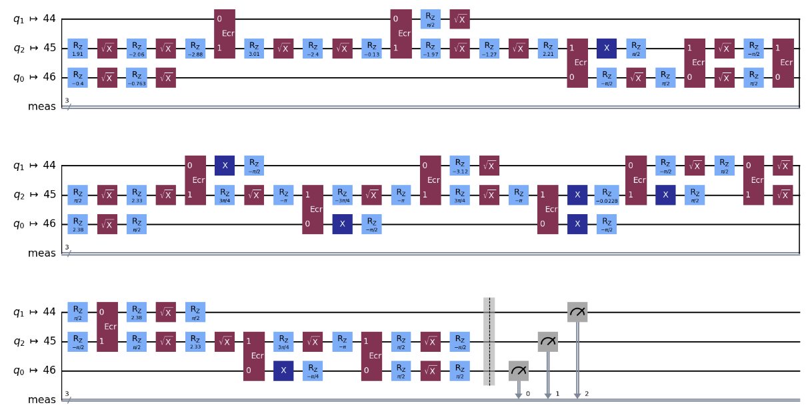

# グローバーのアルゴリズム

[こちら](https://learning.quantum.ibm.com/tutorial/grovers-algorithm)のページの和訳をしています。

## 背景

- 振幅増幅は汎用の量子アルゴリズム、またはサブルーチンである。
- 古典的なアルゴリズムよりも 2次の高速化を実現する。 
- [Grover のアルゴリズム](https://arxiv.org/abs/quant-ph/9605043)は、非構造化検索の問題における高速化を初めて実証した。 
- グローバー探索問題を定式化するには、オラクル関数と増幅回路が必要。
- ここでは、Grover オラクルを構築し、Qiskit 回路ライブラリの`GroverOperator`を使用して Grover の検索インスタンスを簡単にセットアップする方法を示します。 
- ランタイム `Sampler` プリミティブにより、自動コンパイル、エラー抑制、読み出しエラー軽減技術などの Grover 回路のシームレスな実行が可能になります。


## セットアップ

```python
import math
import warnings
warnings.filterwarnings('ignore')

from qiskit import QuantumCircuit
from qiskit.ircuit.library import GroverOperator, MCMT, ZGate
from qiskit.visualization import plot_distribution
```

```python 
# ハードウェアで実行するには、キュー内のジョブの数が最も少ないバックエンドを選択します
service = QiskitRuntimeService(channel='ibm_quantum')
backend = service.least_busy(operational=True, simulator=False)
backend.name
```


## Step1: 古典的な入力を量子問題にマッピングする

- グローバーのアルゴリズムでは[オラクル](https://learning.quantum.ibm.com/course/fundamentals-of-quantum-algorithms/grovers-algorithm) が必要
- オラクルは１つ以上のマーク付き計算基底状態を指す。
- 「マーク付き」とは、位相が -1 の状態を意味します。
- 制御ZゲートもしくはN量子ビットに渡る制御Zゲート一般化では、$2^N - 1$状態がマークされる。
- バイナリ表現で基底状態を1つ以上の`0`でマークするには、制御された Z ゲートの前後で対応する量子ビットに X ゲートを適用する必要があります。
- これは、量子ビット上にオープン コントロールを持つことと同等です。
- MCMT ゲートは、マルチ制御 Z ゲートを実装するために使用されます。

```python 
def grover_oracle(marked_states):
    """複数のマーク付きの状態の Grover オラクルを構築する

     ここでは、すべての入力マーク付き状態が同じビット数を持つと仮定します。

     パラメーター：
         marked_states (str または list): Oracle のマークされた状態

     戻り値：
         QuantumCircuit: Grover oracle を表す量子回路
    """
    
    if not isinstance(marked_states, list):
        marked_states = [marked_states]
    
    # 回路の量子ビットの数を数える
    num_qubits = len(marked_states[0])
    
    qc = QuantumCircuit(num_qubits)
    # インプットリストの各ターゲット状態にマークする
    for target in marked_states:
        # Qiskit のビット順序に一致するようにターゲット ビット文字列を反転します
        rev_target = target[::-1]
        
        # ビット文字列内のすべての「0」要素のインデックスを検索します
        zero_inds = [ind for ind in range(num_qubits) if rev_target.startswith('0', ind)]
        
        # ターゲット ビット文字列に「0」エントリがある、適用前および適用後の X ゲート (オープン コントロール) を備えたマルチ制御 Z ゲートを追加します。
        qc.x(zero_inds)
        qc.compose(MCMT(ZGate(), num_qubits - 1, 1), inplace=True)
        qc.x(zero_inds)
    return qc
```

**特定の Grover のインスタンス**

oracle 関数を用意したので、Grover 検索の特定のインスタンスを定義できます。 この例では、3 量子ビットの計算空間で利用可能な 8 つの計算状態のうち 2 つの計算状態をマークします。

```python 
marked_states = ['011', '100']

oracle = grover_oracle(marked_states)
oracle.draw(output='mpl', style='iqp')
```


**特定のGroverのインスタンス**

oracle 関数を用意したので、Grover 検索の特定のインスタンスを定義できます。 この例では、3 量子ビットの計算空間で利用可能な 8 つの計算状態のうち 2 つの計算状態をマークします。

```python 
marked_states = ['011', '100']

oracle = grover_oracle(marked_states)
oracle.draw(output='mpl', style='iqp')
```


**GroverOperator**

組み込みの Qiskit GroverOperator は、オラクル回路を受け取り、オラクル回路自体と、オラクルによってマークされた状態を増幅する回路で構成される回路を返します。 ここでは、回路を分解して演算子内のゲートを確認します。

```python 
grover_op = GroverOperator(oracle)
grover_op.decompose().draw(output='mpl', style='oqp')
```


この `grover_op` 回路を繰り返し適用すると、マークされた状態が増幅され、回路からの出力分布で最も可能性の高いビット文字列になります。 このようなアプリケーションの最適な数は、可能な計算状態の総数に対するマークされた状態の比率によって決まります。

```python 
optimal_num_iterations = math.floor(
    math.pi / (4 * math.asin(math.sqrt(len(marked_states) / 2**grover_op.num_qubits)))
)
```

**Full Grover circuit**

完全なグローバー実験は、各量子ビットのアダマール ゲートから始まります。 すべての計算基底状態の均等な重ね合わせを作成し、続いて Grover オペレーター ( `grover_op` ) を最適な回数繰り返しました。 ここでは、`QuantumCircuit.power(INT)` メソッドを利用して、Grover オペレーターを繰り返し適用します。

```python 
qc = QuantumCircuit(grover_op.num_qubits)

# 全ての基本状態の重ね合わせを作る
qc.h(range(grover_op.num_qubits))

# Grover 演算子を最適な回数適用する
qc.compose(grover_op.power(optimal_num_iterations), inplace=True)

# 全量子ビットを測定
qc.measure_all()
qc.draw(output='mpl', style='iqp')
```



## Step2: 量子実行用に問題を最適化する

```python 
from qiskit.transpiler.preset_passmanagers import generate_preset_pass_manager

target = backend.target
pm = generate_preset_pass_manager(target=target, optimization_level=3)

circuit_ibm = pm.run(qc)
circuit_ibm.draw(output="mpl", idle_wires=False, style="iqp")
```



## Step3: Qiskitプリミティブを使用して実行

```python 
# ローカルシミュレータで実行するには:
# 1. 代わりに qiskit.primitives のサンプラーを使用します
# 2. 以下のバッチ コンテキスト マネージャーを削除します。

from qiskit_ibm_runtime import QiskitRuntimeService, Sampler, Batch
with Batch(backend=backend) as batch:
    sampler = Sampler()
    dist = sampler.run(circuit_ibm, skip_transpilation=True, shots=10000).result().quasi_dists[0]
```
エラーが出るので、他で解決してから戻ってこよう。

```
---------------------------------------------------------------------------
ImportError                               Traceback (most recent call last)
Cell In[29], line 5
      1 # ローカルシミュレータで実行するには:
      2 # 1. 代わりに qiskit.primitives のサンプラーを使用します
      3 # 2. 以下のバッチ コンテキスト マネージャーを削除します。
----> 5 from qiskit_ibm_runtime import QiskitRuntimeService, Sampler, Batch
      6 with Batch(backend=backend) as batch:
      7     sampler = Sampler()

ImportError: cannot import name 'Batch' from 'qiskit_ibm_runtime' (/opt/homebrew/lib/python3.11/site-packages/qiskit_ibm_runtime/__init__.py)
```