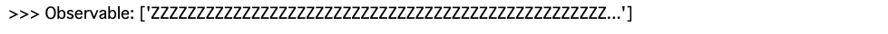

# プリミティブでの実行

このページは[こちら](https://docs.quantum.ibm.com/run/primitives)のサイトの和訳

## プリミティブの導入

コンピューティング システムは、複数の抽象化レイヤーに基づいて構築されています。 抽象化により、目の前のタスクに関連する特定の詳細レベルに焦点を当てることができます。 ハードウェアに近づくほど、必要な抽象化レベルは低くなり (たとえば、電気信号を操作したい場合など)、その逆も同様です。 実行したいタスクが複雑になるほど、抽象化のレベルは高くなります (たとえば、プログラミング ライブラリを使用して代数計算を実行できます)。

この文脈では、プリミティブは最小の処理命令であり、特定の抽象化レベルに役立つものを作成できる最も単純な構成要素です。

量子コンピューティングの最近の進歩により、より高い抽象レベルで作業する必要性が高まっています。 私たちがより大規模なシステムとより複雑なワークフローに移行するにつれて、焦点は個々の量子ビット信号との相互作用から、量子デバイスを必要なタスクを実行するシステムとして見ることに移ります。

量子コンピューターが使用される 2 つの最も一般的なタスクは、量子状態のサンプリングと期待値の計算です。 これらのタスクは、最初の 2 つの Qiskit® プリミティブ、Sampler と Estimator の設計の動機となりました。

つまり、Qiskit プリミティブによって導入された計算モデルは、量子プログラミングを今日の古典的なプログラミングの状態に一歩近づけます。そこでは、ハードウェアの詳細よりも、達成しようとしている結果に重点が置かれています。

### Qiskit プリミティブの実装

Qiskit プリミティブは、オープンソースのプリミティブ基本クラスによって定義され、さまざまなプロバイダーがそこから独自のサンプラーおよびエスティメーターの実装を派生できます。 Qiskit を使用した実装の中には、ローカル シミュレーション用のリファレンス プリミティブ実装が `qiskit.primitives` モジュールにあります。 Qiskit Runtime のようなプロバイダーは、独自のプリミティブのネイティブ実装を通じて適切なシステムへのアクセスを可能にします。

---
**重要**
より高速かつ効率的な結果を確保するには、2024 年 3 月 1 日以降、回路とオブザーバブルは、Qiskit ランタイムに送信される前に、システムでサポートされている命令 (命令セット アーキテクチャ (ISA) 回路およびオブザーバブルと呼ばれます) のみを使用するように変換する必要があります。 プリミティブ。 回路を変換する手順については、[トランスパイルのドキュメント]()を参照してください。 この変更により、プリミティブはレイアウトまたは配線操作を実行しなくなります。 したがって、それらのタスクを参照するトランスパイル オプションは何の効果も持たなくなります。 ユーザーは、`options.transpilation.skip_transpilation` を介してプリミティブが入力回路を最適化しないように要求することもできます。

-----

### Qiskit プリミティブの利点

Qiskit ユーザーの場合、プリミティブを使用すると、すべての詳細を明示的に管理することなく、特定のシステムの量子コードを作成できます。 さらに、抽象化レイヤーが追加されたため、特定のプロバイダーの高度なハードウェア機能に簡単にアクセスできる場合があります。 たとえば、Qiskit ランタイム プリミティブを使用すると、これらの手法の独自の実装を構築するのではなく、`optimization_level` や `resilience_level` などのオプションを切り替えることで、エラーの軽減と抑制における最新の進歩を活用できます。

ハードウェア プロバイダーにとって、プリミティブをネイティブに実装することは、ハードウェア機能にアクセスするための、より「すぐに使える」方法をユーザーに提供できることを意味します。 したがって、ユーザーはハードウェアの最高の機能の恩恵を受けることが容易になります。

### Estimator

Estimator プリミティブは、量子回路によって準備された状態に関するオブザーバブルの期待値を計算します。 Estimator は、回路観測可能なペア (パウリ演算子の加重和として表現される観測可能) を入力として受け取り、ペアごとに計算された期待値とその分散を返します。 さまざまな Estimator 実装がさまざまな構成オプションをサポートしています。 パラメータ値もプリミティブへの入力として提供される限り、回路はパラメータ化できます。

### Sampler

サンプラー プリミティブは、量子回路の実行によって得られる古典的な出力レジスタからサンプリングします。 このため、サンプラーへの入力は (パラメーター化された) 量子回路であり、サンプリングされたビット列の対応する準確率分布を返します。 準確率分布は通常の確率に似ていますが、負の値が含まれる場合があり、これは特定のエラー軽減手法を使用するときに発生する可能性があります。

### Qiskit プリミティブの使用方法

`qiskit.primitives` モジュールは、プリミティブ スタイルの量子プログラムの開発を可能にし、異なるタイプのシステム間の切り替えを簡素化するように特別に設計されました。 このモジュールは、プリミティブ型ごとに 3 つの個別のクラスを提供します。

1. `Sampler` and `Estimator`

これらのクラスは両方のプリミティブの参照実装であり、Qiskit の組み込みシミュレーターを使用します。 バックグラウンドで Qiskit の `quantum_info` モジュールを活用し、理想的な状態ベクトル シミュレーションに基づいた結果を生成します。

2. `BaseSampler` and `Base Estimator`

これらは、プリミティブを実装するための共通インターフェイスを定義する抽象基本クラスです。 `qiskit.primitives` モジュール内の他のすべてのクラスはこれらの基本クラスを継承しており、開発者が特定のシステム プロバイダー向けに独自のプリミティブ ベースの実行モデルを開発することに興味がある場合は、これらを使用する必要があります。 これらのクラスは、高度にカスタマイズされた処理を実行したいが、既存のプリミティブの実装がニーズに対して単純すぎると感じている人にとっても役立つ場合があります。

3. `BackendSampler` and `BackendEstimator`

プロバイダーがプリミティブをネイティブにサポートしていない場合は、これらのクラスを使用して、任意のシステムをプリミティブに「ラップ」できます。 ユーザーは、プリミティブ ベースのインターフェイスをまだ備えていないプロバイダー用にプリミティブ スタイルのコードを作成できます。 これらのクラスは、実行するシステムを選択するために追加のバックエンド引数を使用して初期化する必要があることを除いて、通常のサンプラーおよびエスティメーターと同じように使用できます。

Qiskit ランタイム プリミティブは、クラウドベースのサービスとして、より高度な実装 (エラー軽減など) を提供します。

## Get started with primitives

このトピックの手順では、プリミティブをセットアップし、プリミティブの構成に使用できるオプションを調べて、プログラムでプリミティブを呼び出す方法について説明します。

### Estimatorを始める

1. アカウントを初期化

Qiskit Runtime Estimator はマネージド サービスであるため、最初にアカウントを初期化する必要があります。 次に、期待値の計算に使用するシミュレーターまたは実際のシステムを選択できます。

まだアカウントをお持ちでない場合は、「インストールとセットアップ」トピックの手順に従ってください。

```python
from qiskit_ibm_runtime import QiskitRuntimeService

# service = QiskitRuntimeService()# うまくいかなかったので下を使用
service = QiskitRuntimeService(channel='ibm_quantum', token='my api token')
backend = service.backend('ibm_brisbane')
```

2. 回路とオブザーバブルを作成する

前のセクションと同様に、少なくとも 1 つの回路と、`Estimator` プリミティブへの入力として 1 つのオブザーバブルが必要です。

```python 
import numpy as np
from qiskit.circuit.library import IQP
from qiskit.transpiler.preset_passmanagers import generate_preset_pass_manager
from qiskit.quantum_info import SparsePauliOp, random_hermitian

n_qubits = 127

mat = np.real(random_hermitian(n_qubits, seed=1234))
circuit = IQP(mat)
observable = SparsePauliOp('Z' * n_qubits)
print(f">>> Observable: {observable.paulis}")
```



回路とオブザーバブルは、システムでサポートされている命令のみを使用するように変換する必要があります。 これを行うにはトランスパイラーを使用します。


```python
# pm = generate_preset_pass_manager(backend=backend, ) # 引数にOptimization_levelが必要だと怒られた。
pm = generate_preset_pass_manager(backend=backend, optimization_level=3)
isa_circuit = pm.run(circuit)
isa_observable = observable.apply_layout(isa_circuit.layout)
```

3. Qiskit ランタイム推定ツールを初期化する

ここでは、Qiskit Runtime の Estimator 実装を使用するために、`qiskit.primitives.Estimator` の代わりに `qiskit_ibm_runtime.Estimator` のインスタンスを初期化しています。

`Estimator` を初期化するときは、以前にターゲット デバイス (またはシミュレーター) として選択したシステムまたはシミュレーターを渡す必要があります。 これを`session`パラメータ内で行うこともできます。

```python 
from qiskit_ibm_runtime import Estimator

estimator = Estimator(backend=backend)
```

4. Estimator を呼び出して結果を取得する

その後、 run() メソッドを呼び出して、入力回路とオブザーバブルの期待値を計算できます。

```python
job = estimator.run(isa_circuit, isa_observable)
print(f'>>> Job ID: {job.job_id()}')
print(f'>>> Job Status: {job.status()}')
```

```python
result = job.result()
print(f'>>> {result}')
print(f'   > Expectation value: {result.values[0]}')
print(f'   > Metadate: {result.metadata[0]}')
```

