# Practice1

## Q1. 古典NOTゲートに当たる量子ゲートは以下のうちどれ。

- (正解)Xゲート
- (不正解)Z, Y, H, Sゲート

## Q2. Sゲートを２回行うのと等しいゲートはどれ

- (正解)Tゲート
- (不正解)S-dagger, Z, Y, Rx($\pi$/4)
- $$ S = P_{\pi/2} = \begin{pmatrix}1&0\\0&i\end{pmatrix}$$
- $$ T = P_{\pi/4} = \begin{pmatrix} 1&0\\0&\frac{1+i}{\sqrt{2}}\end{pmatrix} $$


## Q3. 測定に用いる軸周りに状態ベクトルを回転しないゲートを以下から２つ選べ。

- (正解)Xゲート, Yゲート
- (不正解)Z, T, Sゲート
- XとYゲートはx軸、y軸周りに反時計回りで$\pi$rad回転させる。Z, S, TゲートはZ軸周りに回転する。

## Q4. 次のゲートのうち非自発的(involutary)なゲートはどれ。

- (正解)X, Y, Z, Iゲート
- (不正解)S, Tゲート
- 以下の性質を満たす時ゲートはinvolutary(非自発的?)という。$$A^2 = I$$
- $S^2 = Z, T^2 = S$なのでこれは満たさない。

## Q5. 常にエルミートなゲートはどれ

- (正解)X, Y, Z, H, Iゲート
- (不正解)Rx, Ry, Rz, 
- ゲートがエルミート(共役転置)の時、$$A^* = A$$を満たす

## Q6. 正しくないものを２つ選べ

- (正解)$SS = T, ZZ = T$
- (不正解)$XX = I, IX = XI, TT = S$

## Q7. 関係性が正しいものを２つ選べ

- (正解)
  - Inverse of X is X
  - P($\pi$) = Z
  - TTTT = Z(T^5にタイポしている)
  - $\sqrt{Z}$ = S
- (不正解)
  - None of the above

## Q8. Xが等しいのは

- (正解)HZH
- (不正解)TZT, YHY, ZYZ

## Q9. PゲートがZと等しくなる引数$\phi$の値は？

- $$P(\phi) = \begin{pmatrix} 1&0\\0&e^{i\phi} \end{pmatrix}$$
- (正解)$\phi = \pi$

## 10. Hに等しいのは

- (正解)$Z \sqrt{X}$
- $$\begin{aligned}H &= XY^{1/2}\\H &= Y^{-1/2}X\\H &= ZY^{-1/2}\\H &= Y^{1/2}Z\end{aligned}$$

## 11. HHに等しいのは

- (正解)I
- (不正解)H, X, Y, Z

## 12. 次のゲートのうち、ユニバーサルなのは

- (正解)All of the above
  - Rotational gate+H
  - CX, H and P
  - U gate
- ゲートのユニバーサルセットは
  1. 回転ゲート(Rx, Ry, Rz)とH
  2. CX, HとP
  3. Uゲート
- これらのユニバーサルゲートの組みはブロッホ級表面の任意の点に移動できる状態ベクトルであるため'ユニバーサル'と呼ばれる。

## 13. 次の回路で得られる状態はどれか。


- (正解)$\frac{1}{\sqrt{2}}(\ket{00} + \ket{11})$

## 14. 以下のゲートが表しているのは


- (正解)CX gate with q0 as control qubit and q1 as target bit

## 15. Yゲートの演算子は

- (正解)$Y = \begin{pmatrix}0&-i\\i&0\end{pmatrix}$

## 16. Zゲートの演算子は

- (正解)$\begin{pmatrix}1&0\\0&-1\end{pmatrix}$

## 17. Xゲートの固有状態のベクトルは

- (正解)$\ket{+}$と$\ket{-}$

## 18. Xゲートの固有値は

- (正解)$+1$と$-1$

## 19. 次の量子回路の測定後の状態ベクトルとその確率はどれか


- (正解)$\ket{11}; 100\%$

## 20. 次の回路と等しいのは


- (正解)$I$

## 21. $U(\theta, \phi, \lambda)$とHゲートが等しくなるのは

- (正解)$U(\pi/2,  0, 0)$
- $$U(\theta, \phi, \lambda) = \begin{pmatrix}\cos{\frac{\theta}{2}}&-e^{i\lambda}\sin{\frac{\theta}{2}}\\e^{i\phi\sin{\frac{\theta}{2}}}&e^{i(\phi+\lambda)}\cos{\frac{\theta}{2}}\end{pmatrix}$$
- $$U(\pi/2,0, 0) = \frac{1}{\sqrt{2}}\begin{pmatrix}1&1\\1&-1\end{pmatrix}$$

## 22. 以下のうちユニタリーなのは

- (正解)H
- (不正解)$2X, H+X$, $\frac{1}{2}H$

## 23. 3量子ビットと2古典ビットを生成するコードはどれ

- (正解)qc = QuantumCircuit(3, 2)

## 24. 最大限のもつれ回路を生成するコードはどれ

- (正解)
```python
qc = QuantumCircuit(2)
qc.h(0)
qc.cx(0, 1)
```

## 25. 以下のコードを実行した時$\ket{0}$の測定確率はいくつか

```python
qc = QuatnumCircuit(1)
qc.rx(3*math.pi/4)
```

- (正解)0.1464
$$
\begin{aligned}
Rx(\theta) \ket{0} &= \begin{pmatrix}
\cos{\frac{\theta}{2}} & -i\sin{\frac{\theta}{2}}\\
-i\sin{\frac{\theta}{2}}&\cos{\frac{\theta}{2}} 
\end{pmatrix} 
\begin{pmatrix}
1\\0
\end{pmatrix}
\\
&=\cos{\frac{\theta}{2}}\ket{0} -i \sin{\frac{\theta}{2}}\ket{1}
\end{aligned}
$$
より、
$$
\begin{aligned}
Pr(\theta = \frac{3\pi}{4}, \ket{0}) = \cos^2{\frac{3\pi}{8}}
\end{aligned}
$$
半角の公式
$$
\begin{aligned}
\cos^2{\frac{\alpha}{2}} = \frac{1 + \cos{\alpha}}{2}
\end{aligned}
$$
であるから、
$$
\begin{aligned}
\cos^2{\frac{3\pi}{8}} &= \frac{1 + \cos{3\pi/4}}{2}\\
&= \frac{2 - \sqrt{2}}{4}\\
&\sim \frac{0.6}{4}\\
&\sim 0.15
\end{aligned}
$$

## 26. 次の状態ベクトルが与えられるコードはどれ


- (正解)

```python
from qiskit import QuantumCircuit, assemble, Aer
from math import pi, sqrt
from qiskit.visualization import plot_bloch_multivector, plot_histogram

sim = Aer.get_backnd('aer_sumulator')
qc = QuantumCircuit(2)
qc.h(0)
qc.cx(0, 1)
qc.x(0)
```

- $\ket{01}$と$\ket{10}$のもつれを作り出す

$$
\begin{aligned}
\ket{00}
&\xrightarrow{h(0)} \frac{1}{\sqrt{2}} (\ket{00} + \ket{01})\\
&\xrightarrow{cx(0, 1)} \frac{1}{\sqrt{2}}(\ket{00} + \ket{11})\\
&\xrightarrow{x(0)} \frac{1}{\sqrt{2}}(\ket{01} + \ket{10})
\end{aligned}
$$

## 27. トフォリゲートを含む量子回路はどれか

```python
qc = QuantumCircuit(3)
# enter code here
```

- (正解)暗記する。
  - `qc.mct([0, 2], 1)`
  - `qc.ccx(0, 1, 2)`
  - ```c2x = CXGate.control(); qc.append(c2x, [1, 2, 0])```

## 28. 以下の回路の深さはいくつか

```python
qc = QuantumCircuit(3, 3)
qc.x(0)
qc.h(1)
qc.cx(0, 1)
qc.h(2)
qc.cx(0, 2)
qc.draw()
```

- (正解)3


- `qc.depth()`で確かめられる

## 29. 以下の回路の深さはいくつか


- (正解)4


## 30. BasicAerで使用できないシミュレータはどれ

- (正解)quantum_simulator
- (不正解)BasicAerで使用できる。
  - qasm_simulator
  - statevector_simulator
  - unitary_simulator

## 31. BasicAerとはなにか

- (正解)
  - Pythonベースの量子シミュレーターモジュール。シミュレータはBasicAerプロバイダーからアクセスできる
- (不正解)
  - qiskitで利用できる量子コンピューティングランタイムの一種
  - IBMクラウドで利用できる量子コンピュータのシミュレーションフレームワークの一種
  - 量子回路を表現できるpythonのパッケージ

## 32. 以下の条件で実行すべきコードはどれか

【条件】QASMシミュレータを使用し、量子ビット上で[custom_coupling]を用いて、1024回回路を測定する。

- (正解)

```python
from qiskit import QuantumCircuit, execute, BasicAer

simulator = BasicAer.get_backend('qasm_simulator')

qc = QuantumCircuit(3)
qc.measure_all()

custom_coupling = [[0, 1], [1, 2], [2, 0]]

job  = execute(qc, simulator, coupling_map=custom_coupling)
result = job.result()
counts = result.get_counts(qc)
```

- executeの引数(qc, simulator, coupling_map = ***)が大事

## 33. Qiskitの実行の最適化をコントロールするパラメータはどれか

- (正解)`optimization_level`

## 34. 以下のコードのうち、与えられた設定で回路を実行できるのは

【設定】
- 1236回測定する
- Unitary SImulatorを使う
- custom couplingを使用せず、latexフォーマットで出力する。

- (正解)

```python
from qiskit import QuantumCircuit, execute, BasikAer

simulator = BasicAer.get_backend('unitary_simulator')
qc = QuantumCircuit(3)

job = execute(qc, simulator, shots=1236)

result = job.result().get_unitary()
result = array_to_latex(result)
result
```

- 答えが同じのがたくさんあるクソ問

## 35. 次のコードのうち、どの部分でエラーが発生するか


- (正解)エラーは発生しない


## 36. Aerで使用できるシミュレーターはどれ

- (正解)
  - pulse_simulator
  - qasm_simulator
  - statevector_simulator
  - unitary_simulator
- (不正解)
  - ibmq_simulator

## 37. 状態ベクトルシミュレータオブジェクトを使用する際にバックエンドに適切に取り込むのはどのコードか

- (正解)`backend = BasicAer.get_backend('statevector_simulator')`

## 38. `qasm_file`を量子回路`qc`に組み込むのにどのコードが適切か

- (正解)`qc = QuantumCircuit.from_qasm_file('qasm_file')`

- qasm stringから読み取る方法もある

```python
from qiskit import QuantumCircuit
circuit = QuantumCircuit.from_qasm_str("""
OPENQASM 2.0;
include "qelib1.inc";
qreg q[2];
cz q[0], q[1];
u(2*pi, 3*pi, -5*pi) q[0];
""")
circuit.draw('mpl')
```

## 39. Xゲートを表しているのはどれ

- (正解)

```python
qc = QuantumCircuit(1)
qc.x(0)
op = Operator(qc)
```

## 40. ２つの演算子`op1`と`op2`について、`average_gate_fidelity()`と`process_fidelity()`が１であることが意味することは

- (正解)`op1 = exp(op2)`
- 2 つのオペレーター間にグローバル位相差のみがある場合、`average_gate_fidelity()` と `process_fidelity()` は 1 になります。
- 意味わからん
  
- [average_gate_fidelityについて](https://docs.quantum.ibm.com/api/qiskit/0.19/qiskit.quantum_info.average_gate_fidelity)
- [process_fidelityについて](https://docs.quantum.ibm.com/api/qiskit/0.37/qiskit.quantum_info.process_fidelity)

## 41. 次のコードの出力結果は

```python
qc = QuantumCircuit(2, 2)
qc.h(0)
qc.measure([0, 1], [0, 1])
simulator = Aer.get_backend('qasm_simulator')
result = execute(qc, simulator, shots=1024).result()
counts = result.get_counts(qc)
print(counts)
```

- (正解)`{'00': 512, '01': 512}`

## 42. 量子回路qcの深さはどれで得られるか

- (正解)`qc.depth()`

## 43. コードが与えられる。考えられるすべての量子ビット状態に対して等しいカウントを生成する回路を作成するのは、どのコードか

```python
input_reg = QuantumRegister(2, name='input')
ancilla = QuantumRegister(1, name = 'ancilla')
qc = QuantumCircuit(input_reg, ancilla)
# Insert code
qc.measure_all()
```

- (正解)

```
input_reg.h(0)
input_reg.h(1)
ancilla.h(1)
```

## 44. 3量子ビットを含む量子回路qcにおいて、量子ビットにbarrierを追加する操作はどれ

- (正解)`qc.barrier()`

## 45. 実行時、以下の画像で与えられる回路図を生成するコードはどれ

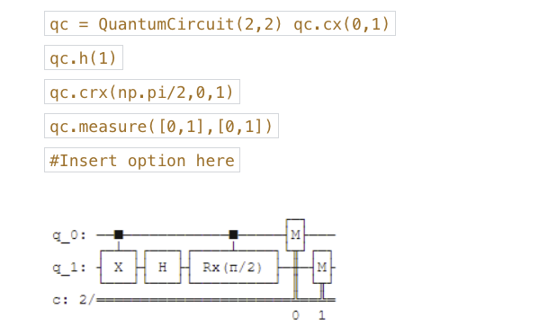

- (正解)`qc.draw(text)`

## 46. 次のうち測定を伴う量子回路を生成するコードはどれ

- (正解)`qc = random_circuit(2, 2, measure=True)`

## 47. jobのステータスを知るコードはどれ

- (正解)`job.status()`

## 48. バックエンドで使用できるハードウェアに関するすべての情報を得るコードはどれ

- (正解)`%qiskit_backend`

## 49. 次のコードの目的は何?`%qiskit_job_watcher`

- (正解)ユーザーの画面上にjobのポップを作成する

## 50. SWAPゲートの図はどれ

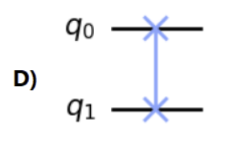

## 51. 次のヒストグラムを作成する回路はどれ

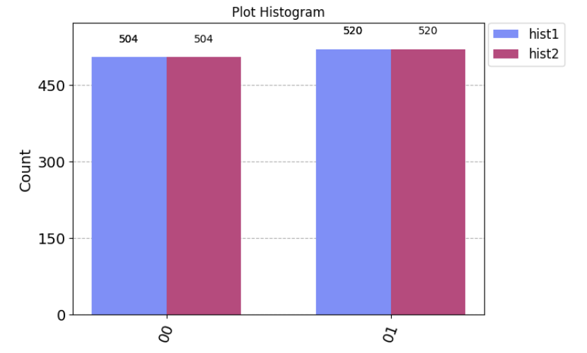

- (正解)

```python
qc = QuantumCircuit(2)
qc.h(0)
qc.cx(1, 0)
qc.x(0)
qc.measure_all()
legend = ['hist1', 'hist2']

back_end = Aer.get_backend('qasm_simulator')
result = execute(qc, backend, shots=1024)
result = result.result()
[count1, count2] = [result.get_counts(), result.get_counts()]
plot_histogram([counts1, counts2], legend=legend, title='Plot Histogram')
```

## 52. 以下のコードのうち描画されるのはどのqsphereか

```python
from qiskit.quantum_info import Statevector
from qiskit.visualization import plot_state_qsphere

qc = QuantumCircuit(2)
qc.h(0)
qc.cx(0, 1)
qc.cz(1, 0)

state = StateVector.from_instruction(qc)
plot_state_qsphere(state)
```

- (正解)

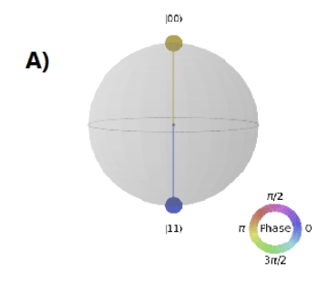

$$
\begin{aligned}
    \ket{00} 
    &\xrightarrow{h(0)} \frac{1}{\sqrt{2}} (\ket{00} + \ket{01})\\
    &\xrightarrow{cx(0, 1)} \frac{1}{\sqrt{2}}(\ket{00} + \ket{11})\\
    &\xrightarrow{cz(1, 0)} \frac{1}{\sqrt{2}}(\ket{00} - \ket{11})
\end{aligned}
$$

- $\ket{00}$と$\ket{11}$が同時にあり、かつ位相が$\pi$だけ異なる図が正解

## 53. 次の回路を生み出すコードはどれ

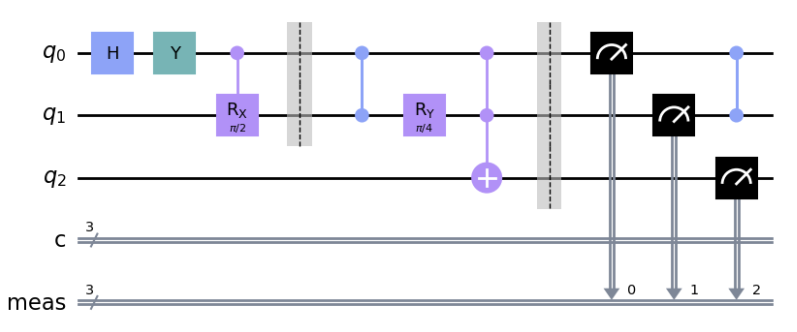

```python
qc = QuantumCircuit(3, 3)
qc.h(0)
qc.y(0)
qc.crx(np.pi/2, 0, 1)
qc.barrier(0, 1)
qc.cz(0, 1)
qc.ry(np.pi/4, 1)
qc.ccx(0, 1, 2)
qc.measure_all()
qc.cz(1, 0)

qc.draw()
```

## 54. 以下の図を生成するコードはどれ

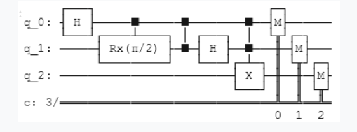

- 正解

```python
qc = QuantumCircuit(3, 3)
qc.h(0)
qc.crx(np.pi/2, 0, 1)
qc.cz(0, 1)
qc.h(1)
qc.ccx(0, 1, 2)

qc.measure([0, 1, 2], [0, 1, 2])
qc.draw('text')
```

## 55, 以下のstate city plotを得られるコードはどれ

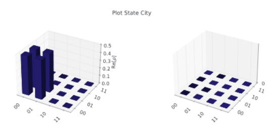

- (正解)

```python
qc = QuantumCircuit(2, 2)
qc.h(0)
qc.cx(1, 0)

backend = BasicAer.get_backend('statevector_simulator')
job = execute(qc, backend).result()
plot_state_city(
    job.get_statevector(qc), 
    color=['midnightblue', 'midnightblue'], 
    title='Plot State City')
```

状態は
$$
\begin{aligned}
    \ket{00} 
    &\xrightarrow{h(0)} \frac{1}{\sqrt{2}}(\ket{00} + \ket{01})\\
    &\xrightarrow{cx(1, 0)} \frac{1}{\sqrt{2}}(\ket{00} + \ket{01})
\end{aligned}
$$
となる。密度行列$\rho$は
$$
\begin{aligned}
    \rho &= \ket{\psi}\bra{\psi}\\
    &= \frac{1}{\sqrt{2}}(\ket{00} + \ket{01}) \frac{1}{\sqrt{2}}(\bra{00} + \bra{01})\\
    &= \frac{1}{2}(\ket{00} + \ket{01})(\bra{00} + \bra{01})
\end{aligned}
$$
となる。
$(\ket{00}\bra{00},~ \ket{00}\bra{01},~ \ket{01}\bra{00},~ \ket{01}\ket{01})$が同じ高さで描画される。

## 56. 以下のブロッホ球を作成するコードはどれか

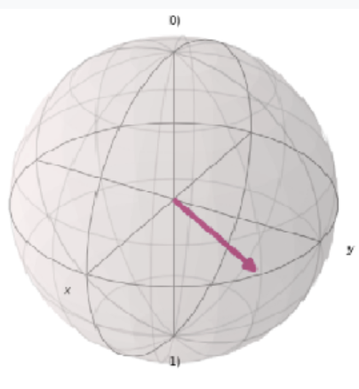

- (正解)`plot_bloch_bector([1, np.pi/2. np.pi/3], coord_type='spherical')`

## 57. 以下のコードによって生成されるhintonプロットはどれか

```python
import numpy as np
from qiskit import QuantumCircuit
from qiskit.quantum_info import DensityMatrix
from qiskit.visualization import plot_state_hinton

qc = QuantumCircuit(2)
qc.h(0)
qc.cx(0,1)

state = DensityMatrix(qc)
plot_state_hinton(state, title='New Hinton Plot')
```

- (正解)

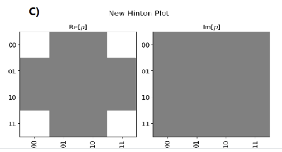

$$
\begin{aligned}
\ket{\psi} = \frac{1}{\sqrt{2}} (\ket{00} + \ket{11})
\end{aligned}
$$
について、量子回路の密度行列は
$$
\begin{aligned}
\rho &= \ket{\psi}\bra{\psi}\\
&= \frac{1}{2}(\ket{00}\bra{00} + \ket{00}\bra{11} + \ket{11}\bra{00} + \ket{11}\bra{11})\\
&=\frac{1}{2}
\begin{pmatrix}
1&0&0&1\\
0&0&0&0\\
0&0&0&0\\
1&0&0&1
\end{pmatrix}
\end{aligned}
$$
となるので実部、虚部についてそれぞれ正解の図のようになる。

## 58. 以下のパウリベクトル*state+paulivec*プロットを作成するコードはどれか

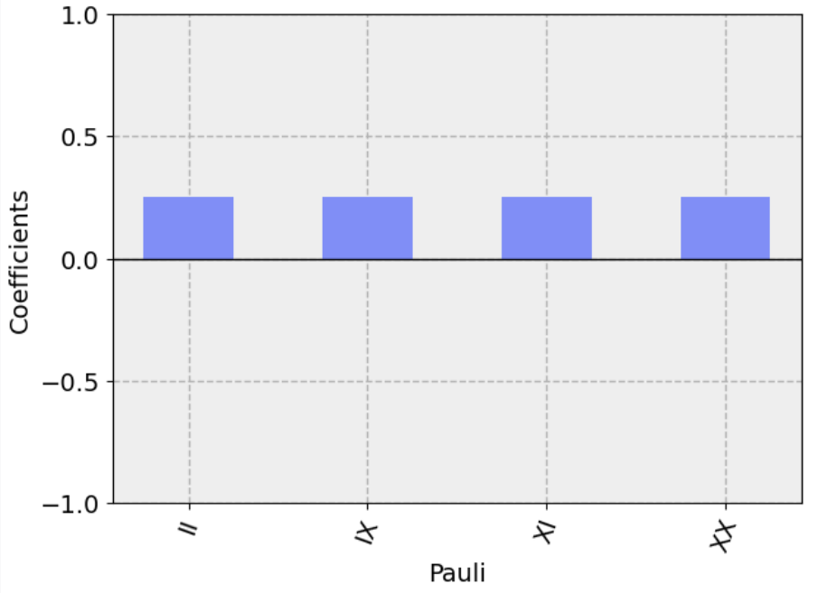

- (正解)

```python
qc = QuantumCircuit(2)
qc.h(0)
qc.h(1)

backend = BasicAer.get_backend('statevector_simulator')
result = job.result()
state_vec = result.get_state_vector()
plot_state_paulivec(state_vec)
```

$$
\begin{aligned}
\ket{\psi} &= \frac{1}{2}(\ket{00} + \ket{01} + \ket{10} + \ket{11})\\
&= \frac{1}{2}(II + IX + XI + XX)
\end{aligned}
$$

## 59. 以下のコードで作成されるブロッホベクトルはどれ

```python
from qiskit.quantum_info import DensityMatrix
qc = QuantumCircuit(2)
qc.h([0])
qc.cx(0, 1)

matrix = DensityMatrix(qc)
plot_bloch_multivector(matrix, title='Bloch Spheres', reverse_bits=True)
```
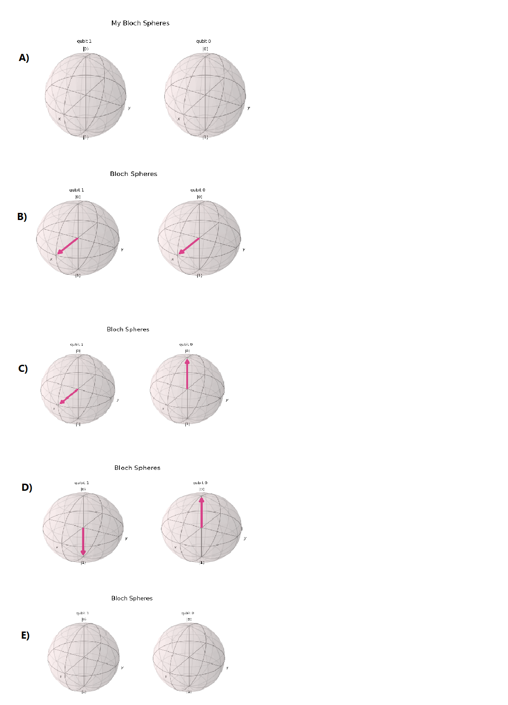

- (正解)E
- 量子もつれ状態はここの量子ビットの表現が不可能なので空白になる。タイトルも間違えないように選択する

## 60. 指定されたバックエンドのゲート マップをプロットする命令は次のどれですか?

- (正解)`backend.gate_map()`
