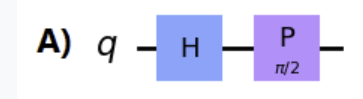
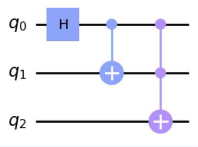
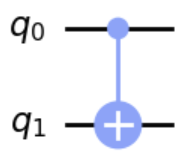
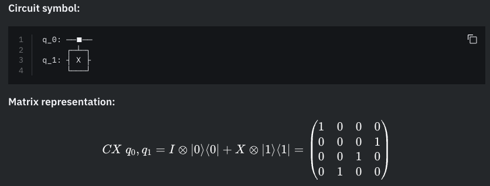
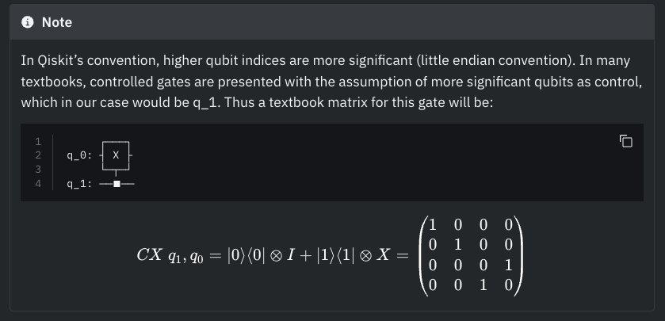
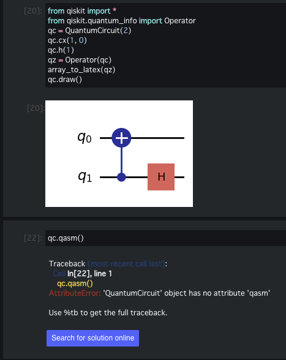
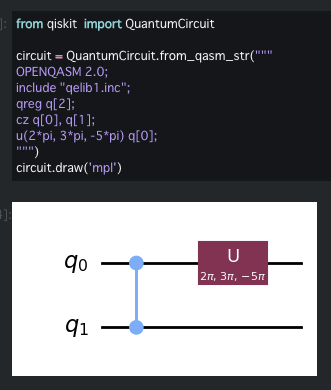

# Practice2

## 1. 制御量子ビットに関係なくpな事項かを表す制御ゲートはどれか

- (正解)CZ

$$
\begin{aligned}
    CZ(0, 1) = CZ(1, 0) = 
    \begin{pmatrix}
    1&0&0&0\\
    0&1&0&0\\
    0&0&1&0\\
    0&0&0&-1\\
    \end{pmatrix}
\end{aligned}
$$

## 2. involutaryなゲートはどれ

- (正解)X, Y, Zゲート
- (不正解)CX, CY, 

involutaryの時
$$
\begin{aligned}
    A^2 &= I\\
    A^{-1} &= A
\end{aligned}
$$
である。パウリゲートはこれを満たす。

## 3. エルミートでないゲートはどれ

- (正解)RX, RY
- 回転ゲートRX, Ry, Rzは常にエルミートではない

## 4. $\frac{1}{\sqrt{2}}(\ket{0} + i\ket{1})$を作る回路はどれか

- (正解)


$$
\begin{aligned}
P(\theta) = \begin{pmatrix}
1&0\\0&e^{i\theta}
\end{pmatrix}
\end{aligned}
$$
より
$$
\begin{aligned}
P(\pi/2) = \begin{pmatrix}
1&0\\0&e^{i\pi/2}
\end{pmatrix}
=\begin{pmatrix}
1&0\\0&i
\end{pmatrix}
\end{aligned}
$$
$$
\begin{aligned}
\ket{0} 
&\xrightarrow{H} \frac{1}{\sqrt{2}}(\ket{0} + \ket{1})\\
&\xrightarrow{P(\pi/2)} \frac{1}{\sqrt{2}}\begin{pmatrix}
1&0\\0&i
\end{pmatrix}
\begin{pmatrix}
1\\1
\end{pmatrix}\\
&= \frac{1}{\sqrt{2}}\begin{pmatrix}
1\\i
\end{pmatrix}\\
&=\frac{1}{\sqrt{2}}(\ket{0} + i\ket{1})
\end{aligned}
$$

## 5. 以下のうちユニタリーでないゲートはどれ

- (正解)なし
- X, Y, Z, RX, RYゲートは全てユニタリー

## 6. $P(\lambda)$ゲートがZゲートに等しくなる$\lambda$の値は？

- (正解)$\pi$
$$\begin{aligned}
P(\phi) &= \begin{pmatrix}
1&0\\0&e^{i\phi}
\end{pmatrix}\\
P(\pi) &= \begin{pmatrix}
1&0\\0&-1
\end{pmatrix} = Z
\end{aligned}
$$

## 7. ZゲートとSゲートの関係は

- (正解)Z = SS

## 8. S, Z, Tゲートの関係は

- (正解)
  - S = TT
  - ZT = SST
  - S^{3/2} = TS

## 9. Hゲートに等しいのは

- (正解)$H = XY^{1/2}$
$$
\begin{aligned}
H &= XY^{1/2} = Y^{-1/2}X\\
H &= Y^{1/2}Z = ZY^{-1/2}
\end{aligned}
$$

## 10. Hゲートの固有値は

- (正解)$\pm 1$

固有値を求める
$$
\begin{aligned}
    |H - \lambda E| &= \begin{vmatrix}
    \frac{1}{\sqrt{2}} - \lambda&\frac{1}{\sqrt2}\\
    \frac{1}{\sqrt{2}}& -\frac{1}{\sqrt{2}}-\lambda
    \end{vmatrix}\\
    &= (\lambda - \frac{1}{\sqrt{2}})(\lambda + \frac{1}{\sqrt{2}}) - \frac{1}{2}\\
    &= \lambda^2 - 1 = 0\\
    \therefore \lambda &= \pm1
\end{aligned}
$$

## 11 ユニバーサルゲートの組み合わせはどれ

- (正解)全て
  - 回転ゲートとHゲート
  - CX, HとPゲート
  - Uゲート
- GPTに聞いた意味
1. >回転ゲートとHゲート: この選択肢には、回転ゲート（例えば、Pauli回転ゲートや位相ゲート）とアダマールゲート（Hゲート）が含まれています。これらのゲートは、1量子ビットの操作を行うための基本的なゲートです。回転ゲートは、量子ビットの状態を周囲の空間内で回転させるための操作を提供し、Hゲートは量子ビットをX軸とZ軸の間でスーパーポジション状態にします。これらのゲートを組み合わせることで、1量子ビットゲートの任意の操作を再現できます。

2. >CXゲートとHゲートとPゲート: この選択肢には、制御NOTゲート（CXゲート）、アダマールゲート（Hゲート）、および位相ゲート（Pゲート）が含まれています。これらのゲートは、量子ビット間の相互作用を可能にし、量子ビットのエンタングルメントを生成するために使用されます。CXゲートは、制御量子ビットの状態に応じてターゲット量子ビットを反転させます。Hゲートは、スーパーポジション状態を生成します。Pゲートは、量子ビットの位相を変更するために使用されます。これらのゲートを組み合わせることで、2量子ビットゲートの任意の操作を再現できます。

3. >Uゲート: この選択肢は、一般的なユニバーサルゲートを示唆しています。Uゲートは、一般的な1量子ビットゲートです。これには、すべての1量子ビット操作を含むことがあります。しかし、CXゲートのような2量子ビットゲートを表すものではありません。

## 12. Sゲートの逆はどれ

- (正解)$S-dagger, P(-\pi/2)$

Sゲート
$$
\begin{aligned}
P(\pi/2) = \begin{pmatrix}
1&0\\0&i
\end{pmatrix}
\end{aligned}
$$
P(-$\pi$/2))ゲート
$$
\begin{aligned}
P(-\pi/2) = \begin{pmatrix}
1&0\\0&e^{-i\pi/2} \end{pmatrix}
= \begin{pmatrix}
1&0\\0&\frac{1}{i}
\end{pmatrix}
= \begin{pmatrix}
1&0\\0&-i
\end{pmatrix}
\end{aligned}
$$

## 13. $\ket{+}$規定を作るのはどれか

- (正解)Hゲート

## 14. GHZ状態を作るコードはどれか



```python
qc = QuantumCircuit(3)
qc.h(0)
qc.cx(0, 1)
qc.ccx(0, 1, 2)
qc.draw()
```

## 15. q0が制御、q1がターゲットのCXゲートの演算子はどれ



- (正解)
$$
\begin{pmatrix}
1&0&0&0\\
0&0&0&1\\
0&0&1&0\\
0&1&0&0\\
\end{pmatrix}
$$




[参照](https://docs.quantum.ibm.com/api/qiskit/qiskit.circuit.library.CXGate)

## 16. 次はどのゲートを表しているか

$$
\begin{pmatrix}
0&-i\\i&0
\end{pmatrix}
$$

- (正解)Yゲート

## 17. m量子ビット, n古典ビットをもつ量子回路を生成するには

- （正解）`qc = QuantumCircuit(m, n)`

## 18. QASMの回路に変換するには

```python
qc = QuantumCircuit(2)
qc.cx(1, 0)
qc.h(1)
qz = Operator(qc)
array_to_latex(qz)
qc.draw()
```

- (正解)qc.qasm()
- (コメント)実際にやってみたが`qc.qasm()`使えなかった


## 19. qasmを量子回路に読み取るコードはどれ

- (正解)`qc.from_qasm_string(qasm_string)`

- (サンプル)

```python
from qiskit  import QuantumCircuit

circuit = QuantumCircuit.from_qasm_str("""
OPENQASM 2.0;
include "qelib1.inc";
qreg q[2];
cz q[0], q[1];
u(2*pi, 3*pi, -5*pi) q[0];
""")
circuit.draw('mpl')
```


## 20. $U(\theta, \phi, \lambda)$を$\ket{0}$に適用得すると状態ベクトルの出力はどうなるか

- (正解)$\cos{\frac{\theta}{2}}\ket{0} + e^{i\phi}\sin{\frac{\theta}{2}}\ket{1}$

$$
\begin{aligned}
U(\theta, \phi, \lambda) = \begin{pmatrix}
\cos{\frac{\theta}{2}}&-e^{i\lambda}\sin{\frac{\theta}{2}}\\
e^{i\phi}\sin{\frac{\theta}{2}}&e^{i(\lambda+\phi)}\cos{\frac{\theta}{2}}
\end{pmatrix}
\end{aligned}
$$