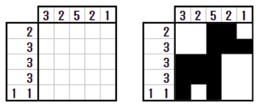
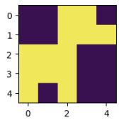

# お絵かきロジック

## 問題

お絵かきロジック(ピクロス)をQUBOで解く。ルールがわからない人は[こちら](https://ja.puzzle-nonograms.com/)であそぶ。


## ソースコード

```python
from tytan import *
import matplotlib.pyplot as plt

q = symbols_list([5, 5])
H = 0
# 行方向
H += (q[0][0] + q[0][1] + q[0][2] + q[0][3] + q[0][4] - 2) ** 2
H += (q[1][0] + q[1][1] + q[1][2] + q[1][3] + q[1][4] - 3) ** 2
H += (q[2][0] + q[2][1] + q[2][2] + q[2][3] + q[2][4] - 3) ** 2
H += (q[3][0] + q[3][1] + q[3][2] + q[3][3] + q[3][4] - 3) ** 2
H += (q[4][0] + q[4][1] + q[4][2] + q[4][3] + q[4][4] - 2) ** 2
# 列方向
H += (q[0][0] + q[1][0] + q[2][0] + q[3][0] + q[4][0] - 3) ** 2
H += (q[0][1] + q[1][1] + q[2][1] + q[3][1] + q[4][1] - 2) ** 2
H += (q[0][2] + q[1][2] + q[2][2] + q[3][2] + q[4][2] - 5) ** 2
H += (q[0][3] + q[1][3] + q[2][3] + q[3][3] + q[4][3] - 2) ** 2
H += (q[0][4] + q[1][4] + q[2][4] + q[3][4] + q[4][4] - 1) ** 2
# 隣接したら報酬
## 行方向
H += - 0.1 * (q[0][0] * q[0][1])- 0.1 * (q[0][1] * q[0][2])- 0.1 * (q[0][2] * q[0][3])- 0.1 * (q[0][3] * q[0][4])
H += - 0.1 * (q[1][0] * q[1][1])- 0.1 * (q[1][1] * q[1][2])- 0.1 * (q[1][2] * q[1][3])- 0.1 * (q[1][3] * q[1][4])
H += - 0.1 * (q[2][0] * q[2][1])- 0.1 * (q[2][1] * q[0][2])- 0.1 * (q[0][2] * q[0][3])- 0.1 * (q[0][3] * q[0][4])
H += - 0.1 * (q[3][0] * q[3][1])- 0.1 * (q[3][1] * q[0][2])- 0.1 * (q[0][2] * q[0][3])- 0.1 * (q[0][3] * q[0][4])
## 列方向
H += - 0.1 * (q[0][0] * q[1][0])- 0.1 * (q[1][0] * q[2][0])- 0.1 * (q[2][0] * q[3][0])- 0.1 * (q[3][0] * q[4][0])
H += - 0.1 * (q[0][1] * q[1][1])- 0.1 * (q[1][1] * q[2][1])- 0.1 * (q[2][1] * q[3][1])- 0.1 * (q[3][1] * q[4][1])
H += - 0.1 * (q[0][2] * q[1][2])- 0.1 * (q[1][2] * q[2][2])- 0.1 * (q[2][2] * q[3][2])- 0.1 * (q[3][2] * q[4][2])
H += - 0.1 * (q[0][3] * q[1][3])- 0.1 * (q[1][3] * q[2][3])- 0.1 * (q[2][3] * q[3][3])- 0.1 * (q[3][3] * q[4][3])
# 隣接したらペナルティ
H += + 0.1 * (q[4][0] * q[4][1]) + 0.1 * (q[4][1] * q[4][2]) + 0.1 * (q[4][2] * q[4][3]) + 0.1 * (q[4][3] * q[4][4])

qubo, offset = Compile(H).get_qubo()
solver = sampler.SASampler()
result = solver.run(qubo)

for r in result[:3]:
  print(r)
  img, subs = Auto_array(r[0]).get_image('q{}_{}')
  plt.figure(figsize=(2, 2))
  plt.imshow(img)
  plt.show()
  print()
```

## 結果

最適解のみ掲載。
```
[{'q0_0': 0, 'q0_1': 0, 'q0_2': 1, 'q0_3': 1, 'q0_4': 0, 'q1_0': 0, 'q1_1': 0, 'q1_2': 1, 'q1_3': 1, 'q1_4': 1, 'q2_0': 1, 'q2_1': 1, 'q2_2': 1, 'q2_3': 0, 'q2_4': 0, 'q3_0': 1, 'q3_1': 1, 'q3_2': 1, 'q3_3': 0, 'q3_4': 0, 'q4_0': 1, 'q4_1': 0, 'q4_2': 1, 'q4_3': 0, 'q4_4': 0}, -79.69999999999999, 21]
```

しっかり解けました。