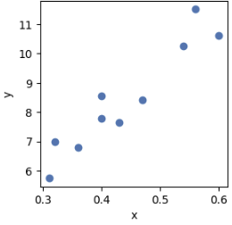

# 線形回帰


### 問題

ビリリダマ１０匹の高さ(m)と重さ(kg)のデータがある。最小二乗法で回帰直線を求める。

```python
height = [0.31, 0.4, 0.47, 0.4, 0.54, 0.36, 0.56, 0.43, 0.32, 0.6]
weight = [5.75, 8.56, 8.42, 7.78, 10.25, 6.79, 11.51, 7.66, 6.99, 10.61]
```


### ソースコード

```python
from tytan import *
import matplotlib.pyplot as plt

x = np.array([0.31, 0.4, 0.47, 0.4, 0.54, 0.36, 0.56, 0.43, 0.32, 0.6])
y = np.array([5.75, 8.56, 8.42, 7.78, 10.25, 6.79, 11.51, 7.66, 6.99, 10.61])

plt.figure(figsize=(3, 3))
plt.plot(x, y, 'o')
plt.xlabel('x')
plt.ylabel('y')
plt.show()

# y = a*x + bのaとbを定義
## aを10-20で256分割
a = symbols_nbit(10, 20, 'a{}', num=8)
## bを0-1で256分割
b = symbols_nbit(0, 1, 'b{}', num=8)

H = 0
for i in range(0, 10):
  H += (y[i] - (a * x[i] + b)) ** 2

qubo, offset = Compile(H).get_qubo()
solver = sampler.SASampler()
result = solver.run(qubo)

for r in result[:5]:
  print(r)
  print('a = ', Auto_array(r[0]).get_nbit_value(a))
  print('b = ', Auto_array(r[0]).get_nbit_value(b))
  print()
```

### 結果

```
[{'a0': 1, 'a1': 1, 'a2': 0, 'a3': 1, 'a4': 1, 'a5': 1, 'a6': 0, 'a7': 0, 'b0': 1, 'b1': 1, 'b2': 1, 'b3': 0, 'b4': 0, 'b5': 0, 'b6': 1, 'b7': 1}, -738.1885632324218, 19]
a =  17.1875
b =  0.88671875

[{'a0': 1, 'a1': 1, 'a2': 0, 'a3': 1, 'a4': 1, 'a5': 1, 'a6': 0, 'a7': 1, 'b0': 1, 'b1': 1, 'b2': 0, 'b3': 1, 'b4': 1, 'b5': 0, 'b6': 1, 'b7': 0}, -738.1882550048828, 20]
a =  17.265625
b =  0.8515625

[{'a0': 1, 'a1': 1, 'a2': 0, 'a3': 1, 'a4': 1, 'a5': 0, 'a6': 1, 'a7': 1, 'b0': 1, 'b1': 1, 'b2': 1, 'b3': 0, 'b4': 1, 'b5': 1, 'b6': 0, 'b7': 0}, -738.1877349853517, 3]
a =  17.109375
b =  0.921875

[{'a0': 1, 'a1': 1, 'a2': 1, 'a3': 0, 'a4': 0, 'a5': 0, 'a6': 0, 'a7': 0, 'b0': 1, 'b1': 1, 'b2': 0, 'b3': 0, 'b4': 0, 'b5': 0, 'b6': 0, 'b7': 0}, -738.180625, 14]
a =  17.5
b =  0.75

[{'a0': 1, 'a1': 1, 'a2': 1, 'a3': 0, 'a4': 0, 'a5': 0, 'a6': 0, 'a7': 0, 'b0': 1, 'b1': 0, 'b2': 1, 'b3': 1, 'b4': 1, 'b5': 1, 'b6': 1, 'b7': 1}, -738.1805114746095, 44]
a =  17.5
b =  0.74609375
```