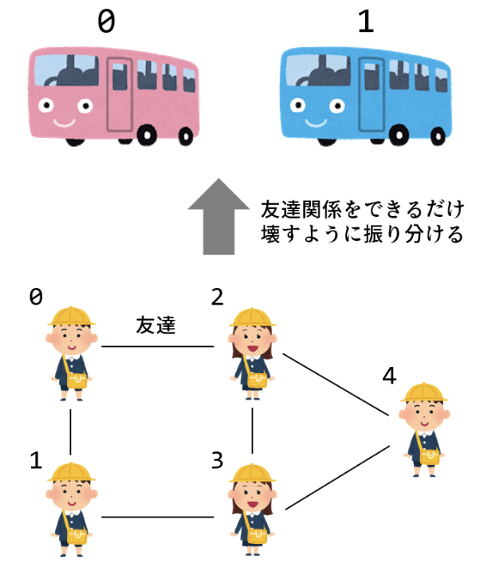

# 最大カット問題


### 問題

5人の幼稚園児を2台のバスに乗せる。
友達関係をできるだけ壊すように振り分けるには、
どのようにグループ分けしたらいいか。


### ソースコード

```python
from tytan import *

q = symbols_list(5)

H = 0
H += (q[0] + q[1] - 1) ** 2
H += (q[0] + q[2] - 1) ** 2
H += (q[1] + q[3] - 1) ** 2
H += (q[2] + q[3] - 1) ** 2
H += (q[2] + q[4] - 1) ** 2
H += (q[3] + q[4] - 1) ** 2

qubo, offset = Compile(H).get_qubo()
print('offset', offset)
solver = sampler.SASampler()
result = solver.run(qubo)
for r in result:
  print(r)
```

### 結果

結果は以下。

```
offset 6.0
[{'q0': 0, 'q1': 1, 'q2': 1, 'q3': 0, 'q4': 0}, -5.0, 32]
[{'q0': 0, 'q1': 1, 'q2': 1, 'q3': 0, 'q4': 1}, -5.0, 16]
[{'q0': 1, 'q1': 0, 'q2': 0, 'q3': 1, 'q4': 0}, -5.0, 21]
[{'q0': 1, 'q1': 0, 'q2': 0, 'q3': 1, 'q4': 1}, -5.0, 31]
```
1番と4番、2番と3番は同じ組み合わせになっている。なので最適解は2つ。(q0, q3)ペア、(q1,q2)ペアに加えて、q4がどちらのペアに加わっても同じになるという解になった。
