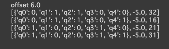

# QUBO

[tytan_tutoria](https://github.com/tytansdk/tytan_tutorial?tab=readme-ov-file)のおすすめコースを勉強し、量子エンジニア(アニーリング式)認定試験を解けるようになることが目標。
## 設定

最初にtytansdkをインストールする必要がある。

```python
!pip install git+https://github.com/tytansdk/tytan
```

## 最大カット問題。

### 【問題】

5人の幼稚園児を2台のバスに乗せる。
友達関係をできるだけ壊すように振り分けるには、
どのようにグループ分けしたらいいか。


### ソースコード

```python
from tytan import *

q = symbols_list(5)

H = 0
H += (q[0] + q[1] - 1) ** 2
H += (q[0] + q[2] - 1) ** 2
H += (q[1] + q[3] - 1) ** 2
H += (q[2] + q[3] - 1) ** 2
H += (q[2] + q[4] - 1) ** 2
H += (q[3] + q[4] - 1) ** 2

qubo, offset = Compile(H).get_qubo()
print('offset', offset)
solver = sampler.SASampler()
result = solver.run(qubo)
for r in result:
  print(r)
```

### 結果
結果は以下。

1番と4番、2番と3番は同じ組み合わせになっている。なので最適解は2つ。(q0, q3)ペア、(q1,q2)ペアに加えて、q4がどちらのペアに加わっても同じになるという解になった。

## 温度計パズル

### 【問題】

以下の画像のパズルを解く。ルールがわからない場合は[こちら](https://www.puzzle-thermometers.com/)で遊んでみて。


### ソースコード

```python
from tytan import *
import numpy as np

q = symbols_list([4, 4])

H = 0
# 各行の個数指定
H += (q[0][0] + q[0][1] + q[0][2] + q[0][3] - 2) ** 2
H += (q[1][0] + q[1][1] + q[1][2] + q[1][3] - 1) ** 2
H += (q[2][0] + q[2][1] + q[2][2] + q[2][3] - 3) ** 2
H += (q[3][0] + q[3][1] + q[3][2] + q[3][3] - 1) ** 2
# 各列の個数指定
H += (q[0][0] + q[1][0] + q[2][0] + q[3][0] - 3) ** 2
H += (q[0][1] + q[1][1] + q[2][1] + q[3][1] - 1) ** 2
H += (q[0][2] + q[1][2] + q[2][2] + q[3][2] - 1) ** 2
H += (q[0][3] + q[1][3] + q[2][3] + q[3][3] - 2) ** 2
# ビットを降順にする(根本から定義)
H += (1 - q[2][0]) * q[1][0] + (1 - q[1][0]) * q[0][0] 
H += (1 - q[1][1]) * q[0][1] 
H += (1 - q[0][3]) * q[0][2]
H += (1 - q[1][3]) * q[1][2]
H += (1 - q[2][3]) * q[2][2] + (1 - q[2][2]) * q[2][1]
H += (1 - q[3][1]) * q[3][0] 
H += (1 - q[3][3]) * q[3][2]

qubo, offset = Compile(H).get_qubo()
solver = sampler.SASampler()
result = solver.run(qubo)
for r in result[:5]:
  # print(r)
  print(np.array(list(r[0].values())).reshape(4, 4))
  print()
```

### 結果

```
[{'q0_0': 1, 'q0_1': 0, 'q0_2': 0, 'q0_3': 1, 'q1_0': 1, 'q1_1': 0, 'q1_2': 0, 'q1_3': 0, 'q2_0': 1, 'q2_1': 0, 'q2_2': 1, 'q2_3': 1, 'q3_0': 0, 'q3_1': 1, 'q3_2': 0, 'q3_3': 0}, -30.0, 46]
[[1 0 0 1]
 [1 0 0 0]
 [1 0 1 1]
 [0 1 0 0]]

[{'q0_0': 1, 'q0_1': 0, 'q0_2': 0, 'q0_3': 1, 'q1_0': 1, 'q1_1': 0, 'q1_2': 0, 'q1_3': 0, 'q2_0': 1, 'q2_1': 1, 'q2_2': 1, 'q2_3': 0, 'q3_0': 0, 'q3_1': 0, 'q3_2': 0, 'q3_3': 1}, -29.0, 16]
[[1 0 0 1]
 [1 0 0 0]
 [1 1 1 0]
 [0 0 0 1]]

[{'q0_0': 1, 'q0_1': 1, 'q0_2': 0, 'q0_3': 0, 'q1_0': 1, 'q1_1': 0, 'q1_2': 0, 'q1_3': 0, 'q2_0': 1, 'q2_1': 0, 'q2_2': 1, 'q2_3': 1, 'q3_0': 0, 'q3_1': 0, 'q3_2': 0, 'q3_3': 1}, -29.0, 22]
[[1 1 0 0]
 [1 0 0 0]
 [1 0 1 1]
 [0 0 0 1]]

[{'q0_0': 0, 'q0_1': 0, 'q0_2': 1, 'q0_3': 1, 'q1_0': 1, 'q1_1': 0, 'q1_2': 0, 'q1_3': 0, 'q2_0': 1, 'q2_1': 0, 'q2_2': 0, 'q2_3': 1, 'q3_0': 1, 'q3_1': 1, 'q3_2': 0, 'q3_3': 0}, -28.0, 7]
[[0 0 1 1]
 [1 0 0 0]
 [1 0 0 1]
 [1 1 0 0]]

[{'q0_0': 0, 'q0_1': 0, 'q0_2': 1, 'q0_3': 1, 'q1_0': 1, 'q1_1': 0, 'q1_2': 0, 'q1_3': 0, 'q2_0': 1, 'q2_1': 1, 'q2_2': 0, 'q2_3': 1, 'q3_0': 1, 'q3_1': 0, 'q3_2': 0, 'q3_3': 0}, -28.0, 1]
[[0 0 1 1]
 [1 0 0 0]
 [1 1 0 1]
 [1 0 0 0]]
```

１番上のみが最適解。見比べてみるとしっかり答えになっている。

## 数字を均等に２組に分ける。

### 【問題】

6つの自然数$(15, 25, 33, 41, 64, 82)$を総和が等しくなるように2組に分ける。

```python
from tytan import *
import numpy as np

v = [15, 25, 33, 41, 64, 82]
q = symbols_list(6)

H = 0
H += (sum(q * v) - sum(v)//2) ** 2

qubo, offset = Compile(H).get_qubo()
solver = sampler.SASampler()
result = solver.run(qubo)

for r in result[:3]:
  print(r)
  print(sum(np.array(list(r[0].values()) * np.array(v))))
```

### 答え

```
[{'q0': 0, 'q1': 1, 'q2': 0, 'q3': 1, 'q4': 1, 'q5': 0}, -16900.0, 27]
130
[{'q0': 1, 'q1': 0, 'q2': 1, 'q3': 0, 'q4': 0, 'q5': 1}, -16900.0, 27]
130
[{'q0': 0, 'q1': 0, 'q2': 0, 'q3': 1, 'q4': 0, 'q5': 1}, -16851.0, 23]
123
```
上二つが最適解。0と１が入れ替わっているだけなので実質、解は一つ。

## シフト最適化

