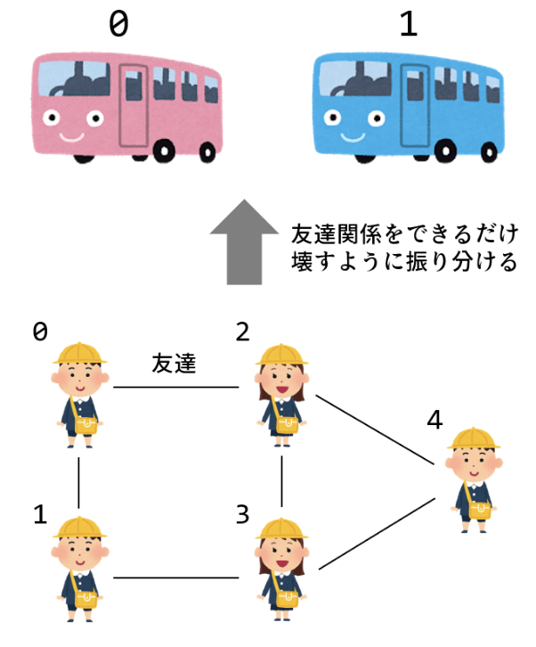
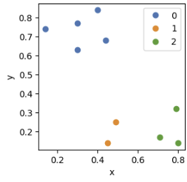

[Top](https://malibu-cola.github.io/Hg-Web/)

# QUBO

[tytan_tutoria](https://github.com/tytansdk/tytan_tutorial?tab=readme-ov-file)のおすすめコースを勉強し、量子エンジニア(アニーリング式)認定試験を解けるようになることが目標。
## 設定

最初にtytansdkをインストールする必要がある。

```python
!pip install git+https://github.com/tytansdk/tytan
```

## 最大カット問題。

### 問題

5人の幼稚園児を2台のバスに乗せる。
友達関係をできるだけ壊すように振り分けるには、
どのようにグループ分けしたらいいか。


### ソースコード

```python
from tytan import *

q = symbols_list(5)

H = 0
H += (q[0] + q[1] - 1) ** 2
H += (q[0] + q[2] - 1) ** 2
H += (q[1] + q[3] - 1) ** 2
H += (q[2] + q[3] - 1) ** 2
H += (q[2] + q[4] - 1) ** 2
H += (q[3] + q[4] - 1) ** 2

qubo, offset = Compile(H).get_qubo()
print('offset', offset)
solver = sampler.SASampler()
result = solver.run(qubo)
for r in result:
  print(r)
```

### 結果

結果は以下。

```
offset 6.0
[{'q0': 0, 'q1': 1, 'q2': 1, 'q3': 0, 'q4': 0}, -5.0, 32]
[{'q0': 0, 'q1': 1, 'q2': 1, 'q3': 0, 'q4': 1}, -5.0, 16]
[{'q0': 1, 'q1': 0, 'q2': 0, 'q3': 1, 'q4': 0}, -5.0, 21]
[{'q0': 1, 'q1': 0, 'q2': 0, 'q3': 1, 'q4': 1}, -5.0, 31]
```
1番と4番、2番と3番は同じ組み合わせになっている。なので最適解は2つ。(q0, q3)ペア、(q1,q2)ペアに加えて、q4がどちらのペアに加わっても同じになるという解になった。

## 温度計パズル

### 問題

以下の画像のパズルを解く。ルールがわからない場合は[こちら](https://www.puzzle-thermometers.com/)で遊んでみて。


### ソースコード

```python
from tytan import *
import numpy as np

q = symbols_list([4, 4])

H = 0
# 各行の個数指定
H += (q[0][0] + q[0][1] + q[0][2] + q[0][3] - 2) ** 2
H += (q[1][0] + q[1][1] + q[1][2] + q[1][3] - 1) ** 2
H += (q[2][0] + q[2][1] + q[2][2] + q[2][3] - 3) ** 2
H += (q[3][0] + q[3][1] + q[3][2] + q[3][3] - 1) ** 2
# 各列の個数指定
H += (q[0][0] + q[1][0] + q[2][0] + q[3][0] - 3) ** 2
H += (q[0][1] + q[1][1] + q[2][1] + q[3][1] - 1) ** 2
H += (q[0][2] + q[1][2] + q[2][2] + q[3][2] - 1) ** 2
H += (q[0][3] + q[1][3] + q[2][3] + q[3][3] - 2) ** 2
# ビットを降順にする(根本から定義)
H += (1 - q[2][0]) * q[1][0] + (1 - q[1][0]) * q[0][0] 
H += (1 - q[1][1]) * q[0][1] 
H += (1 - q[0][3]) * q[0][2]
H += (1 - q[1][3]) * q[1][2]
H += (1 - q[2][3]) * q[2][2] + (1 - q[2][2]) * q[2][1]
H += (1 - q[3][1]) * q[3][0] 
H += (1 - q[3][3]) * q[3][2]

qubo, offset = Compile(H).get_qubo()
solver = sampler.SASampler()
result = solver.run(qubo)
for r in result[:5]:
  # print(r)
  print(np.array(list(r[0].values())).reshape(4, 4))
  print()
```

### 結果

```
[{'q0_0': 1, 'q0_1': 0, 'q0_2': 0, 'q0_3': 1, 'q1_0': 1, 'q1_1': 0, 'q1_2': 0, 'q1_3': 0, 'q2_0': 1, 'q2_1': 0, 'q2_2': 1, 'q2_3': 1, 'q3_0': 0, 'q3_1': 1, 'q3_2': 0, 'q3_3': 0}, -30.0, 46]
[[1 0 0 1]
 [1 0 0 0]
 [1 0 1 1]
 [0 1 0 0]]

[{'q0_0': 1, 'q0_1': 0, 'q0_2': 0, 'q0_3': 1, 'q1_0': 1, 'q1_1': 0, 'q1_2': 0, 'q1_3': 0, 'q2_0': 1, 'q2_1': 1, 'q2_2': 1, 'q2_3': 0, 'q3_0': 0, 'q3_1': 0, 'q3_2': 0, 'q3_3': 1}, -29.0, 16]
[[1 0 0 1]
 [1 0 0 0]
 [1 1 1 0]
 [0 0 0 1]]

[{'q0_0': 1, 'q0_1': 1, 'q0_2': 0, 'q0_3': 0, 'q1_0': 1, 'q1_1': 0, 'q1_2': 0, 'q1_3': 0, 'q2_0': 1, 'q2_1': 0, 'q2_2': 1, 'q2_3': 1, 'q3_0': 0, 'q3_1': 0, 'q3_2': 0, 'q3_3': 1}, -29.0, 22]
[[1 1 0 0]
 [1 0 0 0]
 [1 0 1 1]
 [0 0 0 1]]

[{'q0_0': 0, 'q0_1': 0, 'q0_2': 1, 'q0_3': 1, 'q1_0': 1, 'q1_1': 0, 'q1_2': 0, 'q1_3': 0, 'q2_0': 1, 'q2_1': 0, 'q2_2': 0, 'q2_3': 1, 'q3_0': 1, 'q3_1': 1, 'q3_2': 0, 'q3_3': 0}, -28.0, 7]
[[0 0 1 1]
 [1 0 0 0]
 [1 0 0 1]
 [1 1 0 0]]

[{'q0_0': 0, 'q0_1': 0, 'q0_2': 1, 'q0_3': 1, 'q1_0': 1, 'q1_1': 0, 'q1_2': 0, 'q1_3': 0, 'q2_0': 1, 'q2_1': 1, 'q2_2': 0, 'q2_3': 1, 'q3_0': 1, 'q3_1': 0, 'q3_2': 0, 'q3_3': 0}, -28.0, 1]
[[0 0 1 1]
 [1 0 0 0]
 [1 1 0 1]
 [1 0 0 0]]
```

１番上のみが最適解。見比べてみるとしっかり答えになっている。

## 数字を均等に２組に分ける。

### 問題

6つの自然数$(15, 25, 33, 41, 64, 82)$を総和が等しくなるように2組に分ける。

### ソースコード

```python
from tytan import *
import numpy as np

v = [15, 25, 33, 41, 64, 82]
q = symbols_list(6)

H = 0
H += (sum(q * v) - sum(v)//2) ** 2

qubo, offset = Compile(H).get_qubo()
solver = sampler.SASampler()
result = solver.run(qubo)

for r in result[:3]:
  print(r)
  print(sum(np.array(list(r[0].values()) * np.array(v))))
```

### 結果

```
[{'q0': 0, 'q1': 1, 'q2': 0, 'q3': 1, 'q4': 1, 'q5': 0}, -16900.0, 27]
130
[{'q0': 1, 'q1': 0, 'q2': 1, 'q3': 0, 'q4': 0, 'q5': 1}, -16900.0, 27]
130
[{'q0': 0, 'q1': 0, 'q2': 0, 'q3': 1, 'q4': 0, 'q5': 1}, -16851.0, 23]
123
```
上二つが最適解。0と１が入れ替わっているだけなので実質、解は一つ。

## シフト最適化

### 問題

店のシフトを8人の生徒から決める。お店に必要なパワーは以下。

|********* |13時|14時|15時|16時|17時|
|----------|----|---|----|----|---|
|必要なパワー|2   |2  |2   |2   |2  |

8人のシフト希望が以下。数値はパワーを表している。
|********* |13時|14時|15時|16時|17時|
|-|-|-|-|-|-|
|A君|1||||1|
|B君|1|||1||
|C君||1|||1|
|D君|||1|1||
|E君||||1|1|
|F君|2|||||
|G君||2||||
|H君|||2||| 

### ソースコード

```python 
from tytan import *

q = symbols_list(8)

H = 0
H += (q[0] + q[1] + 2 * q[5] - 2) ** 2
H += (q[2] + 2 * q[6] - 2) ** 2
H += (q[3] + 2 * q[7] - 2) ** 2
H += (q[1] + q[3] + q[4] - 2) ** 2
H += (q[0] + q[2] + q[4] - 2) ** 2

qubo, offset =Compile(H).get_qubo()
solver = sampler.SASampler()
result = solver.run(qubo)

for r in result[:5]:
  print(r)
```

### 結果

```
[{'q0': 1, 'q1': 1, 'q2': 0, 'q3': 0, 'q4': 1, 'q5': 0, 'q6': 1, 'q7': 1}, -20.0, 58]
[{'q0': 0, 'q1': 0, 'q2': 0, 'q3': 1, 'q4': 1, 'q5': 1, 'q6': 1, 'q7': 0}, -18.0, 1]
[{'q0': 0, 'q1': 0, 'q2': 0, 'q3': 1, 'q4': 1, 'q5': 1, 'q6': 1, 'q7': 1}, -18.0, 1]
[{'q0': 0, 'q1': 0, 'q2': 1, 'q3': 0, 'q4': 1, 'q5': 1, 'q6': 0, 'q7': 1}, -18.0, 1]
[{'q0': 0, 'q1': 0, 'q2': 1, 'q3': 0, 'q4': 1, 'q5': 1, 'q6': 1, 'q7': 1}, -18.0, 3]
```
最適解は１番上のみ

## お絵かきロジック

### 問題
お絵かきロジック(ピクロス)をQUBOで解く。ルールがわからない人は[こちら](https://ja.puzzle-nonograms.com/)であそぶ。


### ソースコード

```python
from tytan import *
import matplotlib.pyplot as plt

q = symbols_list([5, 5])
H = 0
# 行方向
H += (q[0][0] + q[0][1] + q[0][2] + q[0][3] + q[0][4] - 2) ** 2
H += (q[1][0] + q[1][1] + q[1][2] + q[1][3] + q[1][4] - 3) ** 2
H += (q[2][0] + q[2][1] + q[2][2] + q[2][3] + q[2][4] - 3) ** 2
H += (q[3][0] + q[3][1] + q[3][2] + q[3][3] + q[3][4] - 3) ** 2
H += (q[4][0] + q[4][1] + q[4][2] + q[4][3] + q[4][4] - 2) ** 2
# 列方向
H += (q[0][0] + q[1][0] + q[2][0] + q[3][0] + q[4][0] - 3) ** 2
H += (q[0][1] + q[1][1] + q[2][1] + q[3][1] + q[4][1] - 2) ** 2
H += (q[0][2] + q[1][2] + q[2][2] + q[3][2] + q[4][2] - 5) ** 2
H += (q[0][3] + q[1][3] + q[2][3] + q[3][3] + q[4][3] - 2) ** 2
H += (q[0][4] + q[1][4] + q[2][4] + q[3][4] + q[4][4] - 1) ** 2
# 隣接したら報酬
## 行方向
H += - 0.1 * (q[0][0] * q[0][1])- 0.1 * (q[0][1] * q[0][2])- 0.1 * (q[0][2] * q[0][3])- 0.1 * (q[0][3] * q[0][4])
H += - 0.1 * (q[1][0] * q[1][1])- 0.1 * (q[1][1] * q[1][2])- 0.1 * (q[1][2] * q[1][3])- 0.1 * (q[1][3] * q[1][4])
H += - 0.1 * (q[2][0] * q[2][1])- 0.1 * (q[2][1] * q[0][2])- 0.1 * (q[0][2] * q[0][3])- 0.1 * (q[0][3] * q[0][4])
H += - 0.1 * (q[3][0] * q[3][1])- 0.1 * (q[3][1] * q[0][2])- 0.1 * (q[0][2] * q[0][3])- 0.1 * (q[0][3] * q[0][4])
## 列方向
H += - 0.1 * (q[0][0] * q[1][0])- 0.1 * (q[1][0] * q[2][0])- 0.1 * (q[2][0] * q[3][0])- 0.1 * (q[3][0] * q[4][0])
H += - 0.1 * (q[0][1] * q[1][1])- 0.1 * (q[1][1] * q[2][1])- 0.1 * (q[2][1] * q[3][1])- 0.1 * (q[3][1] * q[4][1])
H += - 0.1 * (q[0][2] * q[1][2])- 0.1 * (q[1][2] * q[2][2])- 0.1 * (q[2][2] * q[3][2])- 0.1 * (q[3][2] * q[4][2])
H += - 0.1 * (q[0][3] * q[1][3])- 0.1 * (q[1][3] * q[2][3])- 0.1 * (q[2][3] * q[3][3])- 0.1 * (q[3][3] * q[4][3])
# 隣接したらペナルティ
H += + 0.1 * (q[4][0] * q[4][1]) + 0.1 * (q[4][1] * q[4][2]) + 0.1 * (q[4][2] * q[4][3]) + 0.1 * (q[4][3] * q[4][4])

qubo, offset = Compile(H).get_qubo()
solver = sampler.SASampler()
result = solver.run(qubo)

for r in result[:3]:
  print(r)
  img, subs = Auto_array(r[0]).get_image('q{}_{}')
  plt.figure(figsize=(2, 2))
  plt.imshow(img)
  plt.show()
  print()
```

### 結果

最適解のみ掲載。
```
[{'q0_0': 0, 'q0_1': 0, 'q0_2': 1, 'q0_3': 1, 'q0_4': 0, 'q1_0': 0, 'q1_1': 0, 'q1_2': 1, 'q1_3': 1, 'q1_4': 1, 'q2_0': 1, 'q2_1': 1, 'q2_2': 1, 'q2_3': 0, 'q2_4': 0, 'q3_0': 1, 'q3_1': 1, 'q3_2': 1, 'q3_3': 0, 'q3_4': 0, 'q4_0': 1, 'q4_1': 0, 'q4_2': 1, 'q4_3': 0, 'q4_4': 0}, -79.69999999999999, 21]
```

しっかり解けました。

## 巡回セールスマン問題

## 問題

4つの都市A, B, C, Dを最短で訪れる経路を求める。
スタートの都市は決まっていない。
各都市を結ぶ道の距離はわかっている。


### ソースコード

```python
from tytan import *

## q[i][j] = 都市jをi回目に訪れるなら1、そうでなければ0
q = symbols_list([4, 4])

H = 0
# i番目に訪れる都市は一つだけ。
for i in range(0, 4):
  H += (q[i][0] + q[i][1] + q[i][2] + q[i][3] - 1) ** 2
# 都市jに訪れるのは1回だけ
for j in range(0, 4):
  H += (q[0][j] + q[1][j] + q[2][j] + q[3][j] - 1) ** 2

dist = [[0.0, 0.3, 0.2, 0.6], 
        [0.3, 0.0, 0.1, 0.2], 
        [0.2, 0.1, 0.0, 0.3],
        [0.6, 0.2, 0.3, 0.0]]

# i番目からi + 1番目への移動
for i in range(0, 3):
  # 都市j1から
  for j1 in range(0, 4):
    # 都市j2への移動
    for j2 in range(0, 4):
      H += dist[j1][j2] * (q[i][j1] * q[i + 1][j2])

# コンパイル
qubo, offset = Compile(H).get_qubo()
print('offset', offset)
solver = sampler.SASampler()
result = solver.run(qubo)

for r in result[:5]:
  print(r)
  print(np.array(list(r[0].values())).reshape(4, 4))
  print()
```

### 結果

```
offset 8.0
[{'q0_0': 1, 'q0_1': 0, 'q0_2': 0, 'q0_3': 0, 'q1_0': 0, 'q1_1': 0, 'q1_2': 1, 'q1_3': 0, 'q2_0': 0, 'q2_1': 1, 'q2_2': 0, 'q2_3': 0, 'q3_0': 0, 'q3_1': 0, 'q3_2': 0, 'q3_3': 1}, -7.5, 18]
[[1 0 0 0]
 [0 0 1 0]
 [0 1 0 0]
 [0 0 0 1]]

[{'q0_0': 0, 'q0_1': 0, 'q0_2': 0, 'q0_3': 1, 'q1_0': 0, 'q1_1': 1, 'q1_2': 0, 'q1_3': 0, 'q2_0': 0, 'q2_1': 0, 'q2_2': 1, 'q2_3': 0, 'q3_0': 1, 'q3_1': 0, 'q3_2': 0, 'q3_3': 0}, -7.5, 2]
[[0 0 0 1]
 [0 1 0 0]
 [0 0 1 0]
 [1 0 0 0]]

[{'q0_0': 0, 'q0_1': 0, 'q0_2': 0, 'q0_3': 1, 'q1_0': 0, 'q1_1': 0, 'q1_2': 1, 'q1_3': 0, 'q2_0': 0, 'q2_1': 1, 'q2_2': 0, 'q2_3': 0, 'q3_0': 1, 'q3_1': 0, 'q3_2': 0, 'q3_3': 0}, -7.3, 10]
[[0 0 0 1]
 [0 0 1 0]
 [0 1 0 0]
 [1 0 0 0]]

[{'q0_0': 1, 'q0_1': 0, 'q0_2': 0, 'q0_3': 0, 'q1_0': 0, 'q1_1': 0, 'q1_2': 1, 'q1_3': 0, 'q2_0': 0, 'q2_1': 0, 'q2_2': 0, 'q2_3': 1, 'q3_0': 0, 'q3_1': 1, 'q3_2': 0, 'q3_3': 0}, -7.3, 3]
[[1 0 0 0]
 [0 0 1 0]
 [0 0 0 1]
 [0 1 0 0]]

[{'q0_0': 0, 'q0_1': 0, 'q0_2': 1, 'q0_3': 0, 'q1_0': 1, 'q1_1': 0, 'q1_2': 0, 'q1_3': 0, 'q2_0': 0, 'q2_1': 1, 'q2_2': 0, 'q2_3': 0, 'q3_0': 0, 'q3_1': 0, 'q3_2': 0, 'q3_3': 1}, -7.3, 1]
[[0 0 1 0]
 [1 0 0 0]
 [0 1 0 0]
 [0 0 0 1]]
```
最適解は1つめのA→C→B→Dと2つめのD→B→C→Aで、順路を逆にした答えになっている。

## クラスタリング

### 問題

10個の点を３クラスに分類する。点の座標は以下。
```
x = [0.45, 0.80, 0.71, 0.49, 0.79, 0.30, 0.44, 0.14, 0.30, 0.40]
y = [0.14, 0.14, 0.17, 0.25, 0.32, 0.63, 0.68, 0.74, 0.77, 0.84]
```


### ソースコード

```python
from tytan import *
import numpy as np
import matplotlib.pyplot as plt

x = np.array([0.45, 0.80, 0.71, 0.49, 0.79, 0.30, 0.44, 0.14, 0.30, 0.40])
y = np.array([0.14, 0.14, 0.17, 0.25, 0.32, 0.63, 0.68, 0.74, 0.77, 0.84])

# q[i][j] = 点iがクラスjに分類される時1、そうでない時0
q = symbols_list([10, 3])

H = 0
# 分類されるクラスは1つだけ
for i in range(0, 10):
  H += (q[i][0] + q[i][1] + q[i][2] - 1) ** 2

# ２つの点の見て、その距離がペナルティになる。
for i1 in range(0, 10):
  for i2 in range(0, 10):
    dist = ((x[i1] - x[i2]) ** 2 + (y[i1] - y[i2]) ** 2) ** 0.5

    # 同じクラスに入ったら、距離がペナルティ。
    H += 0.1 * dist * (q[i1][0] * q[i2][0])
    H += 0.1 * dist * (q[i1][1] * q[i2][1])
    H += 0.1 * dist * (q[i1][2] * q[i2][2])

qubo, offset = Compile(H).get_qubo()
print('offset', offset)
solver = sampler.SASampler()
result = solver.run(qubo)

for r in result[:3]:
  print(r)

  tmp = np.array(list(r[0].values())).reshape(10, 3)
  ans = np.argmax(tmp, axis = 1)
  print(ans)

  plt.figure(figsize=(3, 3))
  plt.plot(x[ans==0], y[ans==0], 'o', label='0')
  plt.plot(x[ans==1], y[ans==1], 'o', label='1')
  plt.plot(x[ans==2], y[ans==2], 'o', label='2')
  plt.xlabel('x')
  plt.ylabel('y')
  plt.legend()
  plt.show()
```

### 結果

```
offset 10.0
[{'q0_0': 0, 'q0_1': 1, 'q0_2': 0, 'q1_0': 0, 'q1_1': 0, 'q1_2': 1, 'q2_0': 0, 'q2_1': 0, 'q2_2': 1, 'q3_0': 0, 'q3_1': 1, 'q3_2': 0, 'q4_0': 0, 'q4_1': 0, 'q4_2': 1, 'q5_0': 1, 'q5_1': 0, 'q5_2': 0, 'q6_0': 1, 'q6_1': 0, 'q6_2': 0, 'q7_0': 1, 'q7_1': 0, 'q7_2': 0, 'q8_0': 1, 'q8_1': 0, 'q8_2': 0, 'q9_0': 1, 'q9_1': 0, 'q9_2': 0}, -9.504333476237282, 1]
[1 2 2 1 2 0 0 0 0 0]

[{'q0_0': 0, 'q0_1': 1, 'q0_2': 0, 'q1_0': 1, 'q1_1': 0, 'q1_2': 0, 'q2_0': 1, 'q2_1': 0, 'q2_2': 0, 'q3_0': 0, 'q3_1': 1, 'q3_2': 0, 'q4_0': 1, 'q4_1': 0, 'q4_2': 0, 'q5_0': 0, 'q5_1': 0, 'q5_2': 1, 'q6_0': 0, 'q6_1': 0, 'q6_2': 1, 'q7_0': 0, 'q7_1': 0, 'q7_2': 1, 'q8_0': 0, 'q8_1': 0, 'q8_2': 1, 'q9_0': 0, 'q9_1': 0, 'q9_2': 1}, -9.504333476237282, 1]
[1 0 0 1 0 2 2 2 2 2]

[{'q0_0': 0, 'q0_1': 0, 'q0_2': 1, 'q1_0': 0, 'q1_1': 1, 'q1_2': 0, 'q2_0': 0, 'q2_1': 1, 'q2_2': 0, 'q3_0': 0, 'q3_1': 0, 'q3_2': 1, 'q4_0': 0, 'q4_1': 1, 'q4_2': 0, 'q5_0': 1, 'q5_1': 0, 'q5_2': 0, 'q6_0': 1, 'q6_1': 0, 'q6_2': 0, 'q7_0': 1, 'q7_1': 0, 'q7_2': 0, 'q8_0': 1, 'q8_1': 0, 'q8_2': 0, 'q9_0': 1, 'q9_1': 0, 'q9_2': 0}, -9.504333476237282, 2]
[2 1 1 2 1 0 0 0 0 0]
```


上位３つが最適解で、クラスを入れ替えたものだったので、画像は１枚のみ掲載。

## 連立方程式を解く

### 解が0, 1のみからなる連立方程式


解$(x, y, z) = (1, 0, 1)$

### ソースコード

```python
from tytan import *

x = symbols('x')
y = symbols('y')
z = symbols('z')

## 連立方程式の設定
H = 0
H += (5 * x - y + 2 * z - 7) ** 2
H += (-3 * x + 4 * y + z + 2) ** 2
H += (x - 2 * y - 4 * z + 3) ** 2

qubo, offset = Compile(H).get_qubo()
print('offset', offset)
solver = sampler.SASampler()
result = solver.run(qubo)
for r in result:
  print(r)
```

### 結果

```
offset 62.0
[{'x': 1, 'y': 0, 'z': 1}, -62.0, 100]
```
しっかり解が導出できた。

### 解が0, 1, 2, 3のみからなる連立方程式


解$(x, y, z) = (2, 3, 1)$

### ソースコード

```python
from tytan import *

x = symbols_nbit(0, 4, 'x{}', num=2)
y = symbols_nbit(0, 4, 'y{}', num=2)
z = symbols_nbit(0, 4, 'z{}', num=2)

# 連立方程式の設定
H = 0
H += (x + y + z - 6) ** 2
H += (2*x + 3*y - 2*z - 11) ** 2
H += (3*x - y + z - 4) ** 2

qubo, offset = Compile(H).get_qubo()
print('offset', offset)
solver = sampler.SASampler()
result = solver.run(qubo)

for r in result:
  print(r)
  print('x = ', Auto_array(r[0]).get_nbit_value(x))
  print('y = ', Auto_array(r[0]).get_nbit_value(y))
  print('z = ', Auto_array(r[0]).get_nbit_value(z))
```

### 結果

```

from tytan import *

x = symbols_nbit(0, 4, 'x{}', num=2)
y = symbols_nbit(0, 4, 'y{}', num=2)
z = symbols_nbit(0, 4, 'z{}', num=2)

# 連立方程式の設定
H = 0
H += (x + y + z - 6) ** 2
H += (2*x + 3*y - 2*z - 11) ** 2

offset 173.0
[{'x0': 1, 'x1': 0, 'y0': 1, 'y1': 1, 'z0': 0, 'z1': 1}, -173.0, 50]
x =  2.0
y =  3.0
z =  1.0
[{'x0': 1, 'x1': 0, 'y0': 1, 'y1': 0, 'z0': 0, 'z1': 0}, -168.0, 50]
x =  2.0
y =  2.0
z =  0.0
```

### 解が0~255の整数からなる連立方程式


### ソースコード

```python
from tytan import *

x = symbols_nbit(0, 256, 'x{}', num=8)
y = symbols_nbit(0, 256, 'y{}', num=8)
z = symbols_nbit(0, 256, 'z{}', num=8)

H = 0
H += (10*x + 14*y + 4*z - 5120) **2
H += (9*x + 12*y + 2*z - 4230) **2
H += (7*x + 5*y + 2*z - 2360) **2

qubo, offset = Compile(H).get_qubo()
print('offset', offset)
solver = sampler.SASampler()
result = solver.run(qubo)

for r in result[:5]:
  print(r)
  print('x = ', Auto_array(r[0]).get_nbit_value(x))
  print('y = ', Auto_array(r[0]).get_nbit_value(y))
  print('z = ', Auto_array(r[0]).get_nbit_value(z))
  print()

```

### 結果

```
offset 49676900.0
[{'x0': 1, 'x1': 0, 'x2': 0, 'x3': 0, 'x4': 0, 'x5': 0, 'x6': 1, 'x7': 1, 'y0': 1, 'y1': 1, 'y2': 1, 'y3': 0, 'y4': 0, 'y5': 1, 'y6': 1, 'y7': 0, 'z0': 1, 'z1': 0, 'z2': 0, 'z3': 1, 'z4': 0, 'z5': 0, 'z6': 1, 'z7': 1}, -49676886.0, 1]
x =  131.0
y =  230.0
z =  147.0

[{'x0': 1, 'x1': 0, 'x2': 0, 'x3': 0, 'x4': 0, 'x5': 0, 'x6': 0, 'x7': 1, 'y0': 1, 'y1': 1, 'y2': 1, 'y3': 0, 'y4': 0, 'y5': 1, 'y6': 1, 'y7': 0, 'z0': 1, 'z1': 0, 'z2': 0, 'z3': 1, 'z4': 1, 'z5': 0, 'z6': 0, 'z7': 1}, -49676886.0, 1]
x =  129.0
y =  230.0
z =  153.0

[{'x0': 1, 'x1': 0, 'x2': 0, 'x3': 0, 'x4': 0, 'x5': 0, 'x6': 0, 'x7': 1, 'y0': 1, 'y1': 1, 'y2': 1, 'y3': 0, 'y4': 0, 'y5': 1, 'y6': 1, 'y7': 1, 'z0': 1, 'z1': 0, 'z2': 0, 'z3': 1, 'z4': 0, 'z5': 1, 'z6': 1, 'z7': 0}, -49676871.0, 1]
x =  129.0
y =  231.0
z =  150.0

[{'x0': 0, 'x1': 1, 'x2': 1, 'x3': 1, 'x4': 1, 'x5': 1, 'x6': 1, 'x7': 1, 'y0': 1, 'y1': 1, 'y2': 1, 'y3': 0, 'y4': 1, 'y5': 0, 'y6': 0, 'y7': 0, 'z0': 1, 'z1': 0, 'z2': 0, 'z3': 1, 'z4': 1, 'z5': 0, 'z6': 0, 'z7': 0}, -49676814.0, 4]
x =  127.0
y =  232.0
z =  152.0

[{'x0': 0, 'x1': 1, 'x2': 1, 'x3': 1, 'x4': 1, 'x5': 1, 'x6': 1, 'x7': 1, 'y0': 1, 'y1': 1, 'y2': 1, 'y3': 0, 'y4': 0, 'y5': 1, 'y6': 1, 'y7': 1, 'z0': 1, 'z1': 0, 'z2': 0, 'z3': 1, 'z4': 1, 'z5': 1, 'z6': 0, 'z7': 0}, -49676811.0, 3]
x =  127.0
y =  231.0
z =  156.0
```

## 線形回帰

### 問題

ビリリダマ１０匹の高さ(m)と重さ(kg)のデータがある。最小二乗法で回帰直線を求める。

```python
height = [0.31, 0.4, 0.47, 0.4, 0.54, 0.36, 0.56, 0.43, 0.32, 0.6]
weight = [5.75, 8.56, 8.42, 7.78, 10.25, 6.79, 11.51, 7.66, 6.99, 10.61]
```


### ソースコード

```python
from tytan import *
import matplotlib.pyplot as plt

x = np.array([0.31, 0.4, 0.47, 0.4, 0.54, 0.36, 0.56, 0.43, 0.32, 0.6])
y = np.array([5.75, 8.56, 8.42, 7.78, 10.25, 6.79, 11.51, 7.66, 6.99, 10.61])

plt.figure(figsize=(3, 3))
plt.plot(x, y, 'o')
plt.xlabel('x')
plt.ylabel('y')
plt.show()

# y = a*x + bのaとbを定義
## aを10-20で256分割
a = symbols_nbit(10, 20, 'a{}', num=8)
## bを0-1で256分割
b = symbols_nbit(0, 1, 'b{}', num=8)

H = 0
for i in range(0, 10):
  H += (y[i] - (a * x[i] + b)) ** 2

qubo, offset = Compile(H).get_qubo()
solver = sampler.SASampler()
result = solver.run(qubo)

for r in result[:5]:
  print(r)
  print('a = ', Auto_array(r[0]).get_nbit_value(a))
  print('b = ', Auto_array(r[0]).get_nbit_value(b))
  print()
```

### 結果

```
[{'a0': 1, 'a1': 1, 'a2': 0, 'a3': 1, 'a4': 1, 'a5': 1, 'a6': 0, 'a7': 0, 'b0': 1, 'b1': 1, 'b2': 1, 'b3': 0, 'b4': 0, 'b5': 0, 'b6': 1, 'b7': 1}, -738.1885632324218, 19]
a =  17.1875
b =  0.88671875

[{'a0': 1, 'a1': 1, 'a2': 0, 'a3': 1, 'a4': 1, 'a5': 1, 'a6': 0, 'a7': 1, 'b0': 1, 'b1': 1, 'b2': 0, 'b3': 1, 'b4': 1, 'b5': 0, 'b6': 1, 'b7': 0}, -738.1882550048828, 20]
a =  17.265625
b =  0.8515625

[{'a0': 1, 'a1': 1, 'a2': 0, 'a3': 1, 'a4': 1, 'a5': 0, 'a6': 1, 'a7': 1, 'b0': 1, 'b1': 1, 'b2': 1, 'b3': 0, 'b4': 1, 'b5': 1, 'b6': 0, 'b7': 0}, -738.1877349853517, 3]
a =  17.109375
b =  0.921875

[{'a0': 1, 'a1': 1, 'a2': 1, 'a3': 0, 'a4': 0, 'a5': 0, 'a6': 0, 'a7': 0, 'b0': 1, 'b1': 1, 'b2': 0, 'b3': 0, 'b4': 0, 'b5': 0, 'b6': 0, 'b7': 0}, -738.180625, 14]
a =  17.5
b =  0.75

[{'a0': 1, 'a1': 1, 'a2': 1, 'a3': 0, 'a4': 0, 'a5': 0, 'a6': 0, 'a7': 0, 'b0': 1, 'b1': 0, 'b2': 1, 'b3': 1, 'b4': 1, 'b5': 1, 'b6': 1, 'b7': 1}, -738.1805114746095, 44]
a =  17.5
b =  0.74609375
```

## ナップザック問題

### 問題


所持金750円で、美味しい水、サイコソーダ、ミックスオレをかう時、回復量が最も多くなる組み合わせを求めよ。なお、重複購入OK

|飲み物|値段|回復量|
|-|-|-|
|美味しい水|200円|30回復|
|サイコソーダ|300円|50回復|
|ミックスオレ|350円|70回復|


### 750円ぴったりで買う場合。

#### 準備1

最大公約数でそれぞれの変数を割る。重みのバランスの設定が簡単になる。

所持金:15

|飲み物|値段|回復量|
|-|-|-|
|美味しい水|4|3|
|サイコソーダ|6|5|
|ミックスオレ|7|7|

#### 準備2

各飲み物の最大値を見積もり、量子ビットを準備する。
```
美味しい水:最大値3つ→q0, q1, q2
サイコソーダ:最大値2つ→q3, q4
ミックスオレ:最大値2つ→q5, q6
```

#### ソースコード

```python
from tytan import *

q = symbols_list(7)

H = 0
# 値段の制約条件(必ず15円にする)
H += (4*q[0] + 4*q[1] + 4*q[2] + 6*q[3] + 6*q[4] + 7*q[5] + 7*q[6] - 15) ** 2
# 回復量を弱い報酬とする
H += -0.01*(3*q[0] + 3*q[1] + 3*q[2] + 5*q[3] + 5*q[4] + 7*q[5] + 7*q[6])

qubo, offset = Compile(H).get_qubo()
print('offset', offset)
solver = sampler.SASampler()
result = solver.run(qubo)

for r in result:
  print(r)
```

#### 結果

```
offset 225.0
[{'q0': 0, 'q1': 1, 'q2': 1, 'q3': 0, 'q4': 0, 'q5': 0, 'q6': 1}, -225.13, 26]
[{'q0': 0, 'q1': 1, 'q2': 1, 'q3': 0, 'q4': 0, 'q5': 1, 'q6': 0}, -225.13, 7]
[{'q0': 1, 'q1': 0, 'q2': 1, 'q3': 0, 'q4': 0, 'q5': 0, 'q6': 1}, -225.13, 11]
[{'q0': 1, 'q1': 0, 'q2': 1, 'q3': 0, 'q4': 0, 'q5': 1, 'q6': 0}, -225.13, 4]
[{'q0': 1, 'q1': 1, 'q2': 0, 'q3': 0, 'q4': 0, 'q5': 0, 'q6': 1}, -225.13, 25]
[{'q0': 1, 'q1': 1, 'q2': 0, 'q3': 0, 'q4': 0, 'q5': 1, 'q6': 0}, -225.13, 11]
[{'q0': 0, 'q1': 0, 'q2': 1, 'q3': 1, 'q4': 1, 'q5': 0, 'q6': 0}, -224.13000000000002, 3]
[{'q0': 0, 'q1': 1, 'q2': 0, 'q3': 1, 'q4': 1, 'q5': 0, 'q6': 0}, -224.13000000000002, 10]
[{'q0': 1, 'q1': 0, 'q2': 0, 'q3': 1, 'q4': 1, 'q5': 0, 'q6': 0}, -224.13000000000002, 3]
```

#### 750円**以内**で買う場合

750→15となったので0..15の16通りの答えがあるが、補助量子ビットを16個も使用するのは非効率。減らせないかを考える。
合計金額が11円の時、美味しい水を買えば、必ず良い解になる。そのため考えるのは,12, 13, 14, 15の4通り

#### ソースコード

`symbols_list`を使う場合と`symbols()`を使う場合で結果が異なったため両方掲載。後者が正解。
```python
from tytan import *
import numpy as np

# 先と同様に量子ビットを準備
q = symbols_list(7)
# 補助量子ビットを準備(解が4通り)
s = symbols_list(4)

H = 0
H += (s[0] + s[1] + s[2] + s[3] - 1) ** 2
H += (4*q[0] + 4*q[1] + 4*q[2] + 6*q[3] + 6*q[4] + 7*q[5] + 7*q[6] - (12*s[0] + 13*s[1] + 14*s[2] + 15*s[3]))**2
H += -0.01*(3*q[0] + 3*q[1] + 3*q[2] + 5*q[3] + 5*q[4] + 7*q[5] + 7*q[6])

# 変数を降順に
H += (1 - q[0]) * q[1] + (1 - q[1]) * q[2]
H += (1 - q[3]) * q[4]
H += (1 - q[5]) * q[6]

qubo, offset = Compile(H).get_qubo()
print('offset', offset)
solver = sampler.SASampler()
result = solver.run(qubo)

for r in result:
  print(r)
```

```python 
from tytan import *
import numpy as np

#量子ビットを用意する
q0 = symbols('q0')
q1 = symbols('q1')
q2 = symbols('q2')
q3 = symbols('q3')
q4 = symbols('q4')
q5 = symbols('q5')
q6 = symbols('q6')

#補助ビットを用意する
s0 = symbols('s0')
s1 = symbols('s1')
s2 = symbols('s2')
s3 = symbols('s3')

#補助ビットをワンホットにする（強い条件）
#これにより (12*s0 + 13*s1 + 14*s2 + 15*s3) で 「12 or 13 or 14 or 15」 を表現できる
H = 0
H += (s0 + s1 + s2 + s3 - 1)**2

#7個のドリンクをそれぞれ取るか取らないか、値段を係数にして合計が「12 or 13 or 14 or 15」になる（強い条件）
H += (4*q0 + 4*q1 + 4*q2 + 6*q3 + 6*q4 + 7*q5 + 7*q6 - (12*s0 + 13*s1 + 14*s2 + 15*s3))**2

#7個のドリンクをそれぞれ取るか取らないか、回復量を係数にして報酬とする（弱い条件）
H += -0.01 * (3*q0 + 3*q1 + 3*q2 + 5*q3 + 5*q4 + 7*q5 + 7*q6)

#おいしいみずを降順にする
H += (1 - q0) * q1
H += (1 - q1) * q2
#サイコソーダを降順にする
H += (1 - q3) * q4
#ミックスオレを降順にする
H += (1 - q5) * q6


#コンパイル
qubo, offset = Compile(H).get_qubo()
print(f'offset\n{offset}')

#サンプラー選択
solver = sampler.SASampler()

#サンプリング
result = solver.run(qubo)

#結果
for r in result:
    print(r)
```

#### 結果

- 前者

```
offset 1.0
[{'q0': 1, 'q1': 0, 'q2': 0, 'q3': 0, 'q4': 0, 'q5': 1, 'q6': 0}, -0.10000000000000142, 51]
[{'q0': 0, 'q1': 0, 'q2': 1, 'q3': 1, 'q4': 1, 'q5': 1, 'q6': 1}, 1.7300000000000182, 49]
```
- 後者
```
offset
1.0
[{'q0': 0, 'q1': 0, 'q2': 0, 'q3': 0, 'q4': 0, 'q5': 0, 'q6': 0, 's0': 0, 's1': 0, 's2': 0, 's3': 1}, -1.0, 9]
[{'q0': 0, 'q1': 0, 'q2': 0, 'q3': 0, 'q4': 0, 'q5': 0, 'q6': 0, 's0': 0, 's1': 0, 's2': 1, 's3': 0}, -1.0, 22]
[{'q0': 0, 'q1': 0, 'q2': 0, 'q3': 0, 'q4': 0, 'q5': 0, 'q6': 0, 's0': 0, 's1': 1, 's2': 0, 's3': 0}, -1.0, 20]
[{'q0': 0, 'q1': 0, 'q2': 0, 'q3': 0, 'q4': 0, 'q5': 0, 'q6': 0, 's0': 1, 's1': 0, 's2': 0, 's3': 0}, -1.0, 20]
[{'q0': 0, 'q1': 0, 'q2': 1, 'q3': 1, 'q4': 1, 'q5': 1, 'q6': 1, 's0': 0, 's1': 0, 's2': 0, 's3': 1}, 0.7300000000000182, 2]
[{'q0': 0, 'q1': 0, 'q2': 1, 'q3': 1, 'q4': 1, 'q5': 1, 'q6': 1, 's0': 0, 's1': 0, 's2': 1, 's3': 0}, 0.7300000000000182, 6]
[{'q0': 0, 'q1': 0, 'q2': 1, 'q3': 1, 'q4': 1, 'q5': 1, 'q6': 1, 's0': 0, 's1': 1, 's2': 0, 's3': 0}, 0.7300000000000182, 5]
[{'q0': 0, 'q1': 0, 'q2': 1, 'q3': 1, 'q4': 1, 'q5': 1, 'q6': 1, 's0': 1, 's1': 0, 's2': 0, 's3': 0}, 0.7300000000000182, 16]
```

## その他

[QUBOの条件式](https://vigne-cla.com/21-12/)