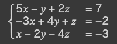
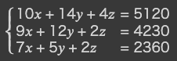

# 連立方程式を解く

## 解が0, 1のみからなる連立方程式



解$(x, y, z) = (1, 0, 1)$

### ソースコード

```python
from tytan import *

x = symbols('x')
y = symbols('y')
z = symbols('z')

## 連立方程式の設定
H = 0
H += (5 * x - y + 2 * z - 7) ** 2
H += (-3 * x + 4 * y + z + 2) ** 2
H += (x - 2 * y - 4 * z + 3) ** 2

qubo, offset = Compile(H).get_qubo()
print('offset', offset)
solver = sampler.SASampler()
result = solver.run(qubo)
for r in result:
  print(r)
```

### 結果

```
offset 62.0
[{'x': 1, 'y': 0, 'z': 1}, -62.0, 100]
```

しっかり解が導出できた。

## 解が0, 1, 2, 3のみからなる連立方程式


解$(x, y, z) = (2, 3, 1)$

### ソースコード

```python
from tytan import *

x = symbols_nbit(0, 4, 'x{}', num=2)
y = symbols_nbit(0, 4, 'y{}', num=2)
z = symbols_nbit(0, 4, 'z{}', num=2)

# 連立方程式の設定
H = 0
H += (x + y + z - 6) ** 2
H += (2*x + 3*y - 2*z - 11) ** 2
H += (3*x - y + z - 4) ** 2

qubo, offset = Compile(H).get_qubo()
print('offset', offset)
solver = sampler.SASampler()
result = solver.run(qubo)

for r in result:
  print(r)
  print('x = ', Auto_array(r[0]).get_nbit_value(x))
  print('y = ', Auto_array(r[0]).get_nbit_value(y))
  print('z = ', Auto_array(r[0]).get_nbit_value(z))
```

### 結果

```

from tytan import *

x = symbols_nbit(0, 4, 'x{}', num=2)
y = symbols_nbit(0, 4, 'y{}', num=2)
z = symbols_nbit(0, 4, 'z{}', num=2)

# 連立方程式の設定
H = 0
H += (x + y + z - 6) ** 2
H += (2*x + 3*y - 2*z - 11) ** 2

offset 173.0
[{'x0': 1, 'x1': 0, 'y0': 1, 'y1': 1, 'z0': 0, 'z1': 1}, -173.0, 50]
x =  2.0
y =  3.0
z =  1.0
[{'x0': 1, 'x1': 0, 'y0': 1, 'y1': 0, 'z0': 0, 'z1': 0}, -168.0, 50]
x =  2.0
y =  2.0
z =  0.0
```

## 解が0~255の整数からなる連立方程式



### ソースコード

```python
from tytan import *

x = symbols_nbit(0, 256, 'x{}', num=8)
y = symbols_nbit(0, 256, 'y{}', num=8)
z = symbols_nbit(0, 256, 'z{}', num=8)

H = 0
H += (10*x + 14*y + 4*z - 5120) **2
H += (9*x + 12*y + 2*z - 4230) **2
H += (7*x + 5*y + 2*z - 2360) **2

qubo, offset = Compile(H).get_qubo()
print('offset', offset)
solver = sampler.SASampler()
result = solver.run(qubo)

for r in result[:5]:
  print(r)
  print('x = ', Auto_array(r[0]).get_nbit_value(x))
  print('y = ', Auto_array(r[0]).get_nbit_value(y))
  print('z = ', Auto_array(r[0]).get_nbit_value(z))
  print()

```

### 結果

```
offset 49676900.0
[{'x0': 1, 'x1': 0, 'x2': 0, 'x3': 0, 'x4': 0, 'x5': 0, 'x6': 1, 'x7': 1, 'y0': 1, 'y1': 1, 'y2': 1, 'y3': 0, 'y4': 0, 'y5': 1, 'y6': 1, 'y7': 0, 'z0': 1, 'z1': 0, 'z2': 0, 'z3': 1, 'z4': 0, 'z5': 0, 'z6': 1, 'z7': 1}, -49676886.0, 1]
x =  131.0
y =  230.0
z =  147.0

[{'x0': 1, 'x1': 0, 'x2': 0, 'x3': 0, 'x4': 0, 'x5': 0, 'x6': 0, 'x7': 1, 'y0': 1, 'y1': 1, 'y2': 1, 'y3': 0, 'y4': 0, 'y5': 1, 'y6': 1, 'y7': 0, 'z0': 1, 'z1': 0, 'z2': 0, 'z3': 1, 'z4': 1, 'z5': 0, 'z6': 0, 'z7': 1}, -49676886.0, 1]
x =  129.0
y =  230.0
z =  153.0

[{'x0': 1, 'x1': 0, 'x2': 0, 'x3': 0, 'x4': 0, 'x5': 0, 'x6': 0, 'x7': 1, 'y0': 1, 'y1': 1, 'y2': 1, 'y3': 0, 'y4': 0, 'y5': 1, 'y6': 1, 'y7': 1, 'z0': 1, 'z1': 0, 'z2': 0, 'z3': 1, 'z4': 0, 'z5': 1, 'z6': 1, 'z7': 0}, -49676871.0, 1]
x =  129.0
y =  231.0
z =  150.0

[{'x0': 0, 'x1': 1, 'x2': 1, 'x3': 1, 'x4': 1, 'x5': 1, 'x6': 1, 'x7': 1, 'y0': 1, 'y1': 1, 'y2': 1, 'y3': 0, 'y4': 1, 'y5': 0, 'y6': 0, 'y7': 0, 'z0': 1, 'z1': 0, 'z2': 0, 'z3': 1, 'z4': 1, 'z5': 0, 'z6': 0, 'z7': 0}, -49676814.0, 4]
x =  127.0
y =  232.0
z =  152.0

[{'x0': 0, 'x1': 1, 'x2': 1, 'x3': 1, 'x4': 1, 'x5': 1, 'x6': 1, 'x7': 1, 'y0': 1, 'y1': 1, 'y2': 1, 'y3': 0, 'y4': 0, 'y5': 1, 'y6': 1, 'y7': 1, 'z0': 1, 'z1': 0, 'z2': 0, 'z3': 1, 'z4': 1, 'z5': 1, 'z6': 0, 'z7': 0}, -49676811.0, 3]
x =  127.0
y =  231.0
z =  156.0
```