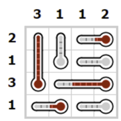

# 温度計パズル

## 問題

以下の画像のパズルを解く。ルールがわからない場合は[こちら](https://www.puzzle-thermometers.com/)で遊んでみて。


## ソースコード

```python
from tytan import *
import numpy as np

q = symbols_list([4, 4])

H = 0
# 各行の個数指定
H += (q[0][0] + q[0][1] + q[0][2] + q[0][3] - 2) ** 2
H += (q[1][0] + q[1][1] + q[1][2] + q[1][3] - 1) ** 2
H += (q[2][0] + q[2][1] + q[2][2] + q[2][3] - 3) ** 2
H += (q[3][0] + q[3][1] + q[3][2] + q[3][3] - 1) ** 2
# 各列の個数指定
H += (q[0][0] + q[1][0] + q[2][0] + q[3][0] - 3) ** 2
H += (q[0][1] + q[1][1] + q[2][1] + q[3][1] - 1) ** 2
H += (q[0][2] + q[1][2] + q[2][2] + q[3][2] - 1) ** 2
H += (q[0][3] + q[1][3] + q[2][3] + q[3][3] - 2) ** 2
# ビットを降順にする(根本から定義)
H += (1 - q[2][0]) * q[1][0] + (1 - q[1][0]) * q[0][0] 
H += (1 - q[1][1]) * q[0][1] 
H += (1 - q[0][3]) * q[0][2]
H += (1 - q[1][3]) * q[1][2]
H += (1 - q[2][3]) * q[2][2] + (1 - q[2][2]) * q[2][1]
H += (1 - q[3][1]) * q[3][0] 
H += (1 - q[3][3]) * q[3][2]

qubo, offset = Compile(H).get_qubo()
solver = sampler.SASampler()
result = solver.run(qubo)
for r in result[:5]:
  # print(r)
  print(np.array(list(r[0].values())).reshape(4, 4))
  print()
```

## 結果

```
[{'q0_0': 1, 'q0_1': 0, 'q0_2': 0, 'q0_3': 1, 'q1_0': 1, 'q1_1': 0, 'q1_2': 0, 'q1_3': 0, 'q2_0': 1, 'q2_1': 0, 'q2_2': 1, 'q2_3': 1, 'q3_0': 0, 'q3_1': 1, 'q3_2': 0, 'q3_3': 0}, -30.0, 46]
[[1 0 0 1]
 [1 0 0 0]
 [1 0 1 1]
 [0 1 0 0]]

[{'q0_0': 1, 'q0_1': 0, 'q0_2': 0, 'q0_3': 1, 'q1_0': 1, 'q1_1': 0, 'q1_2': 0, 'q1_3': 0, 'q2_0': 1, 'q2_1': 1, 'q2_2': 1, 'q2_3': 0, 'q3_0': 0, 'q3_1': 0, 'q3_2': 0, 'q3_3': 1}, -29.0, 16]
[[1 0 0 1]
 [1 0 0 0]
 [1 1 1 0]
 [0 0 0 1]]

[{'q0_0': 1, 'q0_1': 1, 'q0_2': 0, 'q0_3': 0, 'q1_0': 1, 'q1_1': 0, 'q1_2': 0, 'q1_3': 0, 'q2_0': 1, 'q2_1': 0, 'q2_2': 1, 'q2_3': 1, 'q3_0': 0, 'q3_1': 0, 'q3_2': 0, 'q3_3': 1}, -29.0, 22]
[[1 1 0 0]
 [1 0 0 0]
 [1 0 1 1]
 [0 0 0 1]]

[{'q0_0': 0, 'q0_1': 0, 'q0_2': 1, 'q0_3': 1, 'q1_0': 1, 'q1_1': 0, 'q1_2': 0, 'q1_3': 0, 'q2_0': 1, 'q2_1': 0, 'q2_2': 0, 'q2_3': 1, 'q3_0': 1, 'q3_1': 1, 'q3_2': 0, 'q3_3': 0}, -28.0, 7]
[[0 0 1 1]
 [1 0 0 0]
 [1 0 0 1]
 [1 1 0 0]]

[{'q0_0': 0, 'q0_1': 0, 'q0_2': 1, 'q0_3': 1, 'q1_0': 1, 'q1_1': 0, 'q1_2': 0, 'q1_3': 0, 'q2_0': 1, 'q2_1': 1, 'q2_2': 0, 'q2_3': 1, 'q3_0': 1, 'q3_1': 0, 'q3_2': 0, 'q3_3': 0}, -28.0, 1]
[[0 0 1 1]
 [1 0 0 0]
 [1 1 0 1]
 [1 0 0 0]]
```

１番上のみが最適解。見比べてみるとしっかり答えになっている。
