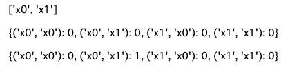
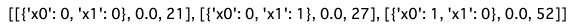
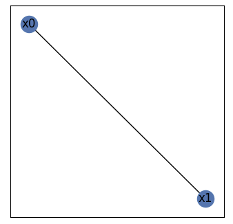

# NetworkXを利用したグラフ問題

## 1. まずライブラリをインストール

```python
!pip install networkx
```

## 2. importし、グラフを作成。

```python
# Graphオブジェクトを生成
G = nx.Graph()

# ノードを定義
node_list = ["x0", "x1"]

# グラフのノードを追加
G.add_nodes_from(node_list)

# グラフのエッジを追加
G.add_edge(node_list[0], node_list[1], weight=1)

# ノードのリストを取得
node_list = list(G.nodes())

print(node_list, '\n')

# QUBO行列の要素を計算
qubo = {(i, j): 0 for i in node_list for j in node_list}

print(qubo, '\n')

for (i, j) in G.edges:
    qubo[(i, j)] += G.edges[(i, j)]['weight']
print(qubo)
```



## 3. QUBOで計算

```python 
sampler = sampler.SASampler()

result = sampler.run(qubo, shots = 100)
print(result)
```


## 4. グラフを描画

```python
# グラフを描画
import matplotlib.pyplot as plt
pos = nx.spring_layout(G, seed = 0)

plt.figure(figsize=(4, 4))
nx.draw_networkx(G, pos)
plt.show()
```


この手順を用いてグラフ問題の描画や計算を行う。