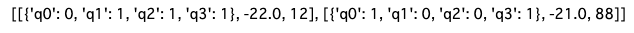
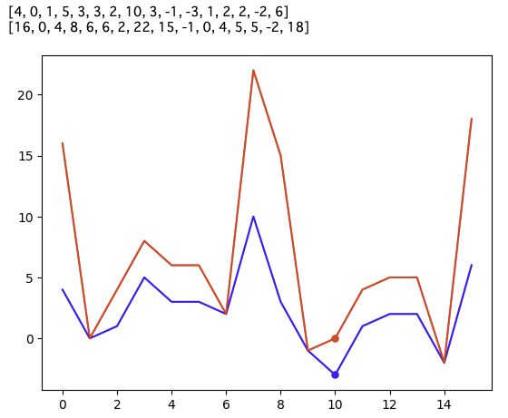
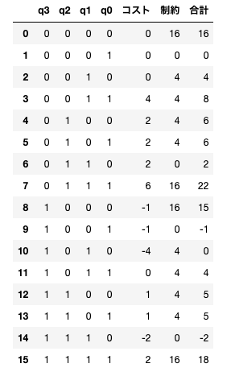

# Simulated Annealingの手順

## Simulated Annealing(SA)とは

- 組合せ最適化問題の解を求める手法
- 計算量が指数関数的に増大してしまう組合せ最適化問題に対して、最適解ではなく近似解を求める手法
- 現実問題は解放自体がわからないものも多いが、SAはその答えを得られる場合がある。
- コスト関数と制約条件を定義することで解く。

## 実際のコード

tytansdkのinstall 

```python
!pip install git+https://tytansdk/tytan
```

SAコード

```python
from tytan import *

# 量子ビットの定義
q = symbols_list(4, 'q{}')

# コスト関数
C = 4*q[0]*q[1] - 3*q[1]*q[3] + 2*q[2]-q[3]
# 制約条件
D = (2*q[0] + q[1] + q[2] - 2)**2

# 式を結合
H = C + 5*D

# 実行
qubo, offset = Compile(H).get_qubo()
solver = sampler.SASampler()
result = solver.run(qubo)
print(result)
```
実行結果


制約条件を計算してみると
$$
D = (2*0 + 1 + 1 - 2)^2 = 0
$$
となり、しっかり満たされている。

制約条件とコストの重みの効果を確かめるために、重みを２つ用意し見比べてみる。

```python
import matplotlib.pyplot as plt

X = [0, 1, 2, 3, 4, 5, 6, 7, 8, 9, 10, 11, 12, 13, 14, 15]
Y = [0, 0, 0, 0, 0, 0, 0, 0, 0, 0, 0  , 0,     0,  0 , 0 , 0]

for q3 in range(2):
    for q2 in range(2):
        for q1 in range(2):
            for q0 in range(2):
                idx = 8*q3 + 4*q2 + 2*q1 + 1*q0
                C = 4*q0*q1 - 3*q1*q3 + 2*q2 - q3
                D = (2*q0 + q1 + q2 - 2)**2
                Y[idx] = C + 1*D
                
plt.plot(X, Y, color = 'blue')
print(Y)
for q3 in range(2):
    for q2 in range(2):
        for q1 in range(2):
            for q0 in range(2):
                idx = 8*q3 + 4*q2 + 2*q1 + 1*q0
                C = 4*q0*q1 - 3*q1*q3 + 2*q2 - q3
                D = (2*q0 + q1 + q2 - 2)**2
                Y[idx] = C + 4*D
plt.plot(10, 0, marker='.', color='red', markersize=10)
plt.plot(10, -3, marker='.', color='blue', markersize=10)
plt.plot(X, Y, color='red')
print(Y)

plt.show()
```



制約条件の重みが軽い方（青）では状態10でコストが最小になっているが、制約条件の重みが大きい方(赤)では、状態10は最小となっていない。制約条件の重みを適宜変える必要があることがわかった。

各条件のコストと制約について表にするには以下のコードを実行する
```python 
import pandas as pd

list1 = list()
list1 = [[0 for i in range(7)] for j in range(16)]

A = 1
B = 4
k = 0
for q3 in range(2):
    for q2 in range(2):
        for q1 in range(2):
            for q0 in range(2):
                list1[k][0] = q3
                list1[k][1] = q2
                list1[k][2] = q1
                list1[k][3] = q0
                list1[k][4] = A * (4*q0*q1 - 3*q1*q3 + 2*q2 - q3)
                list1[k][5] = B * (2*q0 + q1 + q2 - 2)**2
                list1[k][6] = list1[k][4] + list1[k][5]
                k += 1
columns1 = ['q3', 'q2', 'q1', 'q0', 'コスト', '制約', '合計']
pd.DataFrame(data=list1, columns=columns1)
```

