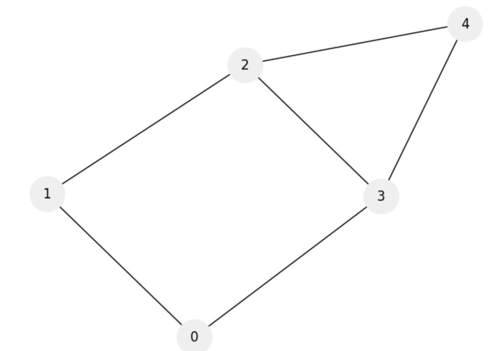
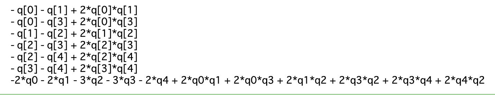
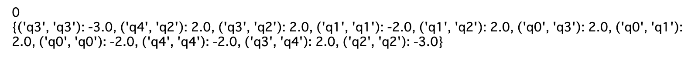
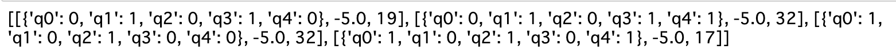
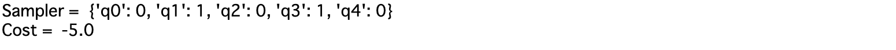
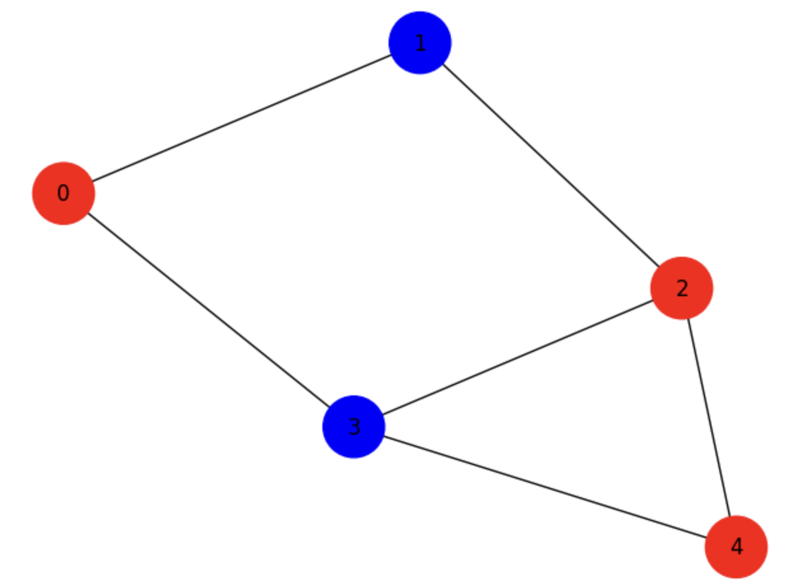
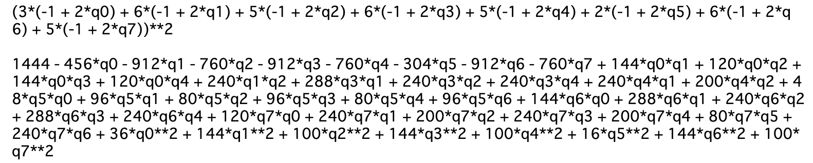
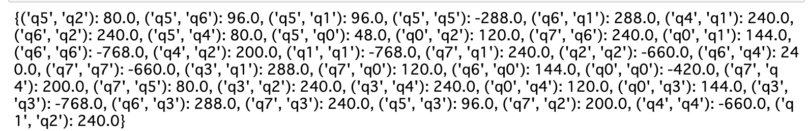

# MaxCut問題と自然数分割問題

## 【MaxCut問題】

一筆書きで切ることができる最大の変の数を求める問題。
辺の両側の点が異なっていれば切れるというルール。

### QUBO式

量子ビット$s_i$が+1と-1のスピンを取る時、QUBO式(イジング式)は
$$
C = \sum_{i, j} s_i s_j
$$
となる。$s_i, s_j$が+1, -1と別の値を取るときにコストが小さくなる。

量子ビット$q_i$が0, 1と書かれる場合は$s_i = 2q_i - 1$として相互に変換できる。
変換後のコスト関数は
$$
\begin{align}
C &= \sum_{i, j} (2q_i - 1) (2 q_i - 1) \\
&= \sum_{i, j} 4 q_i q_j - 2q_i -2q_j + 1 \\
&= 2(\sum_{i, j} 2q_i q_j - q_i - q_j) + 1 \\
\therefore C' &= \sum_{i, j} (- q_i - q_j + 2*q_i *q_j)
\end{align}
$$
となる。

### 1. ライブラリをインストール

```python 
# ライブラリをインストール
!pip install --quiet networkx matplotlib
```

### 2. グラフを作成。

```python 

import networkx as nx
import matplotlib.pyplot as plt

options = {'node_size': 1000, 'with_labels': 'True', 'node_color': '#efefef'}

G = nx.Graph()
G.add_nodes_from([0, 1, 2, 3, 4])
G.add_edges_from([(0, 1), (0, 3), (1, 2), (2, 3), (2, 4), (3, 4)])

nx.draw(G, **options)
```



## 3. コスト関数を定義

```python 
from tytan import *

q = symbols_list(5, 'q{}')
graph = [[0, 1, 0, 1, 0], 
                [0, 0, 1, 0, 0], 
                [0, 0, 0, 1, 1], 
                [0, 0, 0, 0, 1], 
                [0, 0, 0, 0, 0]]

C = 0
for i in range(0, 5):
    for j in range(0, 5):
        if graph[i][j] == 1 :
            C += (- q[i] - q[j] + 2*q[i]*q[j])
            print(f'- q[{i}] - q[{j}] + 2*q[{i}]*q[{j}]')
            
print(C)
```


## 4. 実行

```python 
qubo, offset = Compile(C).get_qubo()
print(offset)
print(qubo)
```


```python 
solver = sampler.SASampler()
result  = solver.run(qubo)
print(result)
```


```python
print('Sampler = ', result[0][0])
print('Cost = ', result[0][1] + offset)
```


## 5. 結果を描画

```python 
import networkx as nx
import matplotlib.pyplot as plt
options = {'node_size': 1200, 'with_labels':'True'}

G = nx.Graph()

G.add_nodes_from([0, 1, 2, 3, 4])
G.add_edges_from([(0, 1), (0, 3), (1, 2), (2, 3), (2, 4), (3, 4)])
c = ['red', 'blue',  'red', 'blue', 'red']

nx.draw(G, **options, node_color=c)
```


## 自然数分割問題

### QUBO式

イジング式は、$s_i = \{-1, 1\}$と各$n_i$との積をとった和が0に近づくほどいいので、
$$
H = \left( \sum_i n_i \times s_i \right)^2
$$ 
となる。先ほど同様$s_i = 2 q_i  - 1$を代入して、
$$
H = \left(\sum_i n_i \times (2q_i - 1)\right)^2
$$
となる。

### 問題設定

$[3, 6, 5, 6, 5, 2, 6, 5]$の配列を２グループに分ける。

### 1. コスト関数を定義

```python
from tytan import *

v = [3, 6, 5, 6, 5, 2, 6, 5]

q = symbols_list(len(v),  'q{}')

C = 0
for i in range(len(v)):
    C += v[i] * (2*q[i] - 1)
    
C = C**2
# C = C.expand()
print(C, '\n')
C = C.expand() # 数式を展開。
print(C)
```


#### 2. 実行

```python
qubo, offset = Compile(C).get_qubo()
print(qubo)
```


```python
solver = sampler.SASampler()
result = solver.run(qubo)
print('Sample = ', result[0][0])
print('Cost = ', result[0][1] + offset)
```


