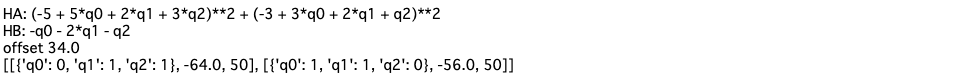
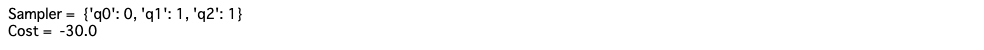

# 二値整数計画問題

連立方程式を満たした上で、ある計算を最小化するという、制約付きの最小値問題。
$Sx = b$を満たすベクトル$x$のうち、$cx$を採用にする$x$を探す問題。

## QUBO

この問題は２つの式から成り立つ。
- $H_A$:連立方程式の制約を満たすため

$$
H_A = \sum_{j = 1}^m [b_j - \sum_{i = 1}^N S_{ji}x_i]^2
$$

- $H_B$: 最小コストを求めるため。

$$
H_B = - \sum_{i=1}^N c_i x_i
$$

これらを重みありで繋ぎ合わせると

$$
H = H_A + \lambda H_B = \sum_{j = 1}^m [b_j - \sum_{i = 1}^N S_{ji}x_i]^2- \lambda \times \sum_{i=1}^N c_i x_i
$$

## 例題

連立方程式

$$
\begin{pmatrix}
3 & 2 & 1\\
5 & 2 & 3
\end{pmatrix}
\begin{pmatrix}
x_0 \\ x_1 \\ x_2
\end{pmatrix}
 = 
\begin{pmatrix}
3 \\ 5
\end{pmatrix}
$$

を満たす$\boldsymbol{x}$のうち

$$
\begin{pmatrix}
1 & 2 & 1
\end{pmatrix}
 \begin{pmatrix}
 x_0 \\ x_1 \\ x_2
 \end{pmatrix}
$$

を最小にする$\boldsymbol{x}$を求める。

制約条件を満たすときQUBO式は$0$になる。

## ソースコード

```python
from tytan import *

q = symbols_list(3, 'q{}')

S = [[3, 2, 1], 
          [5, 2, 3]]
b = [3, 5]
c = [1, 2, 1]

HA = 0
for i in range(2):
    ha = 0
    for j in range(3):
        ha += S[i][j] * q[j]
    ha -= b[i]
    HA += ha ** 2
print("HA:", HA)

HB = 0
for j in range(3):
    HB -= q[j] * c[j]
print('HB:', HB)    
lam = 10
H = HA + lam*HB

qubo, offset = Compile(H).get_qubo()
print('offset', offset)
solver = sampler.SASampler()
result = solver.run(qubo)
print(result)

```


結果の確認

```python
print('Sampler = ', result[0][0])
print('Cost = ', result[0][1] + offset)
```
