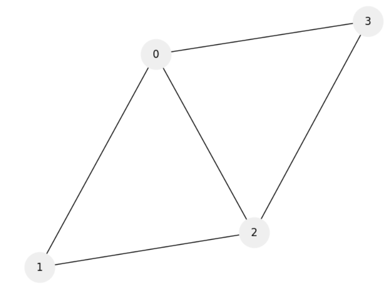
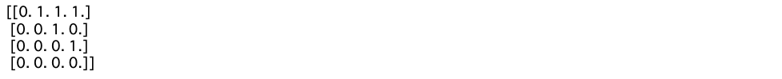
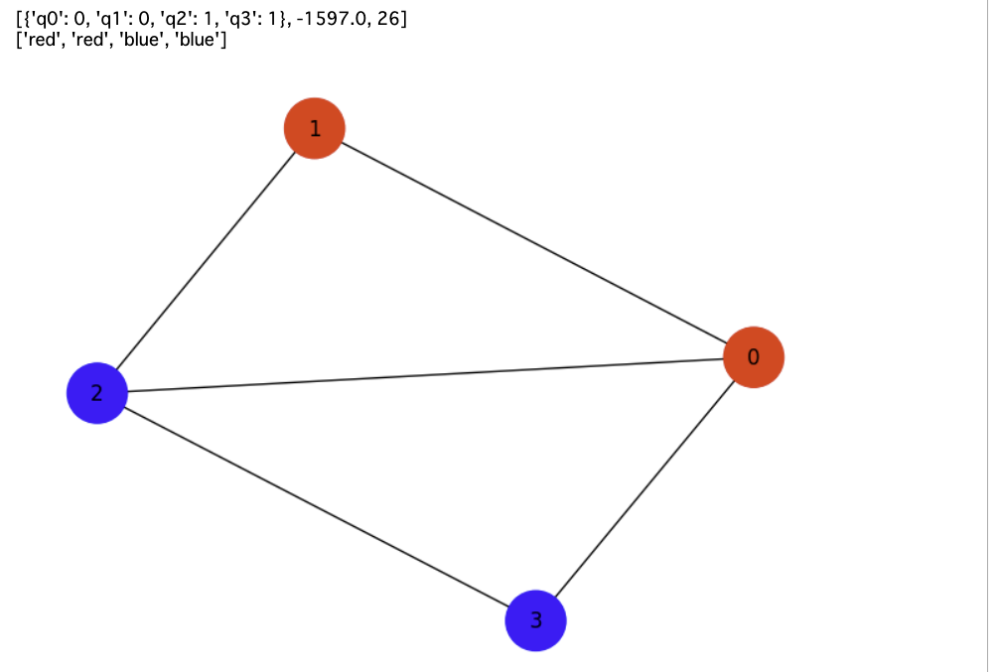
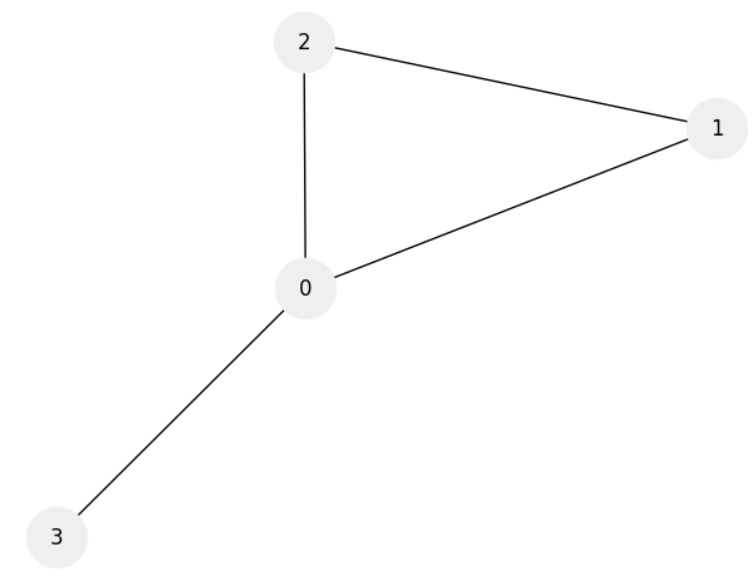
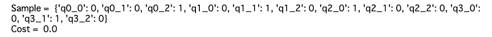

# グラフ分割問題とグラフカラーリング問題

## 【グラフ分割問題】

- グラフ$E$の頂点を２つのグループに分ける
- ２つのグループの頂点数はなるべく同じようにする。
- 異なるグループ同士の頂点を結ぶ辺の数を最小にする。

### イジング式

1. グラフの頂点を２つに分割するためのコスト$H_A$
    - グラフの頂点に$s_i = [+1, -1]$を割り当てる。
    - 和が0に近づくとき、最適な解に近づく。
$$
    H_A = \left( \sum_{i = 1}^N s_i \right)^2
$$

2. 異なるグループ同士の頂点を結ぶ点の個数のコスト$H_B$ 
    - 辺を$(i, j) \in E$と表す
    - 同じグループ$(s_i = s_j)$に辺が伸びている時、コストは$0$になる。
    - 違うグループ$(s_i \neq s_j)$に辺が伸びている時、コストは$1$になる。
$$
    H_B = \sum_{i, j \in E} \frac{1 - s_i s_j}{2}
$$

### QUBO式

さきほどのイジング式をQUBO式に変換する。対応関係は
$$
s_i = 1 - 2q_i
$$
なので
$$
    H_A = \left( \sum_{i = 1}^N 1 - 2q_i \right)^2
$$
$$
\begin{align}
    H_B &= \sum_{i, j \in E} \frac{1 - (1 - 2q_i)(1 - 2q_j)}{2}\\
         &= \sum_{i, j \in E} \frac{1 - (1 - 2q_i - 2q_j + 4q_i q_j)}{2} \\
         &= \sum_{i, j \in E} (q_i + q_j - 2q_i q_j)
\end{align}
$$

```python 
# グラフの作成・描画
import networkx as nx
import matplotlib.pyplot as plt

options = {'node_color': '#efefef', 'node_size': 1200, 'with_labels': 'True'}

N = 4
G = nx.Graph()
G.add_nodes_from(nx.path_graph(N))
G.add_edges_from([(0, 1), (0, 2), (0, 3), (1, 2), (2, 3)])
nx.draw(G, **options)
```


```python
import numpy as np

# 隣接行列として書き出す
A = np.triu(nx.to_numpy_array(G))
print(A)
```


```python 
# QUBO式を定義
from tytan import *

q = symbols_list(N, 'q{}')

# コストHA
HA = sum([(1 - 2*q[i]) for i in range(N)])
HA = HA ** 2

# コストHB
HB = 0.0
for i in range(N):
    for j in range(i + 1, N):
        if A[i][j] == 1:
            HB += (q[i] + q[j] - 2*q[i]*q[j])
            
M = 100
H = M * HA + HB

qubo, offset = Compile(H).get_qubo()

solver = sampler.SASampler()

result = solver.run(qubo)


print(result[0])
v = [0 for i in range(4)]
for key, val in result[0][0].items():
    key = key.replace('q', '')
    v[int(key)] = val
        

c = []
for i in range(len(v)):
    if v[i] == 0:
        c.append('red')
    else:
        c.append('blue')
print(c)

nx.draw(G, **options, node_color=c)
```


## 【グラフカラーリング】

- グラフ分割問題の拡張
- ある$n$頂点と辺からなるグラフにおいて、グラフを$m$個に分割する問題
- グラフの頂点を$m$個に色分けするとも考えられるのでグラフカラーリング問題とも呼ばれる

### QUBO式

最適化する変数は変数$q_{v, i}$である。
$$
q_{v, i} = 
\begin{cases}
1~~(グラフの頂点vを色iで塗るとき), \\
0~~(それ以外の時)
\end{cases}
$$
条件は以下

1. １つの頂点に対して、色がただ一つ選ばれる制約
$$
    H_A = \sum_{v = 0}^{n - 1}(1 - \sum_{i =1}^{m- 1} q_{v, i})^2
$$

2. 異なる色同士の頂点を結ぶ辺の数を最小にする
$$
    H_B = \sum_{(uv)\in E} \sum_{i = 0}^{m - 1} q_{u, i} \times q_{v, i}
$$

```python 
import networkx as nx
import matplotlib.pyplot as plt

options = {'node_color': '#efefef', 'node_size': 1200, 'with_labels': 'True'}

n = 4 # 頂点数
m = 3 # 塗り分ける色の数

G = nx.Graph()
G.add_nodes_from(nx.path_graph(n))
G.add_edges_from([(0, 1), (0, 2), (0, 3), (1, 2)])
nx.draw(G, **options)
```



```python 
from tytan import *

# N = n*m # 量子ビット数
# q = symbols_list(N, 'q_{}')
q = symbols_list([n, m], 'q{}_{}') # q[i][j] = 頂点iを色jで塗るとき1, そうでなければ0

# 隣接行列を取得
A = np.triu(nx.to_numpy_array(G))

HA = 0
for v in range(n):
    tmp = 0
    for i in range(m):
        tmp += q[v][i]
    HA += (1 - tmp)**2
    
HB = 0
for u in range(n):
    for v in range(n):
        if A[u][v] == 0:
            continue
        for i in range(m):
            HB += q[u][i] * q[v][i]
            
H = HA + HB

# # 色の通し番号を格納
# b = np.zeros((n, m))

# # 後で利用するノードの色を表示するための辞書
# my_dict = {}

# # 色を格納
# num = 0
# for v in range(n):
#     for i in range(m):
#         b[v][i] = num
#         my_dict[num] = [str(v), i]
#         num += 1
        
# ## QUBO 式を定義
# # １つの頂点に対して１つの色が選ばれる制約条件
# H_A = 0.0
# for v in range(n):
#     const_H = 0.0
#     for i in range(m):
#         const_H += q[int(b[v][i])]
#     H_A += (1 - const_H)**2

# # 異なる色同士の頂点を結ぶ辺の数を最小にする条件
# H_B = 0.0
# for u in range(n):
#     for v in range(n):
#         for i in range(m):
#             if A[u][v] == 1:
#                 H_B += q[int(b[u][i])] * q[int(b[v][i])]
# H = H_A + H_B    
```


```python
qubo, offset = Compile(H).get_qubo()

solver = sampler.SASampler()

result = solver.run(qubo)

print('Sample = ', result[0][0])
print('Cost = ', result[0][1] + offset)
```


絵を描いて終わりにしたい。
