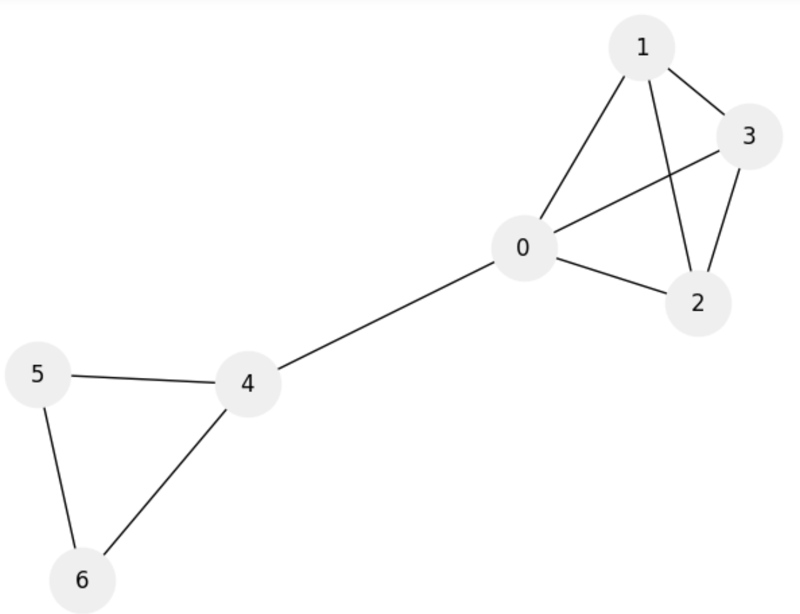

# クリーク問題とクリークカバー問題

## 【クリーク判定問題】

クリークとは頂点同士が全て繋がっている頂点群のこと。

クリーク問題はグラフ$G = (V, E)$の
部分集合$W\in V$において、
大きさ$|W| = K$のあらゆる2点を
繋ぐ$\frac{K(K - 1)}{2}$個の辺があるかどうかを判定する。

### 例

```python 
import networkx as nx
import matplotlib.pyplot as plt
import numpy as np

options = {'node_color': '#efefef', 'node_size': 1200, 'with_labels': 'True'}

n = 7 # 頂点数
K = 4 # 探すクリーク数（グラフGの部分集合Wのサイズのこと）

G = nx.Graph()
G.add_nodes_from(nx.path_graph(n))
G.add_edges_from([(0, 1), (0, 2), (0, 3), (0, 4), (1, 2), (1, 3), (2, 3), (4, 6), (4, 5), (5, 6)])

nx.draw(G, **options)
```


「クリーク数4のクリークを探す」とは、「サイズ４の頂点の部分集合のうち、全ての頂点が辺で結ばれている集合」を探すこと。
上記のグラフにおいてクリーク数4のクリークは$W = \{0, 1, 2, 3\}$である。この部分集合の辺数は6で、$\frac{4 \times 3}{2} = 6$を満たす。

### QUBO式

1. 部分集合の大きさが$K$となる制約

$$
    C_1 = \left(K - \sum_{v \in V} q_v \right)^2
$$

2. あらゆる２点を繋ぐ辺の数が$K(K - 1) /2$ある制約

$$
    C_2 = \frac{K(K - 1)}{2} - \sum_{u, v \in E} q_u q_v
$$

```python 
from tytan import *

q = symbols('q_{0:7}')

C_1 = (K - sum(q))**2

C_2 = K*(K - 1)/2 - sum(q[edge[0]] * q[edge[1]] for edge in G.edges)

H = 10*C_1 + C_2

qubo, offset = Compile(H).get_qubo()

solver = sampler.SASampler()
result = solver.run(qubo)

print('Sampler = ', result[0][0])
print('Cost = ', result[0][1] + offset)
```


頂点$\{0, 1, 2, 3\}$にクリーク数4のクリークが見つけられた。


## 【Clique Cover】

