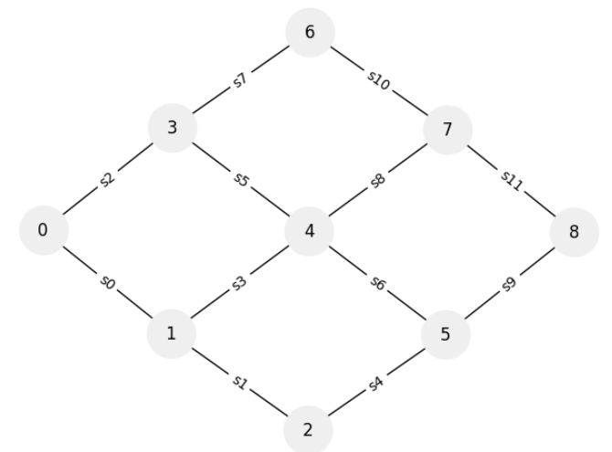
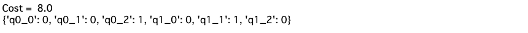
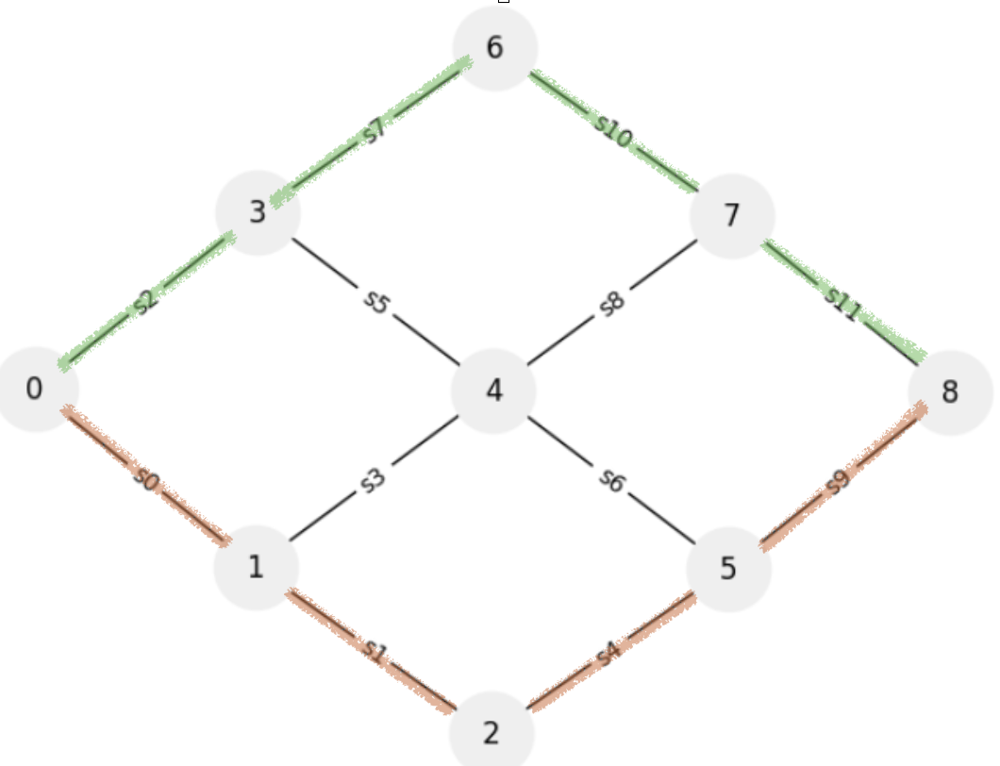

# 交通経路最適化問題

渋滞緩和のために、経路を選択し、最適化する。

```python
import networkx as nx
import matplotlib.pyplot as plt

G = nx.Graph()
G.add_nodes_from([i for i in range(9)])
G.add_edges_from([(0, 1), (0, 3), (1, 2), (1, 4), (2, 5), (3, 4), (3, 6), (4, 5), (4, 7), (5, 8), (6, 7), (7, 8)])
options = {'node_size': 1200, 'with_labels': 'True'}
pos = nx.spring_layout(G)
nx.draw(G, pos, **options, node_color='#efefef')

edge_labels = {(0, 1):'s0', (0, 3):'s2', (1, 2):'s1', (1, 4):'s3', \
                           (2, 5):'s4', (3, 4):'s5', (3, 6):'s7', (4, 5):'s6', \
                           (4, 7):'s8', (5, 8):'s9', (6, 7):'s10', (7, 8):'s11'}

nx.draw_networkx_edge_labels(G, pos, edge_labels=edge_labels)
plt.show()
```


## QUBO式

- 最適化変数$q_{i, j}$

$$
q_{i, j}= 
\begin{cases}
    1~~(\rm i番目の車がj番目の経路を通るとき), \\
    0~~(\rm それ以外)
\end{cases}
$$

- 道路の集合$S = [s_0, s_1, s_2, s_3, s_4, s_5, s_6, s_7, s_8, s_9, s_{10}, s_{11}]$
- QUBOのコスト関数は,
$$
C = \sum_{s}\left( \sum_{s\in S_{i, j}} q_{i, j} \right)^2
$$

## 例題

- 経路
    - 経路1: $s_0, s_{3}, s_{8}, s_{11}$
    - 経路2: $s_2, s_7, s_{10}, s_{11}$
    - 経路3: $s_0, s_1, s_4, s_9$
- 車は2台

- 道路$s_0$のみに関するコスト関数
    - $s_0$を通過するのは経路1と経路3
    - 車1, 2に関して和をとる。
$$
(q_{1, 1} + q_{2, 1} + q_{1, 3} + q_{2, 3})^2
$$

```python 
import numpy as np
from tytan import *

N = 2 # 車の数
W = 3# 経路数
s = np.array([[0, 3, 8, 11], [2, 7, 10, 11], [0, 1, 4, 9]]) # 各経路
S = 12 # 道路数

q = symbols_list([N, W], 'q{}_{}')

HA = 0
for k in range(S):# 各道路において、
    tmp = 0
    for j in range(W): #
        for i in range(N):
            for l in range(4):
                if s[j][l] == k:
                    tmp += q[i][j]
    HA += tmp**2
    
HC = 0
for i in range(N):
    tmp = 0
    for j in range(W):
        tmp += q[i][j]
    HC += (tmp - 1)**2
    
H = HA + 10*HC

qubo, offset = Compile(H).get_qubo()
solver = sampler.SASampler()
result = solver.run(qubo)

print('Cost = ', offset + result[0][1])
print(result[0][0])
```


車0は経路3, 車1は経路2を選択するのが良いのがわかった。


確かに経路として被ってないので最適に見える。Costは選んだ道路の総数だと思う。