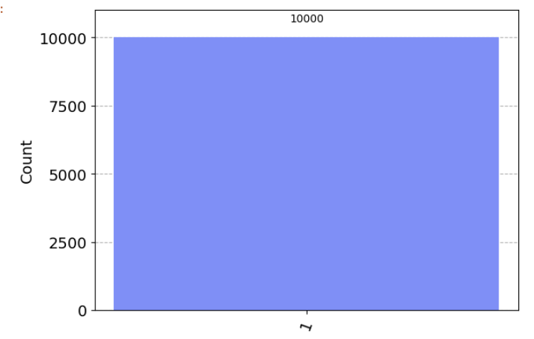

# 誤り訂正符号の実装

Shorの符号をQiskitで実装した。
実装した回路にエラーが入った際の挙動を確認した。

## 1. ライブラリのinstall, import

```python 
!pip install qiskit=0.45.2 qiskit-aer=0.12.0
!pip install pylatexexc
```

```python
import numpy as np
from qiskit import QuantumCircuit
from qiskit_aer import AerSimulator
from qiskit.visualization import plot_histogram
from qiskit_aer.noise import pauli_error
from qiskit_aer.noise.errors.quantum_error import QuantumChannelInstruction
```

## 2. エラーチャネルの作成

```python
# エラー確率を定義
p_error = 0.02

def make_bitphase_error_channel(p_error:float, print_flag: bool = True) -> QuantumChannelInstruction:
    # ビット反転
    bit_flip = pauli_error([('X', p_error), ('I', 1 - p_error)])
    # 位相反転
    phase_flip = pauli_error([('Z', p_error), ('I', 1 - p_error)])

    bitphase_flip = bit_flip.compose(phase_flip)

    if print_flag:
        print(bitphase_flip)
    return bitphase_flip.to_instruction()

bitphase_flip = make_bitphase_error_channel(p_error)
``` 


ビット反転と位相反転はそれぞれ独立に発生するため、出力のような回路が確率的に適用される。

## 3. 単純な回路で試す

Xゲートを適用するだけの回路で試す。

### ショット数とシミュレータを準備

```python
n_shots = 10_000 
backend_sim = AerSimulator()
```

### エラーなしの回路

```python
n_qubits = 1
circ_ideal = QuatumCircuit(n_qubits, 1)

circ_ideal.x(0)

circ_ideal.measure(0, 0)
circ_ideal.draw('mpl')
```


```python 
result_ideal = backend_sim.run(circ_ideal, shots=n_shots).result()
plot_histogram(result_ideal.get_counts(0))
```


エラーが起きずに`1`のみがしっかり観測されている。
次にXゲート適用後にエラーが発生するように設定。

### エラーありの回路

```python
n_qubits = 1
circ_noise = QuatumCircuit(n_qubits, 1)

circ_noise.x(0)
circ_noise.append(bitphase_flip, [0])

circ_noise.measure(0, 0)
circ_noise.draw('mpl')
```


```python
result_noise = backend_sim.run(circ_noise, shots=n_shots).result()
plot_histogram(result_noise.get_counts(0))
```


定義したエラー率(2%)でエラーが発生することが確認できた。ただし位相反転エラーの影響は測定では確認できない。

## 4. ビット反転エラーを検出する回路

3量子ビットのビット反転エラーを検出する回路を実装する

```python
def make_circ(noise_channel: list[int] = [], p_error: float = 0.02) -> QuantumCircuit:
    """
    noise_channel: ノイズをかけたいチャネルのリスト
    p_error: エラーの発生確率
    """
    
    # エラーの定義
    bit_flip = pauli_error([('X', p_error), ('I', 1 - p_error)]).to_instruction()

    # 回路の記述
    circ = QuantumCircuit(3, 1)

    circ.x(0)
    circ.barrier()

    # 符号化
    circ.cx(0, 1)
    circ.cx(0, 2)

    circ.barrier()

    # エラーが発生する箇所
    for i in noise_channel:
        assert (0 <= i) and (i < 3)
        circ.append(bit_flip, [i])

    circ.barrier()

    # 復号
    circ.cx(0, 2)
    circ.cx(0, 1)
    circ.ccx(1, 2, 0)

    circ.measure(0, 0)
    return circ
```

### エラーなしの挙動

回路

```python
circ_ideal = make_circ()
circ_ideal.draw('mpl')
```


```python
result_ideal = backend_sim.run(circ_ideal, shots=n_shots).result()
plot_histogram(result_ideal.get_counts(0))
```



### エラーありの挙動

0番の量子ビットにエラーをかける

```python 
circ_noise = make_circ(noise_channel=[0])
circ_noise.draw('mpl')
```


```python
result_noise = backend_sim.run(circ_noise, shots=n_shots).result()
plot_histogram(result_noise.get_counts(0))
```


量子ビット0にエラーをかけても問題なく誤り訂正することができた。

## 課題1

複数のチャネルにエラーをかけ、誤り訂正が成功するか確認する。
失敗する場合、エラー率がどの程度になるのか確認する。


```python 
# 全て(3つ)の量子ビットにエラーをかけてみた。
circ_noise = make_circ(noise_channel=[0, 1, 2])
circ_noise.draw('mpl')
```


```python 
result_noise = backend_sim.run(circ_noise, shots=n_shots).result()
plot_histogram(result_noise.get_counts(0))
```


エラーが0.1%程度の確率で起きた。２つとも、あるいは3つともエラーが出た時に復号できない。その時の確率は
$$
    Pr = p^3 + {}_{3}{\rm C}_{2}~p^2~(1 - p) \sim 0.00120
$$
となり, 0.1%程度となり、測定とも一致する。

## 5. Shorの符号

