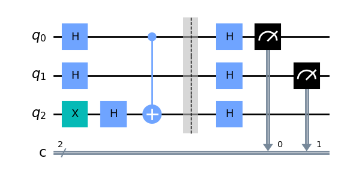
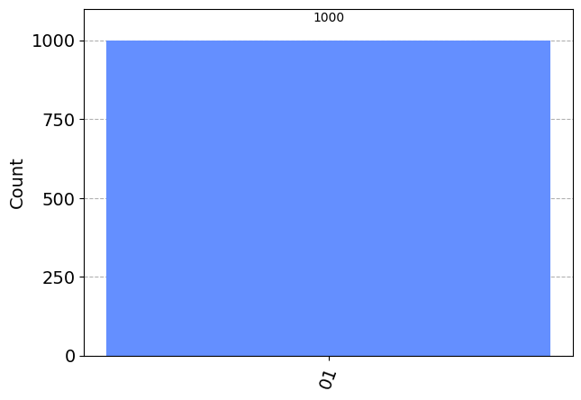
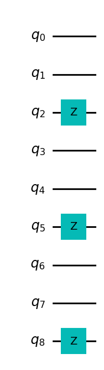
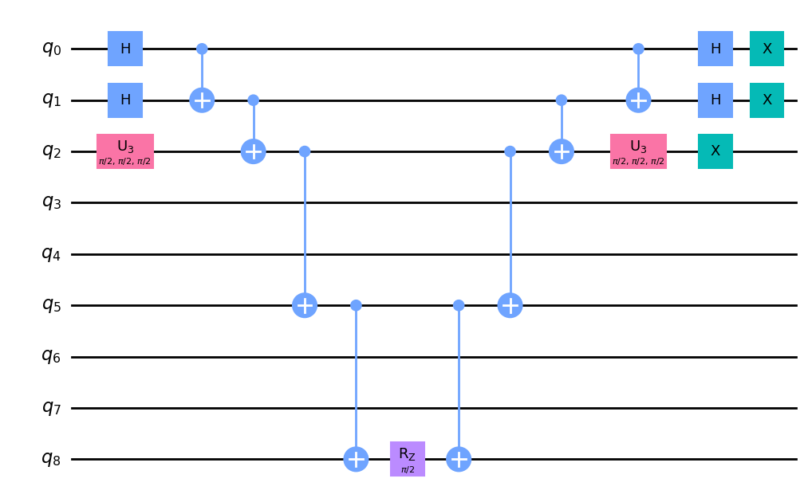
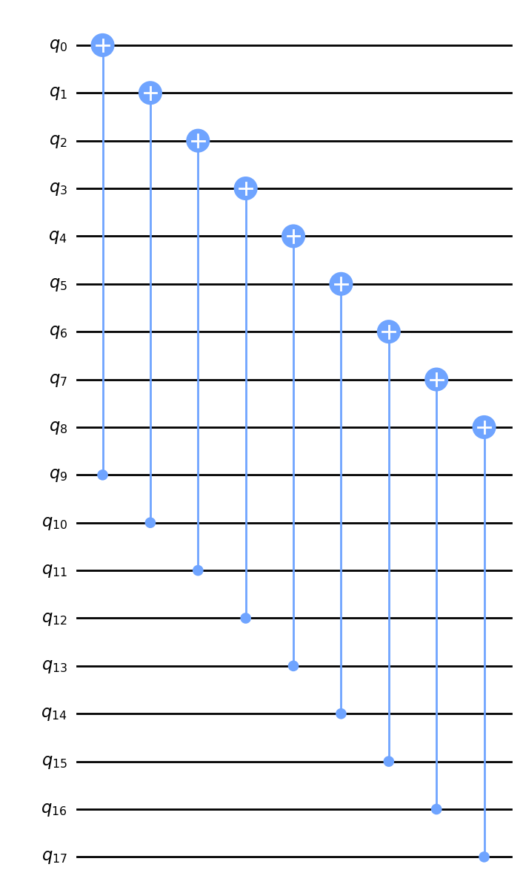
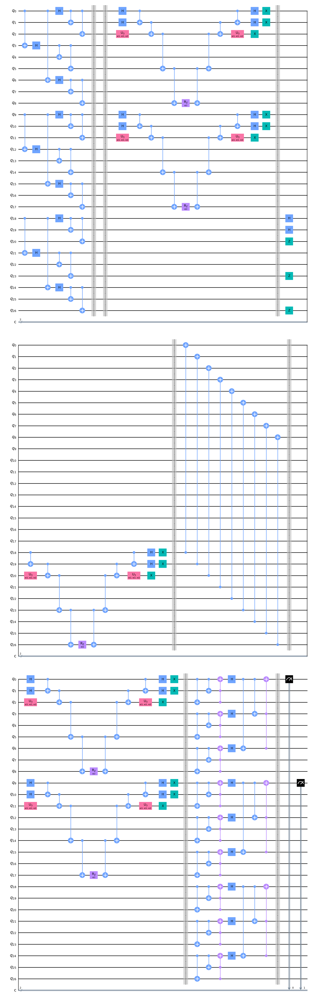
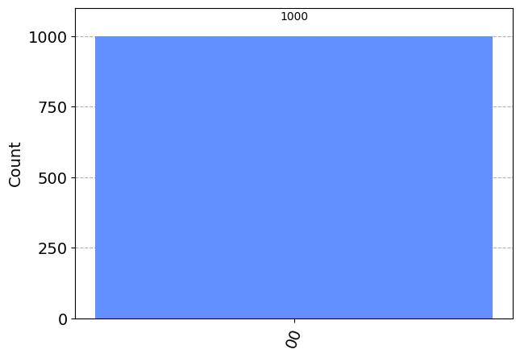

# Shorの符号で論理ビット操作

符号化された状態で、各種ゲート操作に対応する操作を実行する論理ビット操作を行なった。

## 1. ライブラリのinstall, import

```python 
!pip install qiskit=0.45.2 qiskit-aer=0.12.0
!pip install pylatexexc
```

```python
import random
import numpy as np

from qiskit import QuantumCircuit, QuantumRegister, ClassicalRegister
from qiskit_aer import AerSimulator
from qiskit.visualization import plot_histogram
from qiskit_aer.noise import pauli_error
from qiskit_aer.noise.errors.quantum_error import QuantumChannelInstruction
from qiskit.circuit.library import U3Gate
```

## 2. ベルンシュタイン・ヴァジラニアルゴリズム

簡単な回路の例としてベルンシュタイン・ヴァジラニアルゴリズムを動かす

```python 
backend_sim = AerSimulator()
n_shots = 1000

n = 2
bv = QuantumCircuit(n + 1, n)

bv.x(n)
bv.h(range(n + 1))

# オラクル
bv,cx(0, n)
bv.barrier()

bv.h(range(n + 1))

bv.measure(range(n), range(n))
bv.draw("mpl")
```



```python 
result_ideal = backend_sim.run(bv, shots=n_shots).result()
plot_histogram(result_ideal.get_counts(0))
```



これをshorの符号を用いた論理ビット操作で実現する。

```python 
def shor_encode(noise_channel: list[int] = [], p_error: float = 0.02):

    # 回路の記述
    n_qubits = 9
    circ = QuantumCircuit(n_qubits)

    # 符号化
    circ.cx(0, 3)
    circ.cx(0, 6)

    circ.h(0)
    circ.h(3)
    circ.h(6)

    circ.cx(0, 1)
    circ.cx(0, 2)

    circ.cx(3, 4)
    circ.cx(3, 5)

    circ.cx(6, 7)
    circ.cx(6, 8)

    return circ

def shor_decode() -> QuantumCircuit:
    # 回路の記述
    n_qubits = 9
    circ = QuantumCircuit(n_qubits)

    # 復号
    circ.cx(6, 8)
    circ.cx(6, 7)

    circ.cx(3, 5)
    circ.cx(3, 4)

    circ.cx(0, 2)
    circ.cx(0, 1)

    circ.ccx(2, 1, 0)
    circ.ccx(5, 4, 3)
    circ.ccx(8, 7, 6)

    circ.h(0)
    circ.h(3)
    circ.h(6)

    circ.cx(0, 6)
    circ.cx(0, 3)
    circ.ccx(6, 3, 0)

    return circ
```

ここで、各種ゲート操作に対応する論理ビット操作の実装を準備する。

```python
def shor_cnot(circ: QuantumCircuit, qr1: QuantumRegister, qr2: QuantumRegister) -> QuantumCircuit:
    logical_cnot = QuantumCircuit(18)

    for n in range(9):
        logical_cnot.cx(n, n+9)

    circ.append(logical_cnot, qr1 + qr2)
    return circ

def shor_x() -> QuantumCircuit:
    circ = QuantumCircuit(9)
    circ.z(2)
    circ.z(5)
    circ.z(8)
    return circ

def shor_hadamard() -> QuantumCircuit:
    circ = QuantumCircuit(9)
    circ.h(0)
    circ.h(1)
    circ.append(U3Gate(0.5 * np.pi, 0.5 * np.pi, 0.5 * np.pi), [2])
    circ.cx(0,1)
    circ.cx(1,2)
    circ.cx(2,5)
    circ.cx(5,8)
    circ.rz(0.5 * np.pi, 8)
    circ.cx(5,8)
    circ.cx(2,5)
    circ.cx(1,2)
    circ.cx(0,1)
    circ.h(0)
    circ.h(1)
    circ.append(U3Gate(0.5 * np.pi, 0.5 * np.pi, 0.5 * np.pi), [2])
    circ.x(0)
    circ.x(1)
    circ.x(2)

    return circ
```

可視化すると以下のようになる。

### 論理Xゲート

```python 
shor_x().draw('mpl')
```



### 論理アダマールゲート

```python
shor_hadamard().draw("mpl")
```



### 論理CNOTゲート

```python
qr = QuantumRegister(18, 'q')
circ = QuantumCircuit(qr)
shor_cnot(circ, qr[9:], qr[0:9]).decompose().draw("mpl")
```



これらを組み合わせて、元のアルゴリズムに相当する量子回路を構成すると以下のようになる。

```python
def make_logical_bv(x_error_channel: list[int] = [], z_error_channel: list[int] = []):
    qr = QuantumRegister(27, 'q')
    cr = ClassicalRegister(2, 'c')
    circ = QuantumCircuit(qr, cr)

    # エンコード
    circ.append(shor_encode(), qr[0:9])
    circ.append(shor_encode(), qr[9:18])
    circ.append(shor_encode(), qr[18:])
    circ.barrier()
    
    # エラーチャネル
    for i in x_error_channel:
        circ.x(i)
        
    for i in z_error_channel:
        circ.z(i)
        
    circ.barrier()

    # 論理アダマールと反転
    circ.append(shor_hadamard(), qr[0:9])
    circ.append(shor_hadamard(), qr[9:18])
    circ.barrier()
    circ.append(shor_x(), qr[18:])
    circ.append(shor_hadamard(), qr[18:])
    circ.barrier()

    # 論理CNOT
    shor_cnot(circ, qr[18:], qr[0:9])
    circ.barrier()

    # 論理アダマール
    circ.append(shor_hadamard(), qr[0:9])
    circ.append(shor_hadamard(), qr[9:18])
    circ.barrier()

    # デコード
    circ.append(shor_decode(), qr[0:9])
    circ.append(shor_decode(), qr[9:18])
    circ.append(shor_decode(), qr[18:])
    circ.barrier()

    # 観測
    circ.measure(qr[0], cr[0])
    circ.measure(qr[9], cr[1])

    return circ
```

```python
circ = make_logical_bv()
circ.decompose().draw("mpl")
```



```python
result_ideal = backend_sim.run(circ.decompose(), shots=n_shots).result()
plot_histogram(result_ideal.get_counts(0))
```


ここに、１量子ビットまでのエラーを加えてもうまく訂正できるのが期待値であるが、実際にはうまくいかないケースが出てくる。

```python
# うまくいく場合
circ_noise = make_logical_bv(x_error_channel=[0])

result_noise = backend_sim.run(circ_noise.decompose(), shots=n_shots).result()
plot_histogram(result_noise.get_counts(0))
```


```python
# うまくいかない場合
circ_noise = make_logical_bv(z_error_channel=[18])

result_noise = backend_sim.run(circ_noise.decompose(), shots=n_shots).result()
plot_histogram(result_noise.get_counts(0))
```

