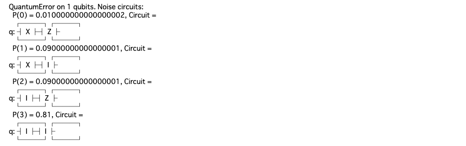
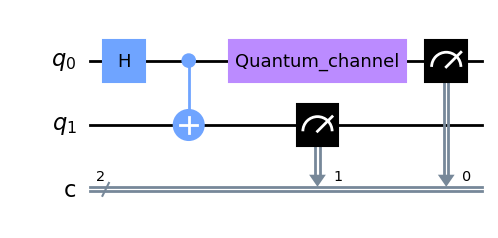
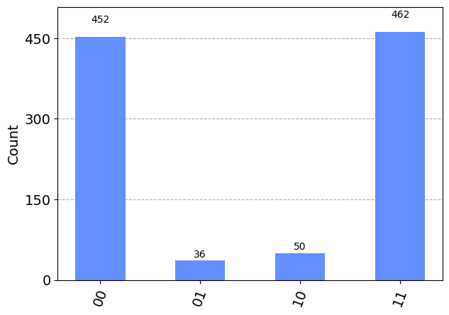
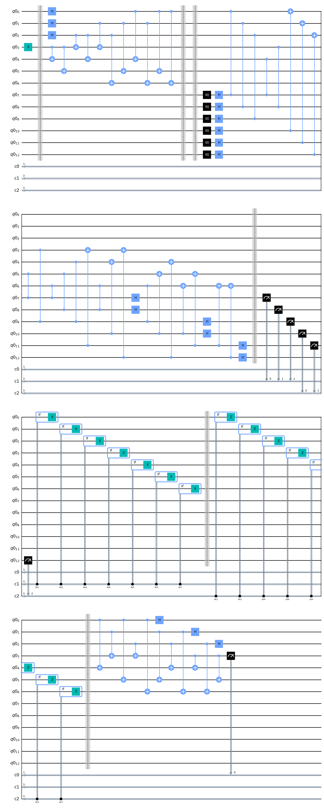
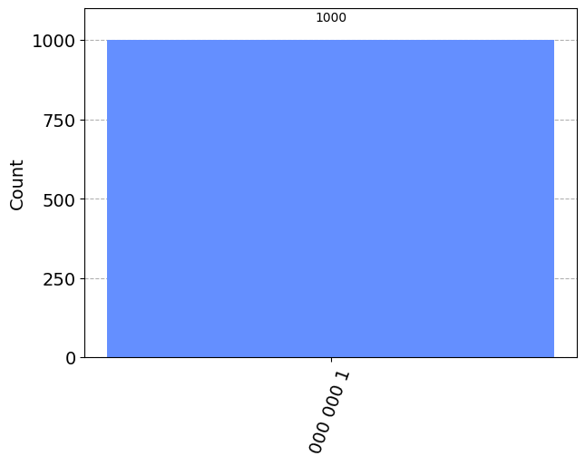
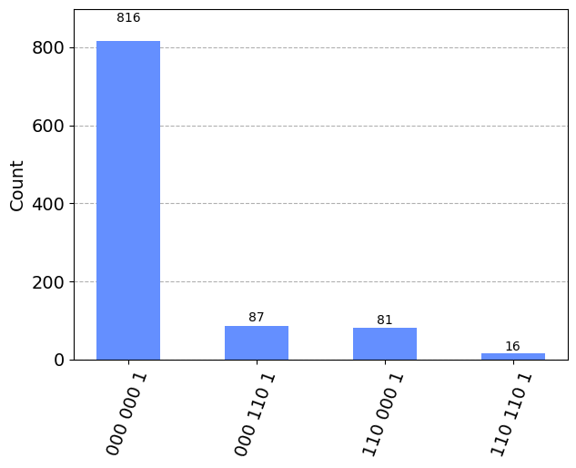
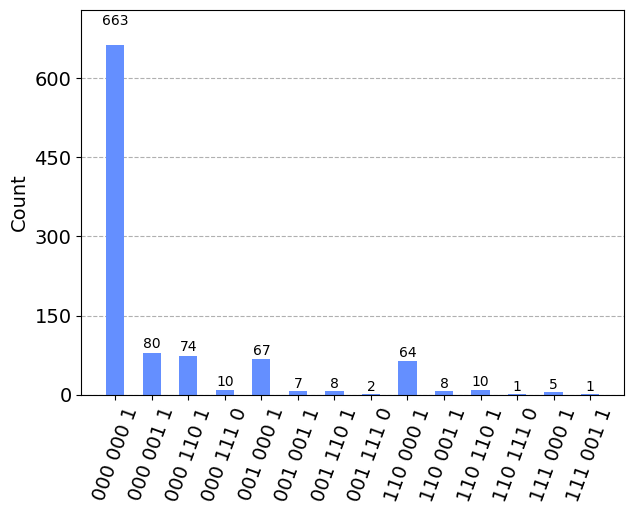

# Steane符号と論理ビット操作

Steane符号を用いた誤り訂正符号の実装をおこなっった。
Steane符号では、論理Hゲート実装の際、各量子ビットに並列に操作を加えることで、論理ビット操作を実装する。

## 1. ライブラリのinstall, import

```python 
%pip install qiskit==0.45.2 qiskit-aer==0.12.0
%pip install pylatexenc
```

```python
import numpy as np
from qiskit import QuantumCircuit, QuantumRegister, ClassicalRegister
from qiskit_aer import AerSimulator
from qiskit.visualization import plot_histogram
from qiskit_aer.noise import pauli_error
from qiskit_aer.noise.errors.quantum_error import QuantumChannelInstruction
```

## 2. エラーチャネルの作成

ここでは先ほどよりも少し高めのエラー率にしています。
理由としては、ここでは17量子ビットを使用する長い回路を利用するため、shot数を多く確保すると実行時間伸びてしまいます。
そのため、shot数を抑えたいのですが、低めのエラー率だと、エラーが出て欲しい場面で観測されない可能性があるため、エラー率を高めています。

```python
n_shots = 1000 # シミュレーターでのサンプリング回数
backend_sim = AerSimulator() # シミュレーターの用意
p_error = 0.1 # エラー確率

def make_bitphase_error_channel(p_error: float, print_flag: bool = True) -> QuantumChannelInstruction:
    bit_flip = pauli_error([('X', p_error), ('I', 1 - p_error)])
    phase_flip = pauli_error([('Z', p_error), ('I', 1 - p_error)])

    bitphase_flip = bit_flip.compose(phase_flip)
    
    if print_flag:
        print(bitphase_flip)
    return bitphase_flip.to_instruction()

bitphase_flip = make_bitphase_error_channel(p_error)
```



まずは、符号化をしないままのベル状態に1量子ビットだけノイズをかけてみます。

```python
# エラーありの回路
n_qubits = 2
circ_noise = QuantumCircuit(n_qubits, 2)

circ_noise.h(0)
circ_noise.cx(0, 1)

circ_noise.append(bitphase_flip, [0])

circ_noise.measure([0, 1], [0, 1])
circ_noise.draw("mpl")
```



```python
result_noise = backend_sim.run(circ_noise, shots=n_shots).result()
plot_histogram(result_noise.get_counts(0))
```



本来出現しないはずの01と11がそれぞれ約5％の確率で出現しています。（合計10％のエラー率）

## 3. Steane符号

まずは1ビットの情報をSteane符号で符号化して、挙動を確認してみます。

Xゲートで反転させただけの状態を用意し、符号化します。

詳細については、以下のwebサイトが参考になります。
- `https://intra.ece.ucr.edu/~korotkov/courses/EE214-QC/QC-7-error-correction.pdf`

```python
def steane_code(noise_channel: list[int] = [], p_error: float = 0.1) -> QuantumCircuit:
    # noise_channel : ノイズをかけたいチャネル(int)を入れたリスト
    # p_error : エラーの発生確率
    
    # エラーの定義
    bitphase_flip = make_bitphase_error_channel(p_error, print_flag=False)
    
    # 回路の記述
    n_qubits = 7 + 6
    qr = QuantumRegister(n_qubits)
    cr = ClassicalRegister(1)
    ancilla_1 = ClassicalRegister(3)
    ancilla_2 = ClassicalRegister(3)
    circ = QuantumCircuit(qr, cr, ancilla_1, ancilla_2)

    # |1>状態を符号化する
    circ.x(3)
    
    circ.barrier()

    # 符号化
    circ.h(0)
    circ.h(1)
    circ.h(2)
    
    circ.cx(3, 4)
    circ.cx(3, 5)
    
    circ.cx(2, 3)
    circ.cx(2, 4)
    circ.cx(2, 6)
    
    circ.cx(1, 3)
    circ.cx(1, 5)
    circ.cx(1, 6)
    
    circ.cx(0, 4)
    circ.cx(0, 5)
    circ.cx(0, 6)
    
    circ.barrier()

    # エラーが発生する部分
    for i in noise_channel:
        assert (0 <= i) and (i < 13)
        circ.append(bitphase_flip, [i])

    circ.barrier()

    # エラー訂正
    
    # アンシラに情報を送る
    for i in range(6):
        circ.reset(i + 7)
        circ.h(i + 7)
        
    circ.cz(7, 0)
    circ.cz(7, 4)
    circ.cz(7, 5)
    circ.cz(7, 6)
    
    circ.cz(8, 1)
    circ.cz(8, 3)
    circ.cz(8, 5)
    circ.cz(8, 6)

    circ.cz(9, 2)
    circ.cz(9, 3)
    circ.cz(9, 4)
    circ.cz(9, 6)
    
    circ.cx(10, 0)
    circ.cx(10, 4)
    circ.cx(10, 5)
    circ.cx(10, 6)

    circ.cx(11, 1)
    circ.cx(11, 3)
    circ.cx(11, 5)
    circ.cx(11, 6)
    
    circ.cx(12, 2)
    circ.cx(12, 3)
    circ.cx(12, 4)
    circ.cx(12, 6)
    
    for i in range(6):
        circ.h(i + 7)
    
    circ.barrier()
    
    # シンドローム測定
    circ.measure(qr[7:10], ancilla_1)
    circ.measure(qr[10:], ancilla_2)
    
    # ビット反転
    
    with circ.if_test((ancilla_1, 0b001)):
        circ.x(0)
        
    with circ.if_test((ancilla_1, 0b010)):
        circ.x(1)
    
    with circ.if_test((ancilla_1, 0b100)):
        circ.x(2)
    
    with circ.if_test((ancilla_1, 0b110)):
        circ.x(3)
        
    with circ.if_test((ancilla_1, 0b101)):
        circ.x(4)
        
    with circ.if_test((ancilla_1, 0b011)):
        circ.x(5)
    
    with circ.if_test((ancilla_1, 0b111)):
        circ.x(6)
    
    circ.barrier()
    
    # 位相反転
    
    with circ.if_test((ancilla_2, 0b001)):
        circ.z(0)
        
    with circ.if_test((ancilla_2, 0b010)):
        circ.z(1)
    
    with circ.if_test((ancilla_2, 0b100)):
        circ.z(2)
        
    with circ.if_test((ancilla_2, 0b110)):
        circ.z(3)
    
    with circ.if_test((ancilla_2, 0b101)):
        circ.z(4)
    
    with circ.if_test((ancilla_2, 0b011)):
        circ.z(5)
        
    with circ.if_test((ancilla_2, 0b111)):
        circ.z(6)
    
    circ.barrier()
    
    # 復号
    circ.cx(0, 4)
    circ.cx(0, 5)
    circ.cx(0, 6)
    
    circ.cx(1, 3)
    circ.cx(1, 5)
    circ.cx(1, 6)
    
    circ.cx(2, 3)
    circ.cx(2, 4)
    circ.cx(2, 6)
    
    circ.cx(3, 4)
    circ.cx(3, 5)
    
    circ.h(0)
    circ.h(1)
    circ.h(2)

    circ.measure(qr[3], cr)

    return circ

circ = steane_code()
circ.draw("mpl")
```



```python
result_ideal = backend_sim.run(circ, shots=n_shots).result()
plot_histogram(result_ideal.get_counts(0))
```



アンシラとターゲットの量子ビットの測定結果がすべて乗っています。最上位ビットの1がターゲットのビットになります。

## 4. 誤り訂正

Steane符号を使って、1量子ビットまでの誤りが訂正できることを確認します。

```python
circ = steane_code(noise_channel=[0])
result_noise = backend_sim.run(circ, shots=n_shots).result()
plot_histogram(result_noise.get_counts(0))
```


最上位ビット（測定したい結果）がすべて1になっていることから、誤り訂正ができていることがわかります。

それぞれのアンシラが100になっているのが1量子ビット目のビット反転、位相反転のエラーに相当します。
（一番右のケースが、両方のエラーが発生している場合）

別の量子ビットにエラーを乗せてみます。

```python
circ = steane_code(noise_channel=[3])
result_noise = backend_sim.run(circ, shots=n_shots).result()
plot_histogram(result_noise.get_counts(0))
```



また、2量子ビット以上の場合は訂正できないことを確認してみます。

```python
circ = steane_code(noise_channel=[0, 3])
result_noise = backend_sim.run(circ, shots=n_shots).result()
plot_histogram(result_noise.get_counts(0))
```



両方の量子ビットにエラーが発生した場合に、アンシラが111という状態になり、6番目の量子ビットにエラーが起きた場合と区別がつかなくなります。


