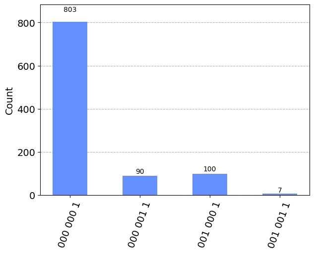
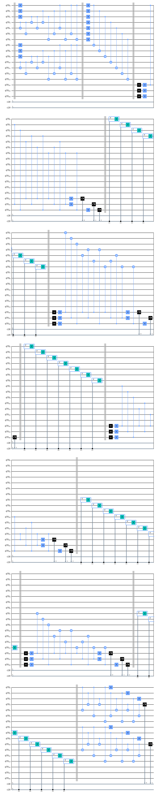
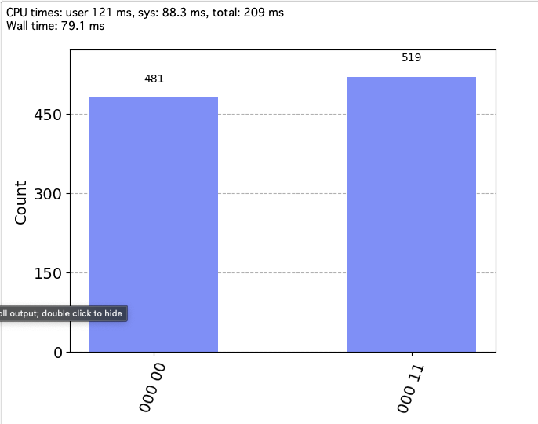
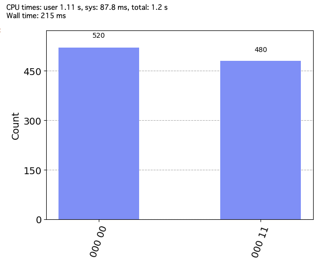
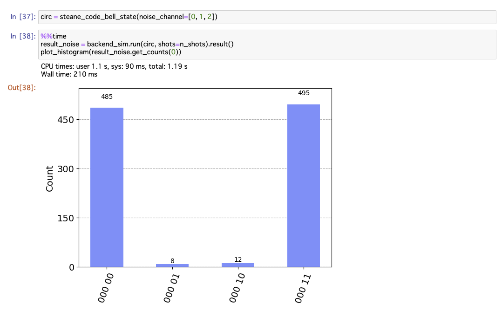
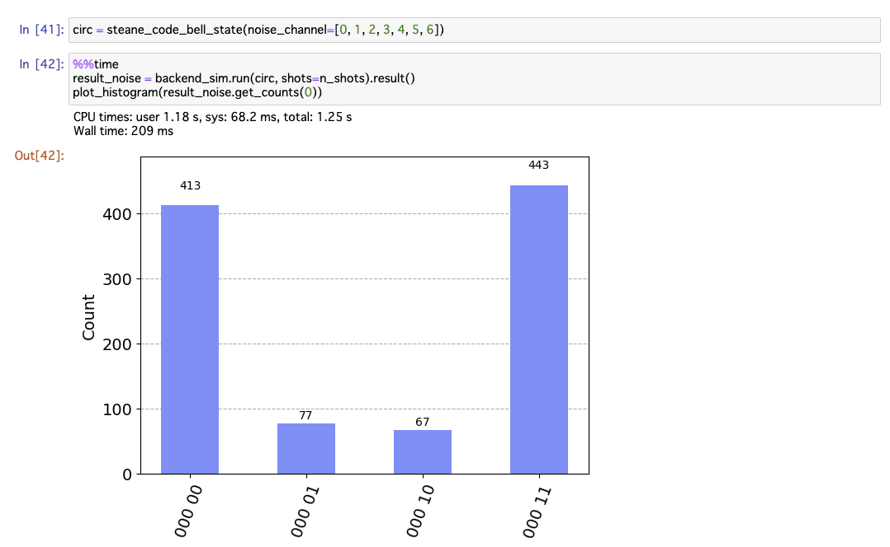
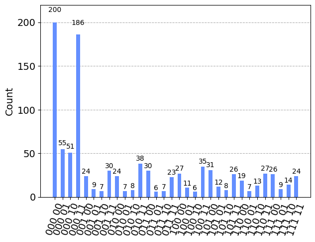
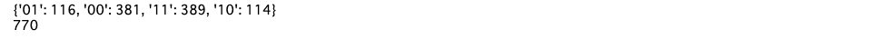
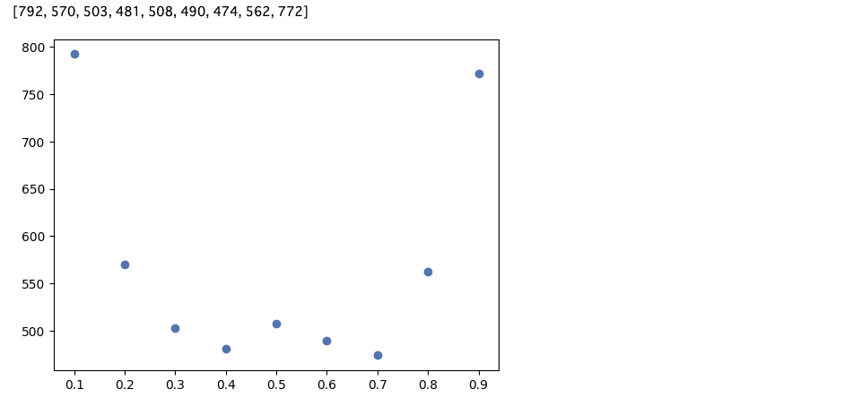

# Steane符号と論理ビット操作

Steane符号を用いた誤り訂正符号の実装をおこなっった。
Steane符号では、論理Hゲート実装の際、各量子ビットに並列に操作を加えることで、論理ビット操作を実装する。

## 1. ライブラリのinstall, import

```python 
%pip install qiskit==0.45.2 qiskit-aer==0.12.0
%pip install pylatexenc
```

```python
import numpy as np
from qiskit import QuantumCircuit, QuantumRegister, ClassicalRegister
from qiskit_aer import AerSimulator
from qiskit.visualization import plot_histogram
from qiskit_aer.noise import pauli_error
from qiskit_aer.noise.errors.quantum_error import QuantumChannelInstruction
```

## 2. エラーチャネルの作成

ここでは先ほどよりも少し高めのエラー率にしています。
理由としては、ここでは17量子ビットを使用する長い回路を利用するため、shot数を多く確保すると実行時間伸びてしまいます。
そのため、shot数を抑えたいのですが、低めのエラー率だと、エラーが出て欲しい場面で観測されない可能性があるため、エラー率を高めています。

```python
n_shots = 1000 # シミュレーターでのサンプリング回数
backend_sim = AerSimulator() # シミュレーターの用意
p_error = 0.1 # エラー確率

def make_bitphase_error_channel(p_error: float, print_flag: bool = True) -> QuantumChannelInstruction:
    bit_flip = pauli_error([('X', p_error), ('I', 1 - p_error)])
    phase_flip = pauli_error([('Z', p_error), ('I', 1 - p_error)])

    bitphase_flip = bit_flip.compose(phase_flip)
    
    if print_flag:
        print(bitphase_flip)
    return bitphase_flip.to_instruction()

bitphase_flip = make_bitphase_error_channel(p_error)
```


まずは、符号化をしないままのベル状態に1量子ビットだけノイズをかけてみます。

```python
# エラーありの回路
n_qubits = 2
circ_noise = QuantumCircuit(n_qubits, 2)

circ_noise.h(0)
circ_noise.cx(0, 1)

circ_noise.append(bitphase_flip, [0])

circ_noise.measure([0, 1], [0, 1])
circ_noise.draw("mpl")
```


```python
result_noise = backend_sim.run(circ_noise, shots=n_shots).result()
plot_histogram(result_noise.get_counts(0))
```


本来出現しないはずの01と11がそれぞれ約5％の確率で出現しています。（合計10％のエラー率）

## 3. Steane符号

まずは1ビットの情報をSteane符号で符号化して、挙動を確認してみます。

Xゲートで反転させただけの状態を用意し、符号化します。

詳細については、以下のwebサイトが参考になります。
- `https://intra.ece.ucr.edu/~korotkov/courses/EE214-QC/QC-7-error-correction.pdf`

```python
def steane_code(noise_channel: list[int] = [], p_error: float = 0.1) -> QuantumCircuit:
    # noise_channel : ノイズをかけたいチャネル(int)を入れたリスト
    # p_error : エラーの発生確率
    
    # エラーの定義
    bitphase_flip = make_bitphase_error_channel(p_error, print_flag=False)
    
    # 回路の記述
    n_qubits = 7 + 6
    qr = QuantumRegister(n_qubits)
    cr = ClassicalRegister(1)
    ancilla_1 = ClassicalRegister(3)
    ancilla_2 = ClassicalRegister(3)
    circ = QuantumCircuit(qr, cr, ancilla_1, ancilla_2)

    # |1>状態を符号化する
    circ.x(3)
    
    circ.barrier()

    # 符号化
    circ.h(0)
    circ.h(1)
    circ.h(2)
    
    circ.cx(3, 4)
    circ.cx(3, 5)
    
    circ.cx(2, 3)
    circ.cx(2, 4)
    circ.cx(2, 6)
    
    circ.cx(1, 3)
    circ.cx(1, 5)
    circ.cx(1, 6)
    
    circ.cx(0, 4)
    circ.cx(0, 5)
    circ.cx(0, 6)
    
    circ.barrier()

    # エラーが発生する部分
    for i in noise_channel:
        assert (0 <= i) and (i < 13)
        circ.append(bitphase_flip, [i])

    circ.barrier()

    # エラー訂正
    
    # アンシラに情報を送る
    for i in range(6):
        circ.reset(i + 7)
        circ.h(i + 7)
        
    circ.cz(7, 0)
    circ.cz(7, 4)
    circ.cz(7, 5)
    circ.cz(7, 6)
    
    circ.cz(8, 1)
    circ.cz(8, 3)
    circ.cz(8, 5)
    circ.cz(8, 6)

    circ.cz(9, 2)
    circ.cz(9, 3)
    circ.cz(9, 4)
    circ.cz(9, 6)
    
    circ.cx(10, 0)
    circ.cx(10, 4)
    circ.cx(10, 5)
    circ.cx(10, 6)

    circ.cx(11, 1)
    circ.cx(11, 3)
    circ.cx(11, 5)
    circ.cx(11, 6)
    
    circ.cx(12, 2)
    circ.cx(12, 3)
    circ.cx(12, 4)
    circ.cx(12, 6)
    
    for i in range(6):
        circ.h(i + 7)
    
    circ.barrier()
    
    # シンドローム測定
    circ.measure(qr[7:10], ancilla_1)
    circ.measure(qr[10:], ancilla_2)
    
    # ビット反転
    
    with circ.if_test((ancilla_1, 0b001)):
        circ.x(0)
        
    with circ.if_test((ancilla_1, 0b010)):
        circ.x(1)
    
    with circ.if_test((ancilla_1, 0b100)):
        circ.x(2)
    
    with circ.if_test((ancilla_1, 0b110)):
        circ.x(3)
        
    with circ.if_test((ancilla_1, 0b101)):
        circ.x(4)
        
    with circ.if_test((ancilla_1, 0b011)):
        circ.x(5)
    
    with circ.if_test((ancilla_1, 0b111)):
        circ.x(6)
    
    circ.barrier()
    
    # 位相反転
    
    with circ.if_test((ancilla_2, 0b001)):
        circ.z(0)
        
    with circ.if_test((ancilla_2, 0b010)):
        circ.z(1)
    
    with circ.if_test((ancilla_2, 0b100)):
        circ.z(2)
        
    with circ.if_test((ancilla_2, 0b110)):
        circ.z(3)
    
    with circ.if_test((ancilla_2, 0b101)):
        circ.z(4)
    
    with circ.if_test((ancilla_2, 0b011)):
        circ.z(5)
        
    with circ.if_test((ancilla_2, 0b111)):
        circ.z(6)
    
    circ.barrier()
    
    # 復号
    circ.cx(0, 4)
    circ.cx(0, 5)
    circ.cx(0, 6)
    
    circ.cx(1, 3)
    circ.cx(1, 5)
    circ.cx(1, 6)
    
    circ.cx(2, 3)
    circ.cx(2, 4)
    circ.cx(2, 6)
    
    circ.cx(3, 4)
    circ.cx(3, 5)
    
    circ.h(0)
    circ.h(1)
    circ.h(2)

    circ.measure(qr[3], cr)

    return circ

circ = steane_code()
circ.draw("mpl")
```


```python
result_ideal = backend_sim.run(circ, shots=n_shots).result()
plot_histogram(result_ideal.get_counts(0))
```


アンシラとターゲットの量子ビットの測定結果がすべて乗っています。最上位ビットの1がターゲットのビットになります。

## 4. 誤り訂正

Steane符号を使って、1量子ビットまでの誤りが訂正できることを確認します。

```python
circ = steane_code(noise_channel=[0])
result_noise = backend_sim.run(circ, shots=n_shots).result()
plot_histogram(result_noise.get_counts(0))
```



最上位ビット（測定したい結果）がすべて1になっていることから、誤り訂正ができていることがわかります。

それぞれのアンシラが100になっているのが1量子ビット目のビット反転、位相反転のエラーに相当します。
（一番右のケースが、両方のエラーが発生している場合）

別の量子ビットにエラーを乗せてみます。

```python
circ = steane_code(noise_channel=[3])
result_noise = backend_sim.run(circ, shots=n_shots).result()
plot_histogram(result_noise.get_counts(0))
```


また、2量子ビット以上の場合は訂正できないことを確認してみます。

```python
circ = steane_code(noise_channel=[0, 3])
result_noise = backend_sim.run(circ, shots=n_shots).result()
plot_histogram(result_noise.get_counts(0))
```


両方の量子ビットにエラーが発生した場合に、アンシラが111という状態になり、6番目の量子ビットにエラーが起きた場合と区別がつかなくなります。

## 5. 論理ビット操作によるベル状態の作成

今度はベル状態の作成を試すのですが、事前にベル状態を作成したものを符号化するのではなく、符号化された論理量子ビットに対して、論理ビット操作を加えて、ベル状態を作成します。

先ほどの例では、補助量子ビットを6量子ビット使っていますが、量子ビット数を節約するため、リセットしながら3量子ビットを使い回して実装します。

```python
def steane_code_bell_state(noise_channel: list[int] = [], p_error: float = 0.1) -> QuantumCircuit:
    # noise_channel : ノイズをかけたいチャネル(int)を入れたリスト
    # p_error : エラーの発生確率
    
    # エラーの定義
    bitphase_flip = make_bitphase_error_channel(p_error, print_flag=False)

    # 回路の記述
    # 符号化用が7x2ビット，アンシラが3ビット
    n_qubits = 14 + 3
    
    qr = QuantumRegister(n_qubits)
    cr = ClassicalRegister(2)
    ancilla = ClassicalRegister(3)
    
    circ = QuantumCircuit(qr, cr, ancilla)
    
    circ.barrier()

    # 符号化
    for i in range(2):
        circ.h(0 + i*7)
        circ.h(1 + i*7)
        circ.h(2 + i*7)

        circ.cx(3 + i*7, 4 + i*7)
        circ.cx(3 + i*7, 5 + i*7)

        circ.cx(2 + i*7, 3 + i*7)
        circ.cx(2 + i*7, 4 + i*7)
        circ.cx(2 + i*7, 6 + i*7)

        circ.cx(1 + i*7, 3 + i*7)
        circ.cx(1 + i*7, 5 + i*7)
        circ.cx(1 + i*7, 6 + i*7)

        circ.cx(0 + i*7, 4 + i*7)
        circ.cx(0 + i*7, 5 + i*7)
        circ.cx(0 + i*7, 6 + i*7)
    
    circ.barrier()

    # エラーチャネル
    # ここで、論理アダマールゲートと論理CNOTゲートをかける 
    for i in range(7):
        circ.h(i)
        
    for i in range(7):
        circ.cx(i, i+7)
    
    # エラーは以下で発生させる
    for i in noise_channel:
        assert (0 <= i) and (i < 17)
        circ.append(bitphase_flip, [i])

    # エラー訂正
    
    for i in range(2): # 論理ビット数に対応するループ
        circ.barrier()
        for j in range(3): # アンシラの初期化（同じものを使い回す）
            circ.reset(j + 14) 
            circ.h(j + 14)

        # アンシラに情報を送る
        circ.cz(14, 0 + i*7)
        circ.cz(14, 4 + i*7)
        circ.cz(14, 5 + i*7)
        circ.cz(14, 6 + i*7)

        circ.cz(15, 1 + i*7)
        circ.cz(15, 3 + i*7)
        circ.cz(15, 5 + i*7)
        circ.cz(15, 6 + i*7)

        circ.cz(16, 2 + i*7)
        circ.cz(16, 3 + i*7)
        circ.cz(16, 4 + i*7)
        circ.cz(16, 6 + i*7)

        for j in range(3):
            circ.h(j + 14)
            
        # シンドローム測定
        circ.measure(qr[14:17], ancilla)

        circ.barrier()
        
        # ビット反転
        
        with circ.if_test((ancilla, 0b001)):
            circ.x(0 + i*7)
            
        with circ.if_test((ancilla, 0b010)):
            circ.x(1 + i*7)
            
        with circ.if_test((ancilla, 0b100)):
            circ.x(2 + i*7)
            
        with circ.if_test((ancilla, 0b110)):
            circ.x(3 + i*7)
            
        with circ.if_test((ancilla, 0b101)):
            circ.x(4 + i*7)
        
        with circ.if_test((ancilla, 0b011)):
            circ.x(5 + i*7)
            
        with circ.if_test((ancilla, 0b111)):
            circ.x(6 + i*7)

        # アンシラをリセットして使い回す
        circ.barrier()
        for j in range(3):
            circ.reset(j + 14)
            circ.h(j + 14)
            
        circ.cx(14, 0 + i*7)
        circ.cx(14, 4 + i*7)
        circ.cx(14, 5 + i*7)
        circ.cx(14, 6 + i*7)

        circ.cx(15, 1 + i*7)
        circ.cx(15, 3 + i*7)
        circ.cx(15, 5 + i*7)
        circ.cx(15, 6 + i*7)

        circ.cx(16, 2 + i*7)
        circ.cx(16, 3 + i*7)
        circ.cx(16, 4 + i*7)
        circ.cx(16, 6 + i*7)
        
        for j in range(3):
            circ.h(j + 14)
            
        # シンドローム測定
        circ.measure(qr[14:17], ancilla)
        
        circ.barrier()
        
        # 位相反転
        with circ.if_test((ancilla, 0b001)):
            circ.z(0 + i*7)
            
        with circ.if_test((ancilla, 0b010)):
            circ.z(1 + i*7)
            
        with circ.if_test((ancilla, 0b100)):
            circ.z(2 + i*7)
            
        with circ.if_test((ancilla, 0b110)):
            circ.z(3 + i*7)
            
        with circ.if_test((ancilla, 0b101)):
            circ.z(4 + i*7)
        
        with circ.if_test((ancilla, 0b011)):
            circ.z(5 + i*7)
            
        with circ.if_test((ancilla, 0b111)):
            circ.z(6 + i*7)


    circ.barrier()
    
    # 復号
    for i in range(2):
        circ.cx(0 + i*7, 4 + i*7)
        circ.cx(0 + i*7, 5 + i*7)
        circ.cx(0 + i*7, 6 + i*7)

        circ.cx(1 + i*7, 3 + i*7)
        circ.cx(1 + i*7, 5 + i*7)
        circ.cx(1 + i*7, 6 + i*7)

        circ.cx(2 + i*7, 3 + i*7)
        circ.cx(2 + i*7, 4 + i*7)
        circ.cx(2 + i*7, 6 + i*7)

        circ.cx(3 + i*7, 4 + i*7)
        circ.cx(3 + i*7, 5 + i*7)

        circ.h(0 + i*7)
        circ.h(1 + i*7)
        circ.h(2 + i*7)

    # 測定
    circ.measure([3, 10], [0, 1])

    return circ
```

```python
circ = steane_code_bell_state()
circ.draw("mpl")
```



まずは誤りをかけない状態で、ベル状態が作れていることを確認します。

```python
%%time
result_ideal = backend_sim.run(circ, shots=n_shots).result()
plot_histogram(result_ideal.get_counts(0))
```



## 課題1

この回路にエラーを加えて、訂正できることを確認してみましょう。

```python
circ = steane_code_bell_state(noise_channel=[0])
```

```python
%%time
result_noise = backend_sim.run(circ, shots=n_shots).result()
plot_histogram(result_noise.get_counts(0))
```







## 課題2

誤りの発生確率を変化させながら、実際に誤りが訂正できる確率を確認してみましょう。すべての量子ビットにエラーをかけて、結果を見てみます。

```python
circ = steane_code_bell_state(noise_channel=range(14), p_error=0.1)
```

```python
%%time
result_noise = backend_sim.run(circ, shots=n_shots).result()
plot_histogram(result_noise.get_counts(0))
```



このままでは見づらいので、以下の関数で本来測定したいビットの値だけ取り出します。

```python
def check_result(result) -> dict:
    # result : qiskit.result.result.Result
    
    counts = result.get_counts()
    output = dict()
    
    for key in counts.keys():
        new_key = key[-2:] # 上位2ビットだけを取り出して、新たなキーにする
        
        if new_key not in output.keys():
            output[new_key] = counts[key]
        else:
            output[new_key] += counts[key]
    
    return output

output = check_result(result_noise)
print(output)
print(output["00"] + output["11"]) # 正しい出力の件数
```



誤り率を変化させながら、実施し、結果の変化を確認してみましょう。

```python

errors = [0.1, 0.2, 0.3, 0.4, 0.5, 0.6, 0.7, 0.8, 0.9]
y = []
for error in errors:
    circ = steane_code_bell_state(noise_channel=range(14), p_error=error)
    result_noise = backend_sim.run(circ, shots=n_shots).result()
    output = check_result(result_noise)
    y.append(output["00"] + output["11"])
print(y)

import matplotlib.pyplot as plt
plt.scatter(errors, y)
plt.show()
```

