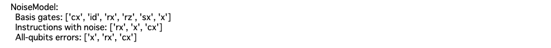
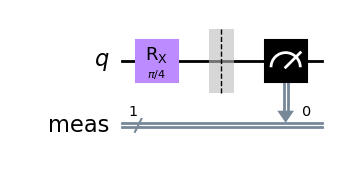
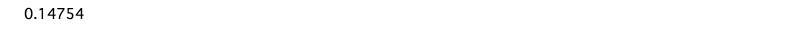
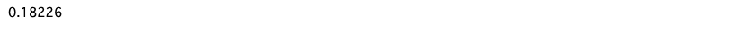

# 外挿法によるError Mitigationの基礎

Error Mitigationの代表的な手法である外挿法(ZNE; Zero Noise Extrapolation)について学んだ。
１量子ビットに対し、回転ゲートを作用させるだけの簡単な回路を題材に、Error Mitigationの流れを確認する。

## 1. ライブラリのインストール

```python
%pip install qiskit==0.45.2 qiskit-aer==0.12.0
%pip install pylatexenc
```

```python
import numpy as np
from qiskit import QuantumCircuit, transpile
from qiskit.quantum_info import Kraus, SuperOp
from qiskit_aer import AerSimulator
from qiskit.visualization import plot_histogram
from matplotlib import pyplot as plt

from qiskit_aer.noise import (NoiseModel, QuantumError, ReadoutError,
    pauli_error, depolarizing_error, thermal_relaxation_error)

%matplotlib inline
```

## 2. エラーモデルの定義

```python
def make_noise_model(p_error: float) -> NoiseModel:
    # p_error : ゲートエラー確率

    bit_flip = pauli_error([('X', p_error), ('I', 1 - p_error)])
    phase_flip = pauli_error([('Z', p_error), ('I', 1 - p_error)])
    bitphase_flip = bit_flip.compose(phase_flip)

    error_gate1 = bitphase_flip
    error_gate2 = error_gate1.tensor(bitphase_flip)

    noise_model = NoiseModel()
    noise_model.add_all_qubit_quantum_error(error_gate1, ["x", "rx"])
    noise_model.add_all_qubit_quantum_error(error_gate2, ["cx"])

    print(noise_model)
    
    return noise_model
```

```python
p_noise = 0.05
noise_model = make_noise_model(p_noise)
```



## 3. 回路ゲートのみの回路で実験

まずは、１量子ビットに対して回転ゲートのみを適用する簡単な回路を作成してみる。

```python
n_shots = 100_000
theta = np.pi / 4

n_qubits = 1
circ = QuantumCircuit(n_qubits)

circ.rx(theta, 0)
circ.measure_all()
circ.draw('mpl')
```



### エラーなしの場合

```python
sim_ideal = AerSimulator()
result_ideal = sim_ideal.run(circ, shots=n_shots).result()
plot_histogram(result_ideal.get_counts(0))
```


```python
true_score = result_ideal.get_counts(0)["1"] / n_shots
print(true_score)
```



エラーなしの場合、15%弱の割合で1が出現する

### エラーありの場合

この回路に対して、エラー率が5%のノイズモデルを動かしてみる。

```python
sim_noise = AerSimulator(noise_model=noise_model)
result_noise = sim_noise.run(circ, shots=n_shots).result()
counts_noise = result_noise.get_counts(0)

plot_histogram(counts_noise)
```


```python
noise_score = result_noise.get_counts(0)["1"] / n_shots
print(noise_score)
```



エラーが増えることで、1の出現頻度が増え、18%程度になっている。

## 4. エラーを増幅する

ここで、エラーの発生確率を２倍にしたモデルを作成してみる。

```python
noise_model_2 = make_noise_model(p_noise * 2)
```


