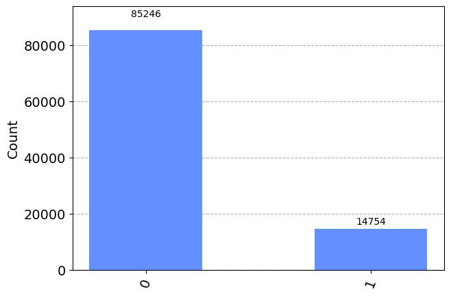

# 外挿法によるError Mitigationの基礎

Error Mitigationの代表的な手法である外挿法(ZNE; Zero Noise Extrapolation)について学んだ。
１量子ビットに対し、回転ゲートを作用させるだけの簡単な回路を題材に、Error Mitigationの流れを確認する。

## 1. ライブラリのインストール

```python
%pip install qiskit==0.45.2 qiskit-aer==0.12.0
%pip install pylatexenc
```

```python
import numpy as np
from qiskit import QuantumCircuit, transpile
from qiskit.quantum_info import Kraus, SuperOp
from qiskit_aer import AerSimulator
from qiskit.visualization import plot_histogram
from matplotlib import pyplot as plt

from qiskit_aer.noise import (NoiseModel, QuantumError, ReadoutError,
    pauli_error, depolarizing_error, thermal_relaxation_error)

%matplotlib inline
```

## 2. エラーモデルの定義

```python
def make_noise_model(p_error: float) -> NoiseModel:
    # p_error : ゲートエラー確率

    bit_flip = pauli_error([('X', p_error), ('I', 1 - p_error)])
    phase_flip = pauli_error([('Z', p_error), ('I', 1 - p_error)])
    bitphase_flip = bit_flip.compose(phase_flip)

    error_gate1 = bitphase_flip
    error_gate2 = error_gate1.tensor(bitphase_flip)

    noise_model = NoiseModel()
    noise_model.add_all_qubit_quantum_error(error_gate1, ["x", "rx"])
    noise_model.add_all_qubit_quantum_error(error_gate2, ["cx"])

    print(noise_model)
    
    return noise_model
```

```python
p_noise = 0.05
noise_model = make_noise_model(p_noise)
```


## 3. 回路ゲートのみの回路で実験

まずは、１量子ビットに対して回転ゲートのみを適用する簡単な回路を作成してみる。

```python
n_shots = 100_000
theta = np.pi / 4

n_qubits = 1
circ = QuantumCircuit(n_qubits)

circ.rx(theta, 0)
circ.measure_all()
circ.draw('mpl')
```


### エラーなしの場合

```python
sim_ideal = AerSimulator()
result_ideal = sim_ideal.run(circ, shots=n_shots).result()
plot_histogram(result_ideal.get_counts(0))
```



```python
true_score = result_ideal.get_counts(0)["1"] / n_shots
print(true_score)
```


エラーなしの場合、15%弱の割合で1が出現する

### エラーありの場合

この回路に対して、エラー率が5%のノイズモデルを動かしてみる。

```python
sim_noise = AerSimulator(noise_model=noise_model)
result_noise = sim_noise.run(circ, shots=n_shots).result()
counts_noise = result_noise.get_counts(0)

plot_histogram(counts_noise)
```


```python
noise_score = result_noise.get_counts(0)["1"] / n_shots
print(noise_score)
```


エラーが増えることで、1の出現頻度が増え、18%程度になっている。

## 4. エラーを増幅する

ここで、エラーの発生確率を２倍にしたモデルを作成してみる。

```python
noise_model_2 = make_noise_model(p_noise * 2)
```


```python
sim_noise_2 = AerSimulator(noise_model=noise_model_2)
result_noise_2 = sim_noise_2.run(circ, shots=n_shots).result()
counts_noise_2 = result_noise_2.get_counts(0)

plot_histogram(count_noise_2)
```


```python
noise_score_2 = result_noise_2.get_counts(0)["1"] / n_shots
print(noise_score_2)
```


さらにエラーが増え、22%程度のエラー発生率になっている。
回路中のゲートエラー率が5%増えたことで、出力1の出現頻度が18%→22%に増えた。
ここで(エラー率10%の回路の出力 - エラー率5％の回路の出力)が(エラーが５％増える)とみなし、
この値をエラー率5%のカイロの出力から引き算することで、仮想的にエラー率0%の回路の出力を求める。

```python
mitigated_score = noise_score - (noise_score_2 - noise_score)
print(mitigated_score)
```


多少差はあるが、何も補正しないよりはいい結果が得られた。
図でイメージすると以下。

```python
plt.plot([p_noise, p_noise*2], [noise_score, noise_score_2], 'o-')
plt.plot([0., p_noise], [mitigated_score, noise_score], 'o-')
plt.scatter([0], [true_score], c='r')
plt.xticks([0.01 * i for i in range(11)])
```


## 5. 回路を長くする方法ほでのエラー増幅

実際の量子コンピュータでは、ゲートエラー率を正確に２倍するような操作を、一般のユーザーが行うことは難しいことが多い。ここで同じ出力になるような長い回路を作成することで、エラーを増幅することを考える

$U = UU^{\dagger}U$とすることで、回路を長くしてエラーを増幅することができる。
これによりエラーが３倍に増える

```python
n_qubits = 1
circ_2 = QuantumCircuit(n_qubits)

circ_2.rx(theta, 0)
circ_2.rx(-theta, 0)
circ_2.rx(theta, 0)
circ_2.measure_all()
circ_2.draw("mpl")
```


```python
result_noise_3 = sim_noise.run(circ_2, shots=n_shots).result()
counts_noise_3 = result_noise_3.get_counts(0)

plot_histogram(counts_noise_3)
```


```python
noise_score_3 = result_noise_3.get_counts(0)["1"] / n_shots
print(noise_score_3)
```


同様の理屈で、エラー率が0%の時の回路の出力を推定する

```python
mitigated_score_2 = noise_score - (noise_score_3 - noise_score) / 2
print(mitigated_score_2)
```


```python
plt.plot([1, 3], [noise_score, noise_score_3], 'o-')
plt.plot([0, 1], [mitigated_score_2, noise_score], 'o-')
plt.scatter([0], [true_score], c='r')
plt.xticks([1 * i for i in range(4)])
```


## 6. さらにエラーを増幅してみる

２点だけで推定するよりも、より多くの点を取って推定する穂が正しい推定ができそうに思える。
ここではさらにエラーを増幅してみる。
$U = U(U^{\dagger}U)^n$とすることで、さらに回路長を長くすることができる。

```python
def make repeated_circ(n_repeat: int) -> QuantumCircuit:
    n_qubits = 1
    circ = QuantumCircuit(n_qubits)

    circ.rx(theta, 0)
    for _ in range(n_repeat):
        circ.rx(-theta, 0)
        circ.rx(theta, 0)
    circ.measure_all()

    return circ

def calc_noise_score(circ):
    result_noise = sim_noise.run(circ, shots=n_shots).result()
    counts_noise = result_noise.get_counts(0)
    noise_score = result_noise.get_counts(0)["1"] / n_shots
    return noise_score
```


