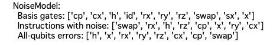
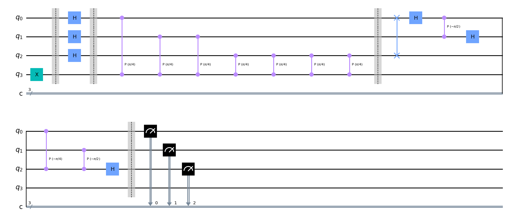

# QPEに誤り低減を用いる

より一般的な回路の例としてQPEを取り上げ、これに対して誤り低減を行ってみる。

## 1. インポート

```python
import numpy as np
from qiskit import QuantumCircuit, transpile
from qiskit.quantum_info import Kraus, SuperOp
from qiskit_aer import AerSimulator
from qiskit.visualization import plot_histogram
from matplotlib import pyplot as plt

from qiskit_aer.noise import (NoiseModel, QuantumError, ReadoutError,
    pauli_error, depolarizing_error, thermal_relaxation_error)

%matplotlib inline

```

## 2. エラーモデルの定義

```python
def make_noise_model(p_error) -> NoiseModel:
    bit_flip = pauli_error([('X', p_error), ('I', 1 - p_error)])
    phase_flip = pauli_error([('Z', p_error), ('I', 1 - p_error)])
    bitphase_flip = bit_flip.compose(phase_flip)

    error_gate1 = bitphase_flip
    error_gate2 = error_gate1.tensor(bitphase_flip)

    noise_mosel = NoiseModel()
    noise_model.add_all_qubit_quantum_error(error_gate1, ['h', 'x', 'rx', 'ry', 'rz'])
    noise_model.add_all_qubit_quantum_error(error_gate2, ['cx', 'cp', 'swap'])

    print(noise_model)
    return noise_model

p_noise = 0.01 # 回路が長いので、エラー率を1%にしておく
noise_model = make_noise_model(p_noise)
```



## 3. TゲートのQPE

QPEは与えられたユニタリ行列$U$に対し、その固有値$e^{2i\pi \lambda}$の位相$\lambda$を求めるアルゴリズムである。
ここでは$U$として、Tゲートを採用する。
Tゲートの固有値$e^{i\pi / 4}$になることが知られている。
そのため、期待する出力は001(二進数表記での1/8)となる。

```python
from qiskit.circuit.library import QFT

n_shots = 100_000

def make_QFT() -> QuantumCircuit:
    n_qubits = 4
    circ = QuantumCircuit(n_qubits, 3)

    # 固有ベクトルの入力
    circ.x(3)
    circ.barrier()

    # アダマールゲートの適用
    for i in range(3):
        circ.h(i)
    circ.barrier()

    # 制御ユニタリーゲートの適用
    k = 1
    for i in range(3):
        for j in range(k):
            circ.cp(np.pi/4, i, ,3)
        k *= 2

    circ.barrier()

    # 逆フーリエ変換
    iqft = QFT(3).inverse().decompose()
    circ = circ.compose(iqft, range(3))

    circ.barrier()

    return circ

circ = make_QFT()
circ.measure(range(3), range(3))
circ.draw('mpl')
```




