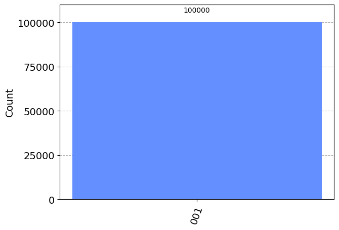
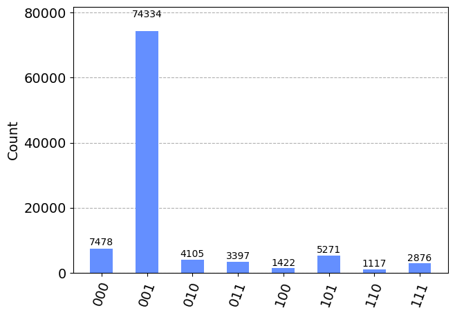
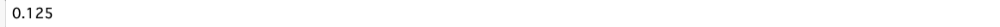
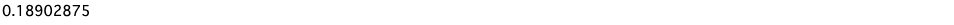
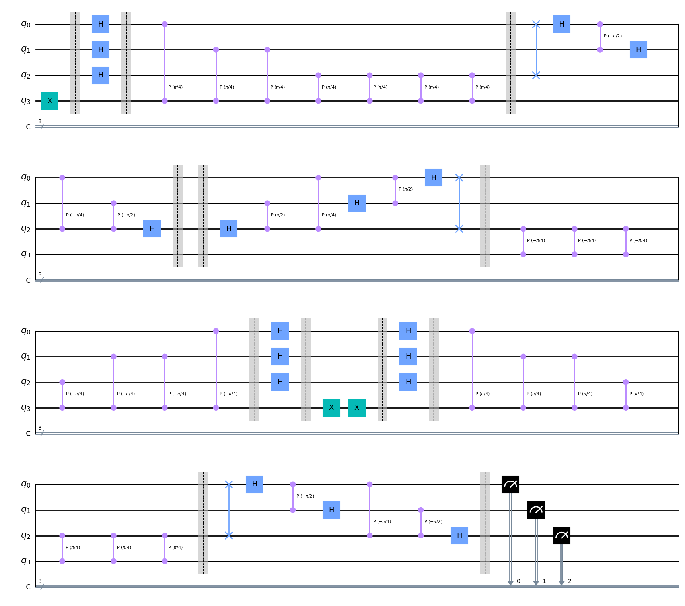
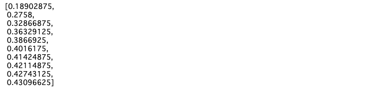
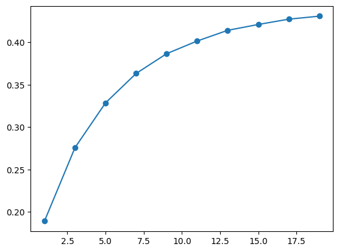
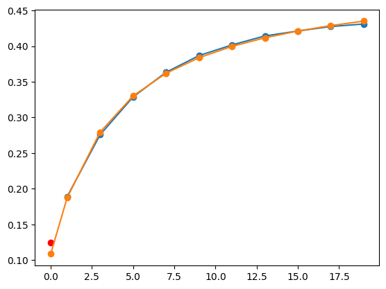
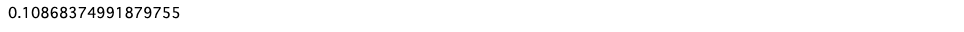
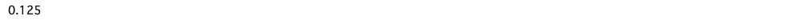

# QPEに誤り低減を用いる

より一般的な回路の例としてQPEを取り上げ、これに対して誤り低減を行ってみる。

## 1. インポート

```python
import numpy as np
from qiskit import QuantumCircuit, transpile
from qiskit.quantum_info import Kraus, SuperOp
from qiskit_aer import AerSimulator
from qiskit.visualization import plot_histogram
from matplotlib import pyplot as plt

from qiskit_aer.noise import (NoiseModel, QuantumError, ReadoutError,
    pauli_error, depolarizing_error, thermal_relaxation_error)

%matplotlib inline

```

## 2. エラーモデルの定義

```python
def make_noise_model(p_error) -> NoiseModel:
    bit_flip = pauli_error([('X', p_error), ('I', 1 - p_error)])
    phase_flip = pauli_error([('Z', p_error), ('I', 1 - p_error)])
    bitphase_flip = bit_flip.compose(phase_flip)

    error_gate1 = bitphase_flip
    error_gate2 = error_gate1.tensor(bitphase_flip)

    noise_mosel = NoiseModel()
    noise_model.add_all_qubit_quantum_error(error_gate1, ['h', 'x', 'rx', 'ry', 'rz'])
    noise_model.add_all_qubit_quantum_error(error_gate2, ['cx', 'cp', 'swap'])

    print(noise_model)
    return noise_model

p_noise = 0.01 # 回路が長いので、エラー率を1%にしておく
noise_model = make_noise_model(p_noise)
```


## 3. TゲートのQPE

QPEは与えられたユニタリ行列$U$に対し、その固有値$e^{2i\pi \lambda}$の位相$\lambda$を求めるアルゴリズムである。
ここでは$U$として、Tゲートを採用する。
Tゲートの固有値$e^{i\pi / 4}$になることが知られている。
そのため、期待する出力は001(二進数表記での1/8)となる。

```python
from qiskit.circuit.library import QFT

n_shots = 100_000

def make_QFT() -> QuantumCircuit:
    n_qubits = 4
    circ = QuantumCircuit(n_qubits, 3)

    # 固有ベクトルの入力
    circ.x(3)
    circ.barrier()

    # アダマールゲートの適用
    for i in range(3):
        circ.h(i)
    circ.barrier()

    # 制御ユニタリーゲートの適用
    k = 1
    for i in range(3):
        for j in range(k):
            circ.cp(np.pi/4, i, ,3)
        k *= 2

    circ.barrier()

    # 逆フーリエ変換
    iqft = QFT(3).inverse().decompose()
    circ = circ.compose(iqft, range(3))

    circ.barrier()

    return circ

circ = make_QFT()
circ.measure(range(3), range(3))
circ.draw('mpl')
```


```python
sim_ideal = AerSimulator()
result_ideal = sim_ideal.run(circ, shots=n_shots).result()
counts_ideal = result_ideal.get_counts(0)
plot_histogram(counts_ideal)
```



エラーがない場合、正しく001が100%の確率で出現することが確認できた。

## 4. エラーありの場合

```python
sim_noise = AerSimulator(noise_model=noise_model)
result_noise = sim_noise.run(circ, shots=n_shots).result()
counts_noise = result_noise.get_counts(0)

plot_histogram(counts_noise)
```



エラーを加えると出力値がばらける。
先ほどは１量子ビットのみだったので、1を取る確率を考えたが、ここでは二進数としての期待値を考えてみる。

## 5. 期待値を計算する

量子回路からの出力を期待値に変換する関数を以下に用意した。

```python
def key_to_value(key: str) -> float:
    """
    input
    key: 0と1からなる文字列
    output
    val: keyを二進数に変換したもの
    """
    val = 0
    x = 1 / 2
    for i in key:
        val += int(i) * x
        x /= 2
    return val

def calc_avg(counts: dict) -> float:
    total = 0
    for key in counts.keys():
        total += key_to_value(key) * counts[key]

    return total / n_shots

true_score = calc_avg(counts_ideal)
print(true_score)
```



```python
noise_score = calc_avg(counts_noise)
print(noise_score)
```



エラーがない場合は正しく0.125(1/8)となり、
エラーがある場合はこれより大きな値となっていることがわかる。

## 6. エラー増幅回路

[外挿法](./05_ExtrapolationMethod.md)と同じ仕組みで、回路長を増やしてエラーを増幅してみる。

```python
def make_repeated_circ(n_repeat: int) -> QuantumCircuit:
    circ = make_QFT()

    for _ in range(n_repeat):
        circ = circ.compose(make_QFT().inverse(), range(4))
        circ = circ.compose(make_QFT(), range(4))

    circ.measure(range(3), range(3))
    return circ

circ = make_repeated_circ(1)
circ.draw('mpl')
```



```python
def calc_noise_score(circ: QuantumCircuit) -> float:
    result_noise = sim_noise.run(circ, shots=n_shots).result()
    counts_noise = result_noise.get_counts(0)
    noise_score = calc_avg(counts_noise)
    return noise_score

calc_length_list = [1]
score_list = [noise_score]
for i in range(1, 10):
    circ = make_repeated_circ(i)
    repeated_noise_score = calc_noise_score(circ)

    circ_length_list.append(1 + i*2)
    score_list.append(repeated_noise_score)

print(score_list)
```



```python
plt.plot(circ_length_list, score_list, 'o-')
```



## 7. 関数近似を行う

```python
from scipy.optimize import curve_fit

def exponential_fitting(x, a, b, c):
    return a + b*np.exp(x / (x + c))

param_2, _ = curve_fit(exponential_fitting, circ_length_list, score_list, maxfev=100000)

x_arr = np.array([0] + circ_length_list)
fitting_result_2 = [exponential_fitting(x, param_2[0], param_2[1], param_2[2]) for x in x_arr]

plt.plot(circ_length_list, score_list, 'o-')
plt.plot([0] + circ_length_list, fittin_result_2, 'o-')
plt.scatter([0], [true_score], c='r')
```



```python
print(fitting_result_2[0])
print(true_score)
```



